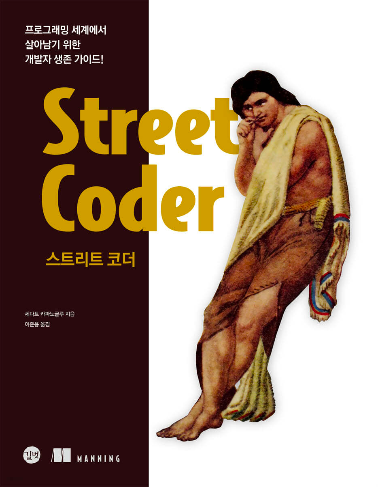
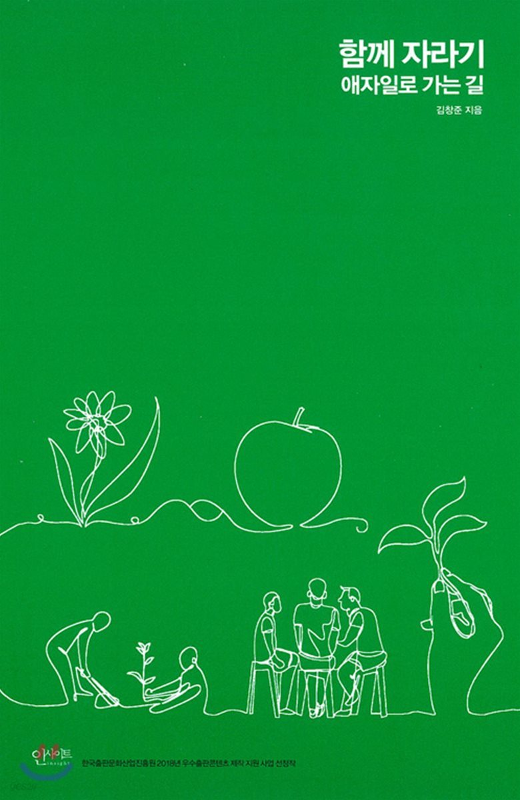

# programmer-study
🎯 공부하는 레파지토리

|        | Book                                                  | 요약           |
|:----------------:|:-----------------------------------------------------------:|:--------------------:|
| Spring Boot & JAVA          |   | ...........................: |
| Spring Boot & JAVA  |   | ...........................: |
| Test   |   | ...........................: |
| Test   |   | ...........................: |
| Java   |   | ...........................: |
| CODE   |   | ...........................: |
| KNOWLEDGE   |   | ...........................: |
| ETC   |   | ...........................: |
