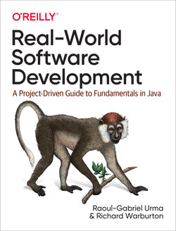

# programmer-study
🎯 공부하는 레파지토리

|                    |                                                                                           Book                                                                                            |                    |                                                                                                Book                                                                                                 |
|:------------------:|:-----------------------------------------------------------------------------------------------------------------------------------------------------------------------------------------:|:------------------:|:---------------------------------------------------------------------------------------------------------------------------------------------------------------------------------------------------:|
| Spring Boot & Java |  | Test |                    | 
|        Java        |            |        Design Pattern        |                             |
|        Spring Boot & Java        |      |        Test        |  |
|     Knowledge      |                     |        Etc         |    |
