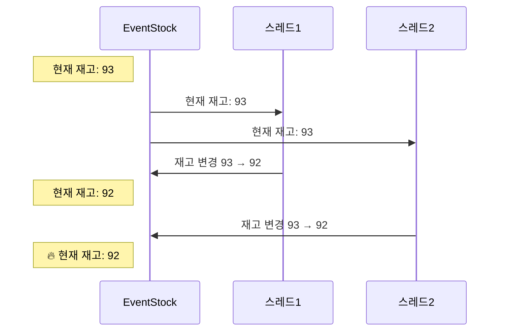
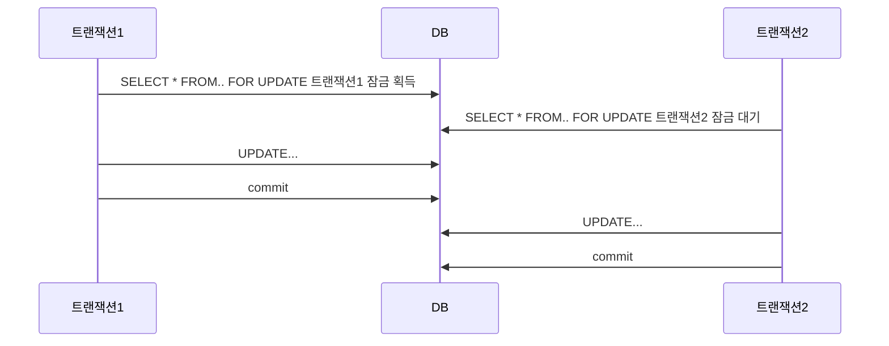
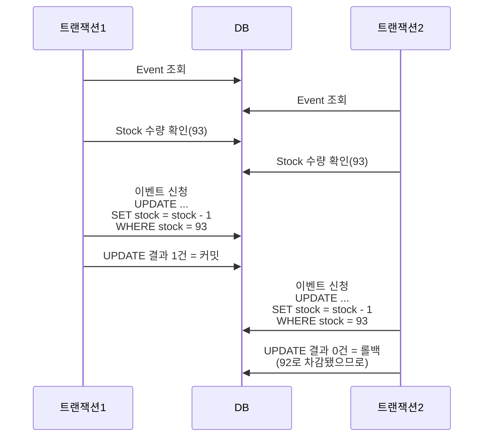

# 🔥 concurrency-problem

서로 다른 스레드가 하나의 자원을 놓고 수정하는 과정에서 동시성 문제가 발생한다.  
<u>**재고가 100개고 100명이 동시에 요청했을 때 재고는 0이 되는가?**</u>  

동시성 문제를 유발시키고 다양한 방법으로 해결해보자.  

1. 그냥 해보기
2. 비관적 락
    1. 애플리케이션 수준
    2. 데이터베이스 수준
3. 낙관적 락
    1. 애플리케이션 수준
    2. 데이터베이스 수준
4. 단일 스레드 처리

## 🚀 1. 문제 발생

재고가 100개고 동시 요청자가 100명이니 재고는 0 신청자 수는 100이 되어야 한다.  
재고가 음수가 되는 경우와 중복 신청을 막아주고 신청자 1명당 1개의 재고를 차감해준다.  

실행 결과를 보면 신청자 수는 100명으로 올바르지만, 남은 재고는 88개로 누락된 것을 확인할 수 있다.  
실행할 때마다 결과는 달라지지만 중요한 것은 재고 차감이 누락되는 것이다.  

## 🚀 2. 비관적 락

비관적 락은 실패할 가능성이 높아서 비관적이다. 정상적으로 변경할 가능성이 떨어지므로 선점 잠금을 통해 동시성 문제에 대응한다.  
Java/Kotlin 과 같은 애플리케이션 수준에서의 락과 MySQL 과 같은 데이터베이스 수준에서의 락으로 해결해보자.  

### 🎯 2-1. Application 비관적 락

크게 `synchronized` 와 `ReentrantLock` 을 사용해서 구현할 수 있다.  

`synchronized` 는 자동 락 해제와 상대적으로 쉽게 사용할 수 있고 `ReentrantLock` 는 조금 더 정밀 제어가 가능하다.  
`ReentrantLock` 는 `synchronized` 에 없는 기능들을 제공하는데 대표적으로 잠금 획득 대기 시간을 지정하는 기능이 있다.  

실행 결과는 항상 성공하게 되는데, 이유는 싱글톤 빈 + 단일 JVM 환경에서 비관적 락은 늘 성공한다.  
실패를 유발하려면 멀티 빈, 멀티 JVM 등 분산 환경에서 사용하면 실패할 것이다.  

### 🎯 2-2. Database 비관적 락

DB 수준 비관적 락은 Row 를 잡고 직렬화 하게 만든다.  
`SELECT .. FOR UPDATE` 같은 비관적 락은 데이터베이스 수준에서 동시성 문제를 해결해 주지만,  
잠금을 획득하지 못한 다른 트랜잭션은 대기해야 하므로 처리량이 저하되는 단점이 있다.  

또 2개 이상의 레코드에서 락을 가져갈 땐 데드락에 특히 신경을 써야 한다.  

## 🚀 3. 낙관적 락

낙관적 락은 실패할 가능성이 적고 명시적으로 잠금을 사용하지 않는 대신 데이터를 조회하는 시점과 수정하려는 시점의 값을 비교하여 동시성 문제를 처리한다.

### 🎯 2-1. Application 낙관적 락

`version` 과 관련된 컬럼이 있다면 해당 컬럼을 이용하고 그게 아니라면 최초 조회했을 때와 값이 같은지 비교할만한 대상을 선택한 후 CASCompare-And-Set 로 업데이트해주면 된다.  
사용자는 매 요청마다 성공할 수는 없겠지만 대기 시간 없이 즉답하므로 오히려 사용자 경험이 낫다고 볼 수 있다.  

CASCompare-And-Set 은 원자적으로 수행되어야 하므로 한 방 SQL 이어야 한다.  
조회하고 비교해서 UPDATE 하게 되면 그 짧은 시간동안에 정합성이 틀어질 수 있다.  
사전 조회는 해도 되지만 비교 자체는 WHERE 절에서 DB 가 수행해야 한다.  
Application 수준에서의 낙관적 락은 분산 시스템(DB 분산 제외)에서도 유용하게 사용이 가능하다.  

### 🎯 2-2. Database 낙관적 락

## 🚀 4. 단일 스레드