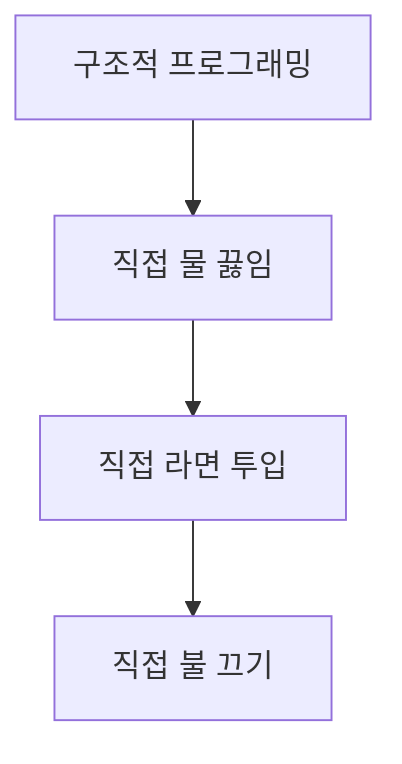
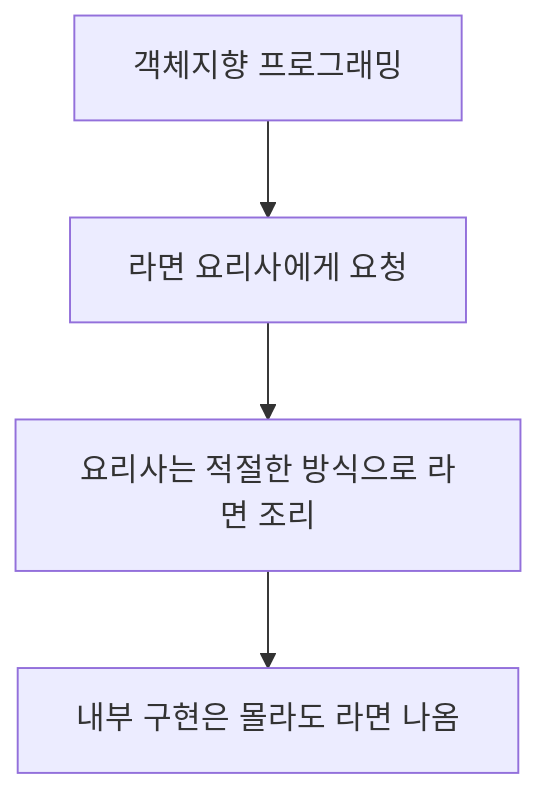
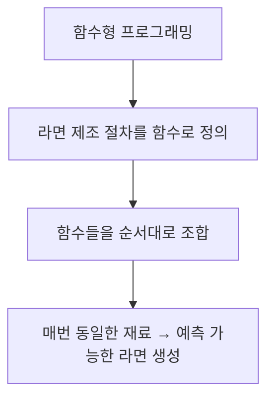

# 구조적 프로그래밍

전역 변수, GOTO 문, 복잡한 흐름 덩어리를 `순차`,`분기`,`반복` 으로 제어 흐름에 대해 구조를 설정한다.  
함수는 하나의 진입점과 하나의 탈출점을 갖도록 하며, 작고 잘 정의된 함수가 코드 이해와 테스트를 쉽게 만든다.  
코드를 예측 가능하게 작게 나눈다.  

- 제어흐름의 직접적인 전환에 대해 규칙을 부과한다.

# 객체 지향 프로그래밍

`구조적 프로그래밍`으로 `제어 흐름`을 단순화했다. OO는 `의존성 제어`와 `변경에 대한 유연성`을 추가한다.  
코드의 변경이 발생하더라도 다른 모듈에 영향을 최소화하는 구조이다.  
다형성을 이용하여 전체 시스템의 모든 소스 코드 의존성에 대한 _절대적인 제어권_ 을 획득할 수 있다.  

중요도가 낮은 저수준의 모듈의 의존성 방향을 고수준으로 흐르게 하되 고수준은 저수준에 대해 독립성을 보장할 수 있다.  
직접 제어 흐름은 예측은 쉬우나 유연성이 낮고,  
간접 제어 흐름은 유연성이 높으나 예측이 어렵다.  
(다형성, 추상화를 사용해 (런타임 시점에 결정) 시스템 내부의 의존 관계를 재구성하므로)  

- 제어흐름의 간접적인 전환에 대해 규칙을 부과한다.

# 함수형 프로그래밍

변수처럼 함수도 값으로 다루며 상태와 부작용을 배제한다. 함수는 입력이 같으면 항상 같은 출력을 내는 순수 함수로 구성한다.  
불변성을 중시하여 데이터를 변경하지 않고 변경된 버전을 새로 만든다.  

상태의 변경은 버그의 원흉이다. 수학적으로 `x = x + 1` 은 성립할 수 없다. Java, Python 등은 x 의 값을 1증가시켜 다시 덮어씌우지만,  
함수형 프로그래밍 언어에서는 새로운 x 를 정의하며 기존의 값은 변경되지 않는다.  

Java, Kotlin 에서는 람다와 클로저를 통해 함수형 스타일을 지원한다.  

- 할당문에 대해 규칙을 부과한다.

