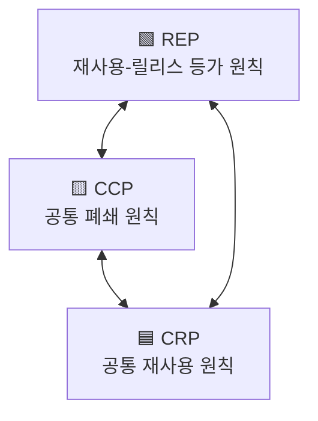

[SOLID](2_SOLID%20원칙.md) 원칙은 벽과 방에 벽돌을 배치하는 방법을 알려준다면,  
컴포넌트 원칙은 빌딩에 방을 배치하는 방법을 설명해준다.

컴포넌트는 배포 가능한 소프트웨어의 단위다.  
시스템보단 작고 소스 코드보다는 큰 모듈과 비슷하지만, 배포 가능한 단위가 핵심이다.  
Java 에선 Jar, War 파일로 패키징되는 것들이다.  

컴포넌트 수준에서는 변경이 곧 재배포를 의미하므로 변경과 배포의 최소 단위를 주의해야 한다.  
컴포넌트 안에서는 내부 구현이 자유롭지만, 인터페이스(경계)는 고정되어야 한다.  

클래스는 컴포넌트를 구성하고, 컴포넌트는 애플리케이션을 구성한다.  

# 컴포넌트 응집도

## REP: 재사용/릴리스 등가 원칙 (Reuse/Release Equivalence Principle)

컴포넌트를 재사용하려면 버전 관리, 문서화, 안정적으로 배포될 수 있어야 한다.  
다른 시스템에서도 인터페이스를 두고 배포/사용 가능한 상호작용이 일어나야 한다.  

컴포넌트를 사용하는 클라이언트 입장에서는 안전성과 사이드 이펙트를 고민하게 되므로  
재사용 가능한 컴포넌트라면 릴리스, 배포까지 염두에 둬야 한다.  

- 재사용 단위는 릴리스 단위와 같다.

## CCP: 공통 폐쇄 원칙 (Common Closure Principle)

SRP 원칙을 컴포넌트 관점에서 다시 쓴 것이다.  
변경의 이유가 같으면 같이 있어야 하고 다르면 같이 있지 말아야 한다.  

하나의 변경이 여러 컴포넌트에 퍼지고 사이드 이펙트를 방지할 수 있다.  
컴포넌트의 응집도를 높이는 핵심 원칙이다.  

- 동일한 시점에 동일한 이유로 변경되는 것들을 한데 묶어라.
- 서로 다른 시점에 다른 이유로 변경되는 것들을 서로 분리하라.

## CRP: 공통 재사용 원칙 (Common Reuse Principle)

어떤 클래스를 사용하고 싶을 때 사용하지 않을 클래스들까지 의존성을 가져간다면 변경에 여파가 전달된다.  
분명 사용하지는 않지만, 재배포, 재검증, 재컴파일 등 함께 따라 움직이게 될 수 있다.  

의존성이 불필요하게 커지지 않도록 컴포넌트를 잘 쪼개야 한다.  
클라이언트 입장에서 외부 종속을 방지하는 것에 집중한다.  

컴포넌트 설계는 변경의 책임과 재사용성의 트레이드 오프의 산물이다.  

- 컴포넌트 사용자들을 필요하지 않는 것에 의존하게 강요하지 마라.

## 원칙들의 다이어그램

REP 와 CCP 는 컴포넌트들을 더 크게 만든다. 반면 CRP 는 컴포넌트를 더 작게 만든다. 즉 서로 상충한다.  
`A` 와 `B` 가 자주 같이 변경되지만, 사용자가 `A` 만 필요한 경우 CCP 는 묶어두길, CRP 는 분리하길 말한다.  

이 3가지 원칙들은 서로 협력하면서 상충하게 되는데,  
REP+CRP 는 재사용성을 높이고 불필요한 의존성을 없애는 것에 집중한다.  
컴포넌트가 커지므로 작은 변경에 여러 컴포넌트 들이 수정/빌드/테스트/배포 된다.  

REP+CCP 는 변경의 이유가 같은 컴포넌트들을 묶어 변경 비용을 최소화한다.  
작은 기능만 필요하더라도, 필요하지 않은 여러 컴포넌트들까지 함께 의존하게 된다.  

재사용성과 개발 가능성이라는 상충하는 곳에서 균형을 이루도록 컴포넌트를 설계해야 한다.  
심지어 이 균형점은 매우 유동적인데 시간이 지남에 따라 맞지 않을 수 있다.  

