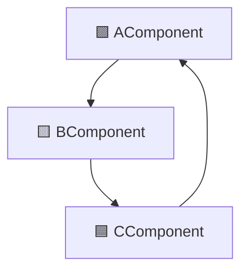

컴포넌트 사이의 관계를 설명한다. 개발 가능성과 논리적 설계 사이의 균형을 다룬다.  

# ADP 의존성 비순환 원칙 (Acyclic Dependencies Principle)

`A` -> `B` -> `C` -> `A`

순환 의존은 컴포넌트를 독립적으로 개발, 테스트, 배포할 수 없다.  
컴포넌트 간 의존은 반드시 방향성을 가지고 있어야 하며, 순환이 없어야 하며,  
항상 더 안정적인 컴포넌트 쪽으로 의존성의 방향이 흐르도록 설계해야 한다.  

- 컴포넌트 의존성 그래프에 순환이 있어서는 안 된다.

# SDP 안정된 의존성 원칙 (Stable Dependencies Principle)

- 안정성의 방향으로(더 안정된 쪽에) 의존하라.

