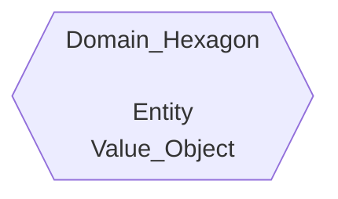
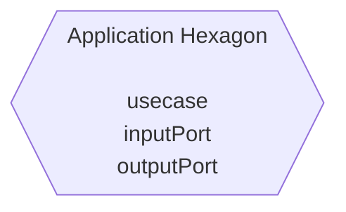
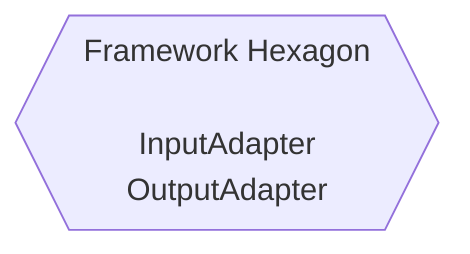
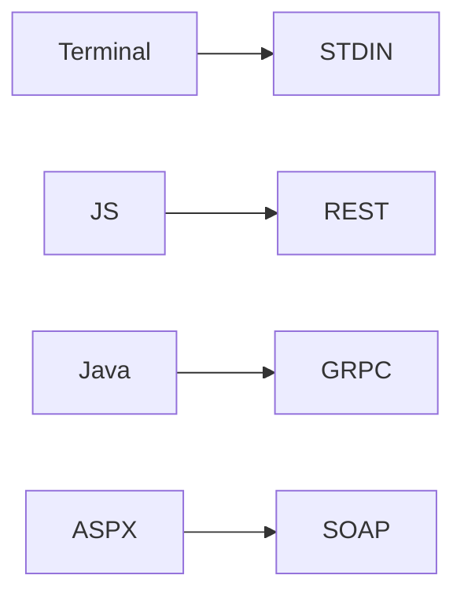

# 도메인 헥사곤

도메인 헥사곤은 실 세계 문제를 이해하고 모델링하는 활동을 나타낸다.<br/>
문제를 해결하는 비즈니스에 필요한 지식을 모델링하는 것이다.<br/>
해당 지식은 가능한 한 기술에 구애받지 않는 형태로 표현돼야 한다.<br/>

도메인 주도 설계에서 권장하는 것처럼 도메인 전문가나 해당 도메인 문제를 이미 알고 있는 개발자에게 조언을 구해야 한다.<br/>
주변에 도와줄 사람이 없다면 문제 영역에 대한 책이나 기타 자료를 찾아봄으로써 지식의 격차를 메우려고 노력해야 한다.<br/>

도메인 헥사곤 안에는 중요한 비즈니스 데이터와 규칙에 관련된 엔티티들이 있다.<br/>
이것들은 실제 문제에 대한 모델을 나타내기 때문에 중요하다.<br/>
문제 영역이 존재하고 도메인 전문가들이 분명하게 알고 있는 상황에서는<br/>
문제 영역과 엔티티, 값 객체와 같은 다른 도메인 객체로의 변환 방법을 파악하지 못하면<br/>
취약하거나 잘못된 가정을 기반으로 소프트웨어를 구축하게 될 것이다.<br/>

이것은 모든 소프트웨어가 간단하게 시작해서, 기반 코드가 커짐에 따라 기술 부채가 누적되고<br/>
유지보수가 더 어려워지는 이유 중 하나로 여겨진다.<br/>
이러한 약한 가정들은 초기에는 비즈니스 문제를 해결할 수 있지만, 응집력 있게 변경을 수용할 준비가 되어 있지 않은<br/>
취약하고 표현력이 부족한 코드로 이어질 수 있다.<br/>

도메인 헥사곤은 문제 영역을 표현하는 데 유용한 모든 종류의 객체들로 구성된다는 점에 주의하라.<br/>
다음 그림은 <strong>엔티티(Entity)</strong>와 <strong>값 객체(Value Object)</strong>를 기반으로 도메인 헥사곤을 나타낸 것이다.<br/>



## Entity

엔티티는 좀 더 표현력 있는 코드를 작성하는 데 도움을 준다.<br/>
도메인 주도 설계에서 설명했듯이, <u>객체를 특징짓는 것은 연속성과 정체성에 대한 감각이다.</u><br/>
연속성은 객체의 수명주기 및 변경 가능한 특성과 관련 있다.<br/>

예를 들어, 네트워크 및 토폴로지 인벤토리 시나리오에서 라우터의 존재가 있다.<br/>
라우터의 경우 상태가 활성 상태인지 비활성 상태인지를 정의할 수 있다.<br/>
라우터가 다른 라우터나 네트워크 장비와 갖는 관계를 설명하는 일부 속성을 할당할 수 있다.<br/>
시간이 지나면서 이러한 모든 속성은 변할 수 있다.<br/>
따라서 문제 영역에서 라우터가 고정된 것이 아니고, 라우터의 특성이 변경될 수 있다는 사실을 알 수 있다.<br/>
이 때문에 라우터는 수명주기를 가진다고 말할 수 있다.<br/>
이외에도 모든 라우터는 인벤토리에서 고유해야 하므로 식별자를 가져야 한다.<br/>
이러한 연속성과 정체성은 엔티티를 결정하는 요소이다.<br/>

```java
import java.util.List;
import java.util.function.Predicate;
import java.util.stream.Collectors;

public class Router {
    private final RouterType routerType;
    private final RouterId routerId;

    public Router(RouterType routerType, RouterId routerId) {
        this.routerType = routerType;
        this.routerId = routerId;
    }

    private static Predicate<Router> isCore() {
        return p -> p.getRouterType() == RouterType.CORE;
    }

    private static Predicate<Router> isEdge() {
        return p -> p.getRouterType() == RouterType.EDGE;
    }

    public static List<Router> retrieveRouter(
            List<Router> routers,
            Predicate<Router> predicate
    ) {
        return routers.stream()
                .filter(predicate)
                .collect(Collectors.<Router>toList());
    }

    public RouterType getRouterType() {
        return routerType;
    }
}
```

## 값 객체

값 객체는 무언가 고유하게 식별할 필요가 없는 경우는 물론이고,</br>
객체의 정체성보다 속성에 관심을 갖는 경우에도 코드의 표현력을 보완하는 데 도움이 된다.</br>
값 객체를 사용해 엔티티 객체를 구성할 수 있다.</br>
따라서 도메인 전체에서 예상치 못한 불일치를 방지하기 위해 값 객체를 변경할 수 없게 해야 한다.</br>

이전 라우터 예제에서 그랬듯이, 라우터 Type을 Router 엔티티에서 값 객체 속성으로 나타낼 수 있다.</br>

```java
public enum RouterType {
    EDGE,
    CORE,
    ;
}
```

도메인 헥사곤이 비즈니스 규칙을 엔티티와 값 객체로 캡슐화하는 방법이다.</br>

# 애플리케이션 헥사곤

소프트웨어가 도메인 수준에서 직접 동작할 필요가 없는 상황이 있다.</br>
클린 아키텍처에서 일부 오퍼레이션은 소프트웨어가 제공하는 자동화를 허용하기 위해서만 존재한다고 얘기한다.</br>
이러한 오퍼레이션은 비즈니스 규칙을 지원하지만, 소프트웨어의 컨텍스트 외부에는 존재하지 않는다.</br>

애플리케이션 헥사곤은 애플리케이션 특화 작업을 추상적으로 처리하는 곳이다.</br>
아직 기술 관심사를 직접 다루지 않기 떄문에 추상적인 것을 이야기한다.</br>
이 헥사곤은 도메인 비즈니스 규칙에 기반한 소프트웨어 사용자의 의도와 기능을 표현한다.</br>

위의 예시를 이어, 같은 타입의 라우터들을 조회하는 방법이 필요하다고 가정해 보자.</br>
이러한 결과를 만들기 위해서는 약간의 데이터 처리가 필요하다.</br>
라우터 타입을 조회하기 위해 사용자 입력을 받아야 한다.</br>
사용자 입력을 검증하기 위해 특정 비즈니스 규칙을 사용해야 할 수 있으며,</br>
외부 소스에서 가져온 데이터를 검증하기 위해 또 다른 비즈니스 규칙을 사용해야 할 수 있다.</br>

제약 조건을 위반하지 않는다면 소프트웨어는 같은 타입의 라우터 목록을 보여주는 데이터를 제공할 것이다.</br>
이러한 모든 작업은 유스케이스에서 그룹화할 수 있다.</br>

다음 그림은 <strong>유스케이스(Usecase)</strong>, <strong>입력 포트(Input Port)</strong>, <strong>출력 포트(Output Port)</strong>를
표현한다.</br>



## 유스케이스

도메인 제약사항을 지원하기 위해 시스템의 동작을 소프트웨어 영역 내에 존재하는 애플리케이션 특화 오퍼레이션을 통해 나타낸다.</br>
<strong><u>엔티티 및 다른 유스케이스와 직접 상호작용하고, 그것들을 유연한 컴포넌트로 만들 수 있다.</strong></u></br>
자바에서는 유스케이스는 소프트웨어가 할 수 있는 것을 표현하는 인터페이스로 정의된 추상화로 나타낸다.</br>

다음 코드는 필터링된 라우터 리스트를 가져오는 오퍼레이션을 제공하는 유스케이스를 보여준다.</br>

```java
import java.util.List;
import java.util.function.Predicate;

public interface RouterViewUseCase {
    List<Router> getRouters(Predicate<Router> filter);
}
```

매개변수로 받는 Predicate 필터는 해당 유스케이스를 구현할 때 라우터 리스트를 필터링하는 데 사용할 것이다.</br>

## 입력 포트

유스케이스가 소프트웨어가 하는 일을 설명하는 인터페이스라면 여전히 유스케이스 인터페이스를 구현해야 한다.</br>
이것이 입력 포트의 역할이다.</br>

애플리케이션 수준에서 유스케이스에 직접 연결되는 컴포넌트가 되기 때문에 입력 포트는 도메인 용어로</br>
소프트웨어의 의도를 구현할 수 있게 한다.</br>
다음은 유스케이스에 서술된 소프트웨어의 의도를 만족시키는 입력 포트를 구현한 것이다.</br>

```java
import java.util.List;
import java.util.function.Predicate;

public class RouterViewInputPort implements RouterViewUseCase {
    private RouterViewOutputPort routerListOutputPort;

    public RouterViewInputPort(RouterViewOutputPort routerListOutputPort) {
        this.routerViewOutputPort = routerListOutputPort;
    }

    @Override
    public List<Router> getRouters(Predicate<Router> filter) {
        var routers = routerListOutputPort.fetchRouters();
        return Router.retrieveRouter(routers, filter);
    }
}
```

<u>입력 포트의 구현에서는 애플리케이션 외부에서 라우터의 리스트를 가져올 수 있다.</u></br>
출력 포트를 사용해 이러한 동작을 수행할 수 있다.</br>

## 출력 포트

유스케이스가 목표를 달성하기 위해 외부 리소스에서 데이터를 가져와야 하는 상황이 있다.</br>
이것이 출력 포트의 역할이다.</br>

출력 포트는 유스케이스나 입력 포트가 오퍼레이션을 수행하기 위해 어떤 종류의 데이터를 외부에서 가져와야 하는지를</br>
기술에 구애받지 않고 설명하는 인터페이스로 표현된다.</br>

```java
public interface RouterViewOutputPort {
    List<Router> fetchRouters();
}
```

# 프레임워크 헥사곤

도메인 헥사곤으로 제한되는 중요한 비즈니스 규칙은 모든 것이 잘 구성된 것처럼 보이고,<br/>
애플리케이션 특화 오퍼레이션을 다루는 애플리케이션 헥사곤이 뒤따른다.<br/>

이제 소프트웨어와 통신할 수 있는 기술을 결정해야 하는 순간이 왔다.<br/>
통신은 두 가지 형태로 발생할 수 있다.<br/>

하나는 드라이빙(Driving), 다른 하나는 드리븐(Driven) 방식이다.<br/>
드라이버의 관점의 경우는 입력 어댑터(Input Adapter)를 사용하고,<br/>
드리븐 관점의 경우는 출력 어댑터(Output Adapter)를 사용한다.<br/>



## 드라이빙 오퍼레이션과 입력 어댑터

드라이빙 오퍼레이션(Driving operation)은 소프트웨어에 동작을 요청하는 것이다.<br/>

예를 들어, 드라이빙 오퍼레이션은 명령행 클라이언트를 갖는 사용자나 사용자를 대신하는 프런트엔드 애플리케이션이 될 수 있다.<br/>
소프트웨어에 의해 노출된 항목들의 정확성을 검사하는 일부 테스트 스위트가 될 수 있다.<br/>
노출된 일부 소프트웨어 기능과 상호작용이 필요한 대규모 생태계 내의 다른 애플리케이션일 수도 있다.<br/>

이러한 통신은 입력 어댑터 상단에 구축된 **애플리케이션 프로그래밍 인터페이스(API)** 를 통해 일어난다.<br/>

이 API는 외부 엔티티가 시스템과 상호작용하고, 외부 엔티티의 요청을 여러분의 도메인 애플리케이션으로 변환하는 방법을 정의한다.<br/>
드라이빙이라는 용어를 사용하는 이유는 이러한 외부 엔티티들이 시스템의 동작을 유도(driving)하기 때문이다.<br/>

입력 어댑터는 다음과 같이 애플리케이션에서 지원하는 프로토콜을 정의할 수 있다.<br/>



헥사고날 아키텍처를 통해 여러 시나리오에 대한 입력 어댑터를 생성하고,<br/>
도메인 관점에서 각 어댑터를 같은 입력 포트에 연결해 차례로 작동하도록 요청 다운스트림을 변환할 수 있다.<br/>

유스케이스 참조를 사용해 입력 포트 오퍼레이션 중 하나를 호출하는 입력 어댑터다.<br/>

```java
import java.util.List;

public class RouterViewCLIAdapter {
    RouterViewUseCase routerViewUseCase;

    public RouterViewCLIAdapter() {
        setAdapters();
    }

    public List<Router> obtainRelatedRouters(String type) {
        return routerViewUseCase.getRouters(
                outer.filterRouterByType(RouterType.valueOf(type))
        );
    }

    private void setAdapters() {
        this.routerViewUseCase =
                new RouterViewInputPort(RouterViewFileAdapter.getInstance());
    }
}
```

위의 코드는 STDIN 에서 데이터를 가져오는 입력 어댑터의 생성 방법이다.<br/>
유스케이스 인터페이스를 통해 입력 포트를 사용하는 것이 중요 포인트다.<br/>

여기서는 도메인 헥사곤의 제약사항을 다루기 위해 애플리케이션 헥사곤에서 사용하는 입력 데이터를 캡슐화하는 명령어를 전달했다.<br/>
시스템에서 REST 같은 다른 통신 형식을 활성화하려면 REST 통신 엔드포인트 노출을 위한 의존성을 포함하는 새로운 REST 어댑터를 생성하면 된다.<br/>

## 드리븐 오퍼레이션과 출력 어댑터

드라이빙 오퍼레이션의 반대편에는 **드리븐 오퍼레이션(Driven Operation)** 이 있다.<br/>
이 오퍼레이션은 애플리케이션의 트리거되고, 외부에서 소프트웨어 요구사항을 충족시키는 데 필요한 데이터를 가져온다.<br/>

일반적으로 드리븐 오퍼레이션은 일부 드라이빙 오퍼레이션에 응답해 발생한다.<br/>
출력 어댑터를 통해 드리븐 오퍼레이션을 정의한다.<br/>
이 어댑터는 그것들을 구현하는 출력 포트와 일치해야 한다.<br/>

출력 포트는 일부 애플리케이션 특화 작업을 수행하는 데 필요한 데이터의 종류를 알려준다.<br/>
데이터를 어떻게 가져올지 설명하는 것은 출력 어댑터에 달려있다.<br/>

출력 어댑터와 드리븐 오퍼레이션에 대한 다이어그램이다.

```mermaid
flowchart LR
    id1[(MariaDB)]
    DBMS --> id1
    FILE --> JSON
    SMTP --> asdf(@)
    OAUTH2 --> Key
```

예를 들어, 애플리케이션이 오라클 관계형 데이터베이스로 시작했고, 얼마 후 기술을 변경해<br/>
데이터 소스로 MongoDB를 수용하는 NoSQL 방식으로 바꾸기로 결정했다고 가정해 보자.<br/>
처음에는 오라클 데이터 베이스와 지속성을 허용하는 출력 어댑터만 가지고 있었다.<br/>

**MongoDB와 통신하기 위해 애플리케이션 헥사곤과 가장 중요한 도메인 헥사곤은 건드리지 말고 그대로 두고**<br/>
프레임워크 헥사곤에 출력 어댑터를 생성해야 한다.<br/>

입력 어댑터와 출력 어댑터 모두 헥사곤 내부를 가리키고 있기 때문에<br/>
이것들을 애플리케이션 및 도메인 헥사곤에 종속되게 만들어 의존성을 역전시킨다.<br/>

```java
import java.util.ArrayList;
import java.util.List;

public class RouterViewFileAdapter implements RouterViewOutputPort {
    @Override
    public List<Router> fetchRouters() {
        return readFileAsString();
    }

    private static List<Router> readFileAsString() {
        List<Router> routers = new ArrayList<>();
        try (Stream<String> stream = new BufferedReader(
                new InputeStreamReader(RouterViewFileAdapter.class.getClassLoader()
                        .getResourceAsStream("routers.txt"))).lines()) {
            stream.forEach(line -> {
                String[] routerEntry = line.split(";");
                var id = routerEntry[0];
                var type = routerEntry[1];
                Router router = new Router(RouterType.valueOf(type), RouterId.of(id));
                routers.add(router);
            });
        } catch (Exception e) {
            e.printStackTrace();
        }
        
        return routers;
    }
}
```

애플리케이션이 외부 데이터를 얻는 방법을 지정하기 위해 출력 어댑터가 출력 포트 인터페이스를 구현하는 예시이다.<br/>
출력 포트는 애플리케이션이 외부로부터 필요로 하는 데이터를 나타낸다.<br/>

## 헥사고날 접근 방식의 장점

헥사고날 아키텍처는 클래스, 패키지, 코드 구조가 전체적으로 구성되는 방법에 영향을 주어 어떠한 표준을 만드는 기초로 사용할 수 있다.</br>

## 변경 허용(Change-tolerant)

많은 이유로 인해 애플리케이션의 변화는 개발자가 감내해야할 몫이다.</br>
헥사고날 아키텍처의 포트와 어댑터라는 특성은 마찰이 적고 기술 변화를 흡수할 준비가 되어 있는</br>
애플리케이션을 위한 아키텍처 원칙을 강력한 이점으로 제공한다.</br>

## 유지보수성(Maintainability)

비즈니스 규칙을 변경해야 할 경우 유일하게 변경해야 하는 것은 도메인 헥사곤이다.</br>
반면, 아직 애플리케이션에서 지원하지 않는 특정 기술이나 프로토콜을 사용하는 기존 기능을 고객이</br>
트리거할 수 있게 허용해야 하는 경우 프레임워크 헥사곤에서 실행할 수 있는 새로운 어댑터를 생성하기만 하면 된다.</br>

## 테스트 용이성(Testability)

헥사고날 아키텍처의 궁극적인 목표 중 하나는 UI와 데이터베이스 같은 외부 의존성이 없더라도</br>
개발자가 애플리케이션을 테스트할 수 있게 하는 것이다.</br>

코드의 가장 중요한 부분을 테스트하는 데 필요한 유연성을 제공함으로써 더욱더 계속해서 통합하는 방식을 허용한다.</br>

### 요약

소프트웨어 아키텍처는 견고하고 높은 품질의 애플리케이션을 개발하기 위한 기반을 만드는 데 중요한 역할을 한다.</br>
헥사고날 아키텍처의 핵심 컴포넌트들의 장점과 특성을 이해하고 활용하여 고품질의 애플리케이션을 생산할 수 있다.</br>