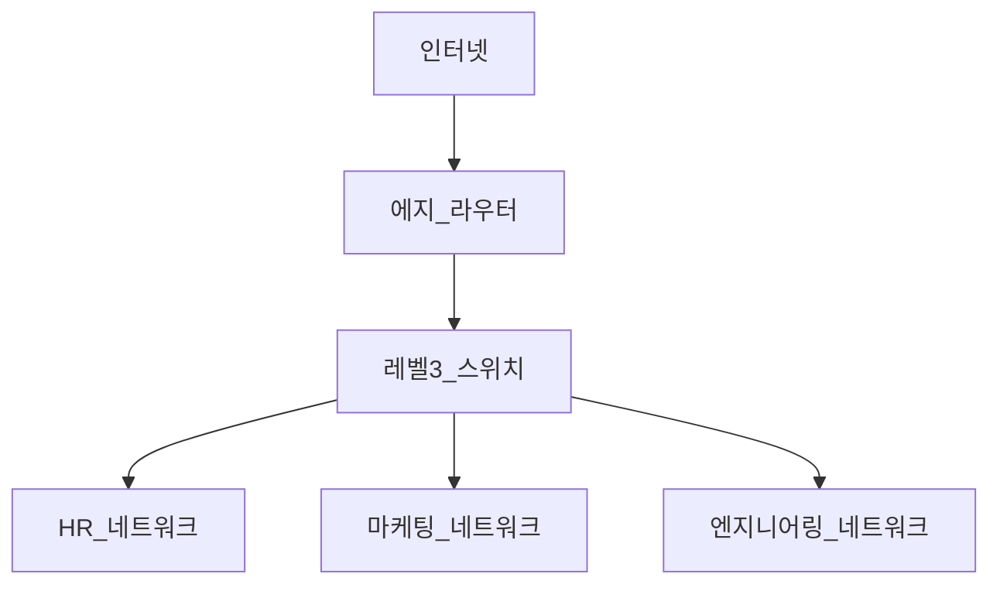
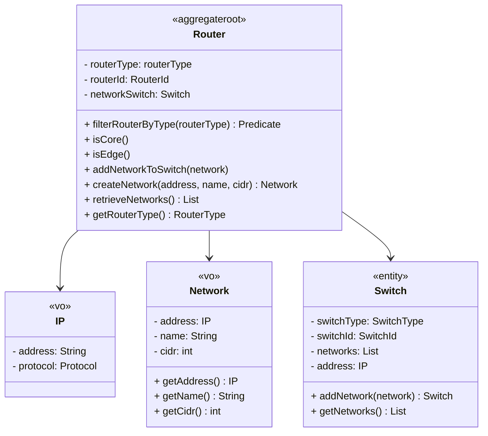

## 애그리게잇을 통한 일관성 보장

관련 엔티티와 값 객체의 그룹이 함께 전체적인 개념을 섦여하는 경우에 애그리게잇(Aggregate)을 사용한다.<br/>
애그리게잇 내부의 객체들은 일관되고 격리된 방식으로 동작한다.<br/>
이러한 일관성을 달성하려면, 애그리게잇 객체에 대한 모든 변경은 해당 애그리게잇에 부과되는 변경 사항에 따라 결정되는 것이 보장돼야 한다.<br/>

애그리게잇은 객체의 데이터와 동작을 조정하는 오케스트레이터(orchestrator)와 같다.<br/>
- aggreegate root(entry point): 상호작용할 진입점

성능과 확장성 관점에서 항상 애그리게잇을 가능한 한 작게 유지해야 한다.<br/>
일반적으로 작은 애그리게잇은 애그리게잇 루트로 동작하는 엔티티와 다른 값 객체들을 포함한다.<br/>

두 개의 서로 다른 애그리게잇이 상호작용하게 만드는 방버은 애그리게잇 루트(고유 ID를 갖는 엔티티 루트)를 사용하는 것이다.<br/>
애그리게잇 루트는 지속성 목적으로 사용된다.<br/>

### 예시

예를 들어, 비즈니스 요구사항 중 하나는 특정 에지 라우터에 연결된 장비와 네트워크를 카탈로그로 만드는 것이다.<br/>
**에지 라우터** 아래에는 다양한 네트워크에 대한 **VLAN(Virtual Local-Area Network)** 생성을 담당하는 **레벨 3 스위치**가 있다.<br/>



애그리게잇의 진원지는 애그리게잇 루트가 되는 **에지 라우터 엔티티**다.<br/>
**스위치도 엔티티**다.<br/>
스위치에 연결된 HR, 마케팅, 엔지니어링 VLAN 네트워크로 구성된 네트워크는 결과적으로 에지 라우터에 연결된다는 것이다.<br/>
인터넷과 다른 네트워크들은 다른 컨텍스트에서 고려될 수 있다.<br/>

에그리게잇에 대한 UML<br/>



코드로 알아보기.<br/>
값 객체 Network<br/>

```java
public class Network {
    private final IP address;
    private final String name;
    private final int cidr;
    
    public Network(IP address, String name, int cidr) {
        if (cidr < 1 || cidr > 32) {
            throw new IllegalArgumentException("Invalid CIDR value");
        }
        this.address = address;
        this.cidr = cidr;
    } 
}
```

값 객체 인터넷 프로토콜(IP: Internet Protocol)<br/>

```java
public class IP {
    private final String address;
    private final Protocol protocol;

    private IP(String address) {
        if (address == null) {
            throw new IllegalArgumentException("Null IP address");
        }

        if (address.length() <= 15) {
            this.protocol = Protocol.IPV4;
        } else {
            this.protocol = Protocol.IPV6;
        }

        this.address = address;
    }
}
```

IP와 Network 값 객체 클래스의 생성자에 몇 가지 유효성 검사 규칙이 있다.<br/>
이러한 유효성 검사는 잘못된 값 객체의 생성을 방지하는 방패 역할을 한다.<br/>
클라이언트의 유효성 검사 부담을 덜어주며 각각의 값 객체가 실행하는 유효성 검사 분담이 가능해진다.<br/>

IP 값 객체를 구성하는 enum 값 객체<br/>

```java
public enum Protocol {
    IPV4,
    IPV6,
    ;
}
```

위의 값 객체를 모델링하고 나면 비로소 Switch 클래스를 모델링하는 데 필요한 값 객체가 갖춰진 셈이다.<br/>

엔티티 Switch<br/>

```java
import java.util.ArrayList;
import java.util.Arrays;
import java.util.List;

public class Switch {
    private SwitchType type;
    private SwitchId switchId;
    private List<Network> networks;
    private IP address;

    public Switch(
            SwitchType switchType,
            SwitchId switchId,
            List<Network> networks,
            IP address
            ){
        this.switchType = switchType;
        this.switchId = switchId;
        this.networks = networks;
        this.address = address;
    }
    
    public Switch addNetwork(Network network) {
        var networks = new ArrayList<>(Arrays.asList(network));
        networks.add(network);
        return new Switch(this.switchType, this.switchId, networks, this.address);
    }
    
    public List<Network> getNetworks() {
        return networks;
    }
}
```

네트워크 스위치에 직접 연결되어 있기 때문에 스위치에 더 많은 네트워크를 추가하는 기능인<br/>
addNetwork 메서드를 만들었는데, 이 메서드는 확장된 네트워크 리스트를 갖는 새로운 Switch 객체를 반환한다.<br/>

지금까지 생성한 값 객체를 토대로 애그리게잇 루트를 갖는 바운더리를 만든다.<br/>
Router 엔티티 클래스의 역할이다.<br/>

```java
import java.util.function.Predicate;

public class Router {
    private final RouterType routerType;
    private final RouterId routerId;
    private Switch networkSwitch;

    public Router(RouterType routerType, RouterId routerId) {
        this.routerType = routerType;
        this.routerId = routerId;
    }

    public static Predicate<Router> filterRouterByType(RouterType routerType) {
        return routerType.equals(RouterType.CORE) ? Router.isCore() : Router.isEdge();
    }

    public static Predicate<Router> isCore() {
        return p -> p.getRouterType() == RouterType.CORE;
    }

    public static Predicate<Router> isEdge() {
        return p -> p.getRouterType() == RouterType.EDGE;
    }

    public void addNetworkToSwitch(Network network) {
        this.networkSwitch = networkSwitch.addNetwork(network);
    }

    public Network createNetwork(IP address, String name, int cidr) {
        return new Network(address, name, cidr);
    }

    public List<Network> retrieveNetworks() {
        return networkSwitch.getNetworks();
    }

    public RouterType getRouterType() {
        return routerType;
    }
}
```

값 객체 및 엔티티의 메서드들을 하나로 통합하는 애그리게잇 루트에 두면<br/>
해당 컨테스트 하위의 모든 객체를 처리하는 책임을 애그리게잇 루트에 위임하게 된다.<br/>
따라서 이러한 객체 집합을 다루는 경우 일관성이 향상된다.<br/>
빈약한 도메인 모델도 방지할 수 있다.<br/>