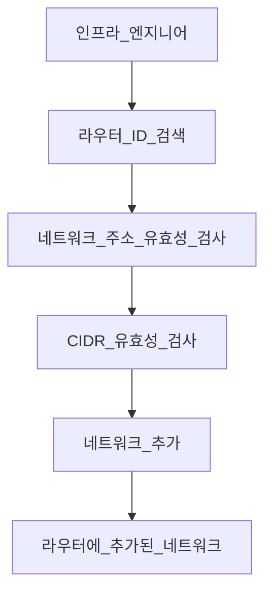
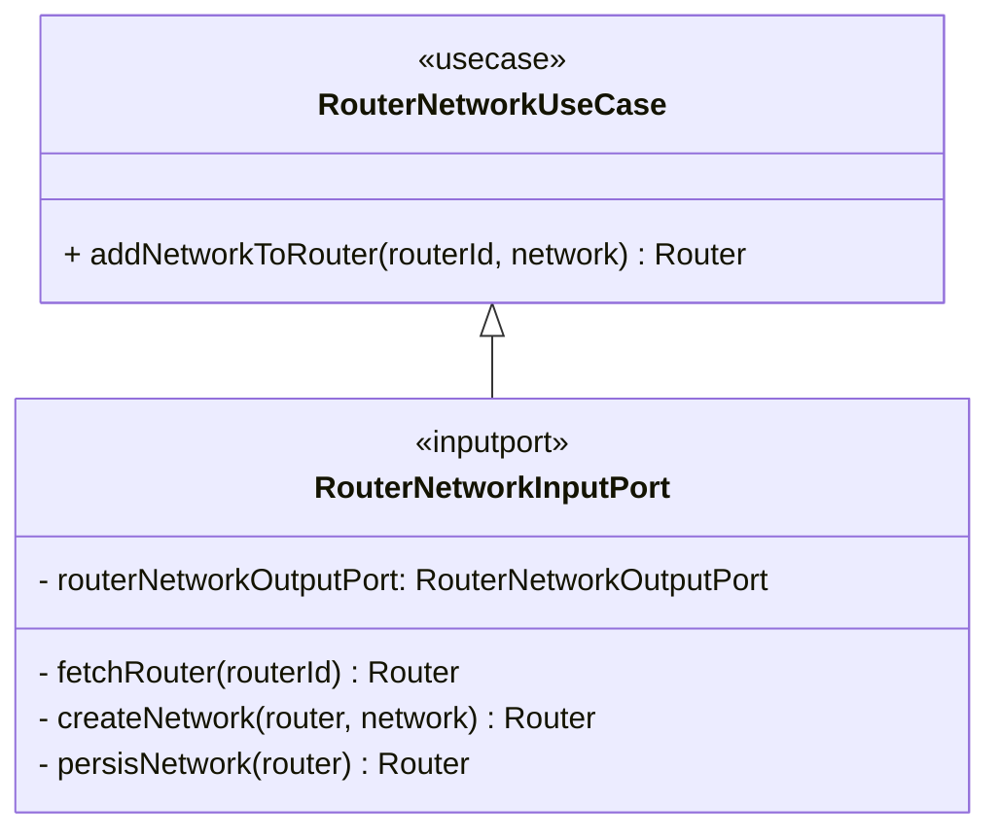

# 2-2.유스케이스를 통한 소프트웨어의 동작 표현

소프트웨어 시스템은 사용자나 다른 소프트웨어 시스템이 정의한 목표를 달성하기 위해<br/>
함께 동작하는 일련의 행위 집합에 불과하다.<br/>
단독, 혹은 다른 소프트웨어 동작과 결합해 가치 있는 소프트웨어 목표를 실현하는 데 기여하는 의미 있는 행동이다.<br/>

이러한 목표는 사용자나 시스템이 관심을 갖고 표현하는 표현하는 **요구사항과 밀접하게 연결**되어 있다.<br/>
이처럼 관심을 갖는 사람들을 이해당사자(stakeholder)나 액터(actor)로 분류할 수 있으며,<br/>
이들은 목표(goal)로 변환될 실 세계의 요구사항을 도출할 수 있다.<br/>
이러한 요구사항은 SuD(System under Discussion)나 단순히 개발 중인 시스템에 충족될 것이다.<br/>

**드라이버 오퍼레이션과 드리븐 오퍼레이션**을 논의할 때 이러한 액터를 연관 시킬 수 있다.<br/>

> 드라이버 오퍼레이션: 소프트웨어에 동작을 요청하는 것.<br/>
> 드리븐 오퍼레이션: 외부에서 소프트웨어 요구사항을 충족시키는 데 필요한 데이터를 가져온다.<br/>

**드라이버 액터(driver actor)** 는 SuD 행위 중 하나를 트리거하는 사람이나 시스템이고,<br/>
**드리븐 액터(driven actor)** 는 SuD가 소비하는 외부 시스템이다.<br/>

비즈니스 요구사항을 시스템이 동작하는 방법을 표현한 기법 중 하나인 유스케이스.<br/>
유스케이스는 SuD 목표, 목표를 충족하기 위한 수단이나 행위, 가능한 실패 시나리오와 이들이 발생하는 경우에<br/>
수행해야 할 작업을 설정하는 귀중한 기법이다.<br/>

## 유스케이스 작성 방법

형식을 갖춘 상세 유스케이스(fully dressed): 입력 데이터, 가능한 행위, 유스케이스 결과에 대해 상세하고 표준화된 정보 규정<br/>
형식을 따르는 유스케이스는 명확한 경로를 제공한다.<br/>

ex.<br/>
- 액터(Actor): 인프라 엔지니어
- 목표(Goal): 에지 라우터에 새로운 네트워크를 추가
- 범위(Scope): 인프라 부서
- 트리거(Trigger): 다른 네트워크를 통한 네트워크 액세스를 분리하는 특별한 이유
- 입력 데이터(Input data): 라우터 ID, 네트워크 이름, 주소, CIDR
- 액션(Actions):
  1. 라우터 ID를 찾는다.
  2. 네트워크 주소가 이미 존재하는지 확인한다.
  3. CIDR이 최솟값 아래인지 확인한다.
  4. 이전 검사에서 문제가 없다면 통보된 라우터에 네트워크를 추가한다.

위의 예시와 다른 유스케이스로는 덜 형식적이면서 간단한 타입의 유스케이스가 있다.<br/>
간단한 타입의 유스케이스가 가진 주된 특징은 정보 기록 방식에 대한 표준을 따르지 않는다는 것이다.<br/>
이것들은 한,두 단락으로 가능한 한 많은 의미를 전달하려고 시도한다.<br/>

형식을 갖추거나 간단한 작성 기법 외에, 자동화된 테스트로 직접 사용자의 의도를 코드로 표현하는 것이 가능하다.<br/>
발견(discovery), 형식화(formulation), 자동화(automation)와 관련된 **행위 주도 설계(BDD: Behavior Driven Desgin)** 원칙에 의존한다.<br/>

1. 비즈니스 관련자의 요구를 발견한다.
2. 발견의 결과로 비즈니스 요구를 기술하는 상황과 행동에 대한 예제를 포함한다.
3. 예제를 기반으로 구조화된 문서가 만들어지는 형식화 과정이다.
4. 행동을 검증하기 위해 테스트가 만들어지고 실행되는 단계다.

소프트웨어 개발 초기 BDD를 사용할 때 비즈니스 아이디어를 검증하기 위해 만든 예제와<br/>
테스트를 기반으로 반복적으로 유스케이스를 생성할 기회를 갖게 된다.<br/>

큐컴버(Cucumber) 같은 도구의 지원을 받아 헥사고날 애플리케이션에 BDD 방식을 적용할 수 있다.<br/>
이전에 글로 작성한 유스케이스를 변환하려면 큐컴버의 기능 파일(Feature file)을 만들어야 한다.<br/>

```gherkin
@addNetworkToRouter
Feature: 라우터에 네트워크를 추가한다.
기존 라우터에 네트워크를 추가할 수 있기를 원한다.

Senario: 기존 라우터에 네트워크 추가
    Given 라우터 ID와 네트워크 세부 사항을 제공한다.
    When 라우터를 발견했다.
    And 네트워크 주소가 유효하며 기존에 존재하지 않는다.
    And CIDR이 유효하다.
    Then 라우터에 네트워크를 추가한다.
```

간단한 도식화



유스케이스는 **대상(What)** 에 있지 않고 **방법(How)** 에 있다.<br/>
유스케이스의 예상 행위를 기록하고 구조화해서 유스케이스의 처리 방식에 대한 아이디어를 명확히 하고<br/>
더 잘 조직화하는 추가적인 귀중한 단계에 참여하게 된다.<br/>

헥사고날 아키텍쳐에서는 유스케이스를 바로 구현하는 것보다는 추상적 개념을 통해 설계하는 것이 좋다.<br/>
아래의 예제는 네트워크를 추가하는 유스케이스의 인터페이스이며 추상 클래스를 사용해도 문제가 없다.<br/>

```java
public interface RouterNetworkUseCase {
    Router addNetworkToRouter(RouterId routerId, Network network);
}
```

인터페이스로 정의하는 이유는 다음과 같다.<br/>

- 유스케이스 목표를 달성하는 다양한 방법을 제공한다.
- 구현보다는 추상적 개념에 대한 의존성을 허용한다.

헥사고날 아키텍쳐에서 유스케이스의 역할은 **입력 포트 구현을 허용하는 것**이다.<br/>

