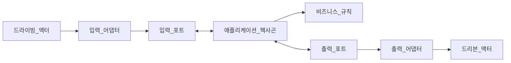

# 입력 포트를 갖는 유스케이스 구현

헥사고날 아키텍처에는 **드라이빙 오퍼레이션**과 **드리븐 오퍼레이션**이라는 개념이 있다.<br/>
이러한 분류가 상호작용하는 액터를 결정하는 데 유효하다.<br/>

드라이빙 액터는 요청을 보내는 주체, 드리븐 액터는 외부 컴포넌트를 나타낸다.<br/>

**유스케이스는 애플리케이션이 지원해야 하는 동작을 알려주고, 입력 포트는 이러한 동작의 수행 방법을 알려준다.**<br/>
입력 포트는 드라이빙 액터로부터 데이터가 프레임워크 헥사곤의 어댑터 중 하나를 통해 헥사고날 시스템에 도달할 때 데이터가 흐르도록 하는 통합 역할을 한다.<br/>
입력 포트를 통해 출력 포트와 어댑터를 통한 외부 시스템과의 통신도 조정한다.<br/>



```java
public class RouterNetworkInputPort implements RouterUseCase {
    private final RouterNetworkOutputPort routerNetworkOutputPort;
    //...
}
```

입력 포트 구현을 통해 라우터에 네트워크를 추가하는 유스케이스 목표를 만족시키 위해 소프트웨어가 수행햐 하는 동작에 대한 명확한 뷰를 갖게 된다.<br/>

```java
public interface RouterNetworkOutputPort {
    Router fetchRouterById(RouterId routerId);
    boolean persistRouter(Router router);
}
```

출력 포트는 애플리케이션이 데이터를 외부 소스로부터 얻어 유지하려는 의도를 나타낸다.<br/>
입력 포트는 문제 영역에 대한 어떤 특정 항목도 포함되어 있지 않다.<br/>
주된 관심사는 도메인 서비스를 통한 내부 호출과 외부 포트를 통한 외부 호출을 조정하고 데이터를 처리하는 것이다.<br/>
입력 포트는 오퍼레이션의 실행 순서를 결정하고 도메인 헥사곤이 이해할 수 있는 형식으로 데이터를 제공한다.<br/>