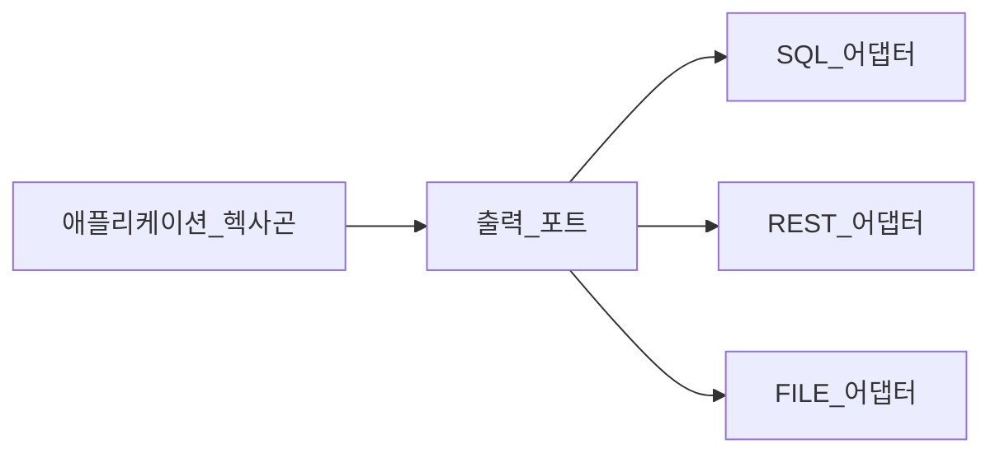

# 출력 포트를 이용한 외부 데이터 처리

출력 포트는 보조 포트로도 알려져 있으며, 외부 데이터를 처리하려는 애플리케이션의 의도를 나타낸다.<br/>
출력 포트를 통해 시스템이 외부 세계와 통신할 수 있도록 준비한다.<br/>
이러한 통신을 허용함으로써 출력 포트를 드리븐 액터와 오퍼레이션에 연결할 수 있다.<br/>
드리븐 액터는 외부 시스템이지만 드리븐 오퍼레이션은 이런 시스템과 통신하는 데 사용된다.<br/>

세부적인 결정을 늦추면 더 많은 정보를 얻을 수 있고, 이를 기초로 제대로 된 결정을 내릴 수 있다. 즉, 선택사항을 미뤄두면 더 나은 결정을 내리는데 도움이 된다.<br/>
"개발 초기에 데이터베이스 시스템을 선택할 필요가 없다.", "개발 초기에는 웹 서버를 선택할 필요가 없다."<br/>
지속성이나 메시징 매커니즘이 애플리케이션의 설계에 충분한 영향을 주지 못할만큼 관련성이 낮다는 것은 아니지만,<br/>
외부 기술이 애플리케이션의 설계 방법을 지시하지 않게 하자는 것이다.<br/>

## 리포지토리만 문제가 아니다

헥사고날 애플리케이션에서는 리포지토리를 출력 포트로 대체한다.<br/>
출력 포트의 기본 개념은 지속성이나 모든 종류의 외부 통신이 데이터베이스 시스템에서 발생할 것이라 추론하지 않는 것이다.<br/>
출력 포트의 범위는 더 넓다. 예를 들면, 출력 포트는 데이터베이스, 메시징 시스템, 로컬 파일 시스템, 네트워크 시스템 같은 모든 시스템과의 통신에 관심을 갖는다.<br/>

```java
public interface PasswordResetTokenOutputPort {
    PasswordResetToken findByToken(String token);
    PasswordResetToken findByUser(User user);
    Stream<PasswordResetToken> findAllByExpiryDateLessThan(Date now);
    void deleteByExpiryDateLessThan(Date now);
    void deleteAllExpiredSince(Date now);
}
```

애노테이션을 사용하는 목적이 특정 프레임워크에만 있는 기능을 구현하기 위해서라면 소프트웨어는 해당 프레임워크와 결합하게 된다.<br/>
자파 표준 명세에 기반한 기능을 구현하기 위해 애노테이션을 사용한다면 소프트웨어가 변경에 더 잘 견디게 만들기 위한 노력을 하고 있는 것이다.<br/>

오늘은 관계형 데이터 베이스에서 직접 가져올 수 있다, 내일은 REST API 에서 얻을 수 있다.<br/>
이러한 세부사항은 애플리케이션 헥사곤 관점에서는 필요하지 않다.<br/>
이들의 주된 관심사는 액티비티를 수행하는 데 필요한 데이터의 종류를 표현하는 것이다.<br/>



이러한 애플리케이션 헥사곤 컴포넌트가 어떤 데이터를 필요로 하는지 정의하는 방법은<br/>
**도메인 헥사곤의 엔티티와 값 객체** 를 기반으로 한다.<br/>
출력 포트의 주된 목표는 데이터를 가져오는 방법을 지정하지 않고 어떤 종류의 데이터가 필요한지 지정하는 것이다.<br/>

## 어디에 출력 포트를 사용하는가?

애플리케이션에서 유용한 무언가를 달성하기 위해 필요한 동작을 설정했다.<br/>
이러한 동작 중에는 외부 시스템과 상호작용해야 하는 상황이 있을 수 있다.<br/>
따라서 출력 포트를 만들고 활용하는 이유는 유스케이스에서 수행하는 활동 때문일 수 있다.<br/>

```java
public class RouterNetworkInputPort implements RouterNetworkUseCase {
    private final RouterNetworkOutputPort routerNetworkOutputPort;
    // ...
}
```

유스케이스에서 정의되고 입력 포트에 의해 구현되는 오퍼레이션 중 일부 오퍼레이션은 외부 소스에서 데이터를 가져오거나 데이터를 유지하는 역할을 한다.<br/>
이것이 유스케이스 목표를 달성하는 데 필요한 데이터를 제공하기 위해 출력 포트가 필요한 이유다.<br/>

소프트웨어의 의도가 구현되는 방법은 말하지 않고 목표를 사용해 소프트웨어 의도를 표현하는 것과 같은 방식으로,<br/>
출력 포트는 데이터가 어떤 방법으로 얻어지는지 알 필요 없이 애플리케이션이 필요로 하는 데이터의 종류를 나타냄으로써 같은 작업을 한다.<br/>