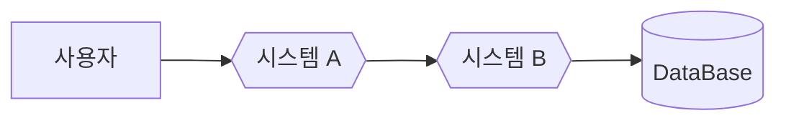

# 애플리케이션 간의 헥사고날 시스템 호출

모놀리스(monolith) 에서는 객체와 메서드 호출 사이에 직접적으로 데이터가 흐른다.  
같은 애플리케이션 내의 모든 소프트웨어 명령어는 그룹화되어 있으며, 통신 오버헤드를 줄이고 시스템에서 생성된 로그가 중앙 집중화된다.  

마이크로서비스(microservice)와 분산 시스템에는 전체 시스템이 제공하는 기능을 위해 협력하는 독립 실행형 애플리케이션 사이에서 일부 데이터가 네트워크를 통해 흐른다.  

분산 방식에서는 둘 이상의 자급식(self-contained) 헥사고날 시스템이 전체 헥사고날 기반 시스템을 구성할 수 있다.  
헥사고날 시스템 A 는 요청을 시작하는 주요 액터로 행동하며 헥사고날 시스템 B 에 대한 드라이빙 오퍼레이션을 트리거 한다.

시스템 A 는 출력 어댑터 중 하나를 통해 요청을 트리거한다.  
이 요청은 시스템 B 의 입력 어댑터 중 하나로 직접 이동한다.  
분산 아키텍처의 흥미로운 점은 모든 시스템 컴포넌트를 개발하는 데 같은 프로그래밍 언어를 사용할 필요가 없다는 것이다.