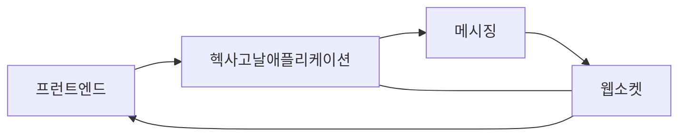

# 메시징과 이벤트2

- 헥사고날 애플리케이션이 카프카로 이벤트를 내보내고 소비할 수 있도록 적절한 포트의 어댑터를 추가해야 한다.

```java
public interface NotifyEventOutputPort {
    void sendEvent(String event);
    String getEvent();
}
```

- 출력 어댑터로 출력 포트를 구현한다.

```java
public class NotifyEventKafkaAdapter implements NotifyEventOutputPort {
    private static String KAFKA_BROKERS = "localhost:9092";
    private static String GROUP_ID_CONFIG = "consumerGroup1";
    private static String CLIENT_ID = "hexagonalclient";
    private static String TOPIC_NAME = "topology-inventory-events";
    private static String OFFSET_RESET_EARLIER = "earliest";
    private static Integer MAX_NO_MESSAGE_FOUND_COUNT = 100;
    /** 코드 생략 **/
}
```

- 카프카 토픽에 메시지를 보내기 위한 메서드를 작성한다.

```java
private static Producer<Long, String> createProducer() {
    Properties props = new Properties();
    
    props.put(ProducerConfig.BOOTSTRAP_SERVERS_CONFIG, KAFKA_BROKERS);
    props.put(ProducerConfig.CLIENT_ID_CONFIG, CLIENT_ID);
    props.put(ProducerConfig.KEY_SERIALIZER_CLASS_CONFIG, LongSerializer.class.getName());
    props.put(ProducerConfig.VALUE_SERIALIZER_CLASS_CONFIG, StringSerializer.class.getName());
    
    return new KafkaProducer<>(props);
}
```

- Producer 메서드가 생성한 메시지를 소비하는 consumer 메서드를 작성한다.

```java
public static Consumer<Long, String> createConsumer() {
    Properties props = new Properties();
    
    props.put(ConsumerConfig.BOOSTRAP_SERVERS_CONFIG, KAFKA_BROKERS);
    props.put(ConsumerConfig.GROUP_ID_CONFIG, GROUP_ID_CONFIG);
    props.put(ConsumerConfig.KEY_DESERIALIZER_CLASS_CONFIG, LongDeserializer.class.getName());
    props.put(ConsumerConfig.VALUE_DESERIALIZER_CLASS_CONFIG, StringDeserializer.class.getName());
    props.put(ConsumerConfig.MAX_POLL_RECORDS_CONFIG, 1);
    props.put(ConsumerConfig.ENABLE_AUTO_COMMIT_CONFIG, "false");
    props.put(ConsumerConfig.AUTO_OFFSET_RESET_CONFIG, OFFSET_RESET_EARLIER);
    
    Consumer<Long, String> consumer = new KafkaConsumer<>(props);
    consumer.subscribe(Collections.singletonList(TOPIC_NAME));
    
    return consumer;
}
```

- 카프카 producer 인스턴스로 메시지를 보내는 메서드를 작성한다.

```java
@Override
public void sendEvent(String eventMessage) {
    var record = new ProducerRecord<Long, String>(TOPIC_NAME, eventMessage);
    try {
        var metadata = producer.send(record).get();
        getEvent();
    } catch (Exception e) {
        e.printStackTrace();    
    }
}
```

- 카프카의 메시지를 소비하고 그것을 WebSocekt 서버로 보내기 위한 메서드를 작성한다.

```java
@Override
public String getEvent() {
    int noMessageToFetch = 0;
    AtomicReference<String> event = new AtomicReference<>("");
    
    while(true) {
        /** 코드 생략 **/
        consumerRecords.forEach(record -> {
            event.set(record.value());
        });
    }
    var eventMessage = event.toString();
    if(sendToWebsocket) {
        sendMessage(eventMessage);
    }
    return eventMessage;
}
```

- 메시지를 검색한 후 WebSocket 서버로 메시지를 전달하는 sendMessage 를 호출한다.

```java
public void sendMessage(String message) {
    try {
        var client = new WebSocketClientAdapter(new URI("ws://localhost:8887"));
        client.connetBlocking();
        client.send(message);
        client_closeBlocking();
    } catch (URISyntaxException | InterruptedException e) {
        e.printStackTrace();
    }
}
```

/** 생략 **/
카프카 토픽에서 메시지가 소비되면 헥사고날 애플리케이션은 `WebSocketClientAdapter`를 사용해 `WebSocket` 서버로 메시지를 전달한다.  
헥사고날 애플리케이션에서 마지막으로 해야 할 일은 지금 생성한 포트와 어댑터를 사용해 이벤트를 보내는 메서드를 작성하는 것이다.  

```java
public class RouterNetworkInputPort implements RouterNetworkUseCase {
    /** 코드 생략 **/
    @Override
    public Router addNetworkToRouter(RouterId routerId, Network network) {
        var router = fetchRouter(routerId);
        notifyEventOutputPort.sendEvent("adding " + network.getName() + "network to router " + router.getId().getUUID());
        
        return createNetwork(router, network);
    }
    
    @Override
    public Router getRouter(RouterId routerId) {
        notifyEventOutputPort.sendEvent("Retrieving router ID" + routerId.getUUID());
        
        return fetchRouter(routerId);
    }
}
```



카프카와 웹소켓을 이용한 이러한 통합은 헥사고날 애플리케이션이 메시지 주도 오퍼레이션을 처리하는 방법을 보여준다.  
**이러한 기술을 추가하기 위해 비즈니스 로직을 건드릴 필요가 없다.**  
시스템의 기능을 보강하려면 포트와 어댑터만 더 만들면 된다.  