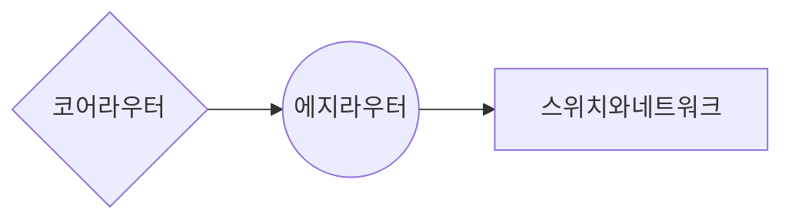
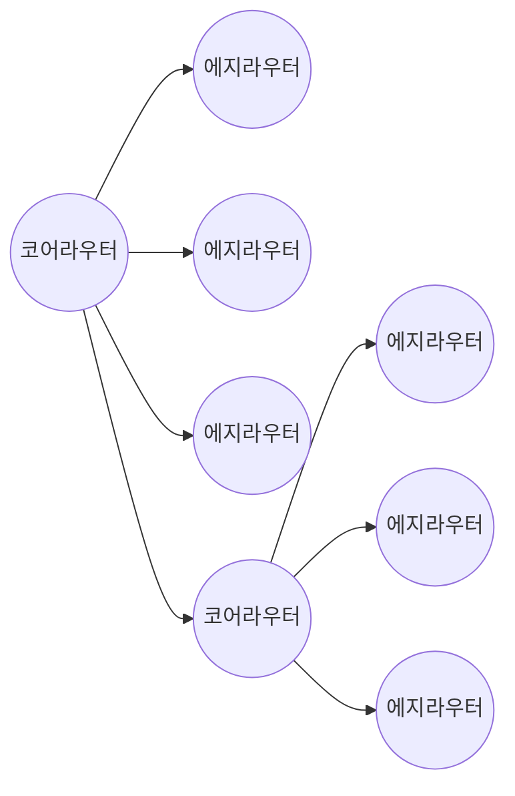

# 문제 영역 이해

코어 라우터는 코어 라우터와 에지 라우터 모두에 연결할 수 있다는 사실을 고려해 문제 영역의 모델링을 시작한다.  

코어 라우터는 더 빠르고 높은 트래픽 부하를 처리하며, 스위치와 스위치의 네트워크에서 생성된 트래픽을 직접적으로 처리하지 않는다.  
에지 라우터는 스위치에 스위치의 네트워크에서 생성된 트래픽을 직접 처리한다.  
예제 시나리오에서 에지 라우터는 다른 에지 라우터와 연결할 수 없고 코어 라우터와 스위치에만 연결된다.  
스위치는 여러 개의 네트워크를 가질 수 있다.  

토폴로지 및 인벤토리 시스템의 목적은 사용자가 네트워크 자산을 보고 관리할 수 있게 하는 것이다.  
네트워크 자산은 라우터, 스위치, 네트워크를 의미한다. 라우터와 스위치는 물리적인 자산이고, 네트워크는 스위치가 제공하는 논리적인 자산이다.  

관리 부문은 사용자가 토폴로지 및 인벤토리 시스템의 데이터를 제어할 수 있게 하는 CRUD 같은 오퍼레이션을 기반으로 한다.  

이러한 시스템을 구축하는 방법은 먼저 도메인 모델을 이용해 취상위 수준에서 시스템의 목적 달성에 필요한 오퍼레이션과 규칙을 포함하는 도메인 헥사곤을 생성하는 것이다.  
여기서 기대하는 최상의 결과는 애플리케이션 헥사곤과 프레임워크 헥사곤에 있는 것들이 도움없이 도메인 헥사곤에서 비즈니스 아이디어를 곧바로 검증하는 것이다.  

도메인 헥사곤 내에서 핵심적인 시스템 기능을 유지하는 정도는 헥사고날 시스템이 얼마나 느슨하게 결합되느냐에 큰 영향을 미친다.  

