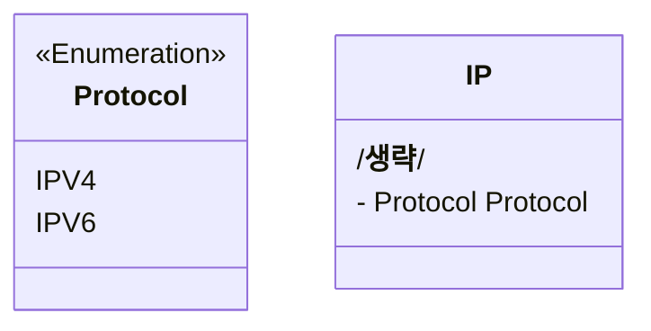

# 값 객체 정의

식별자를 정의할 필요가 없는 시스템 요소를 기술할 때 값 객체를 사용한다.  
객체의 관련 엔티티와 값들을 캡슐화하는 애그리게잇이 있다.

값 객체는 더 정교한 값 객체와 가장 중요한 엔티티를 만드는 데 사용되는 원자재인 기반 요소이므로  
먼저 값 객체를 생성하는 것으로 시작하기를 권장한다.

값 객체는 열거형, 클래스 등과 같은 방식으로 작성한다.  
이렇게 생성된 값 객체들은 전제 시스템을 구성하는 다른 값 객체의 엔티티들의 기본적인 기반 요소이기 때문에 가장 중요한 객체들이다.  
해당 값 객체들을 통해서 더 정교한 값 객체를 생성할 수 있다.

값 객체에는 생성에 대한 제약 사항이 들어갈 수 있다.  
도메인 헥사곤의 기반 요소인 값 객체를 토대로 엔티티와 엔티티의 명세를 생성하는 작업을 계속해서 진행한다.