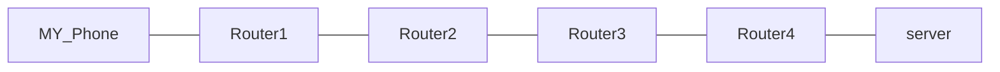
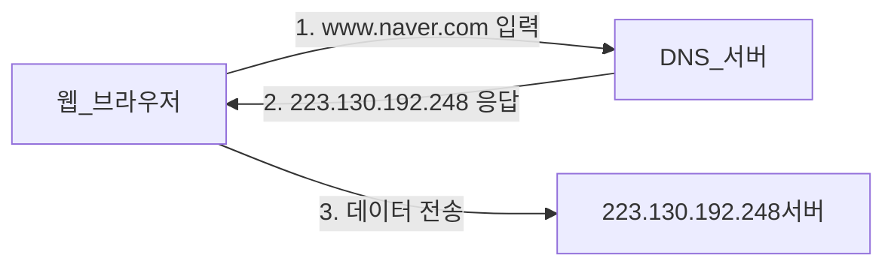
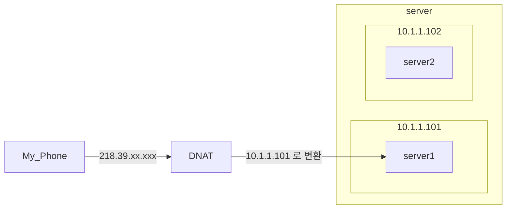
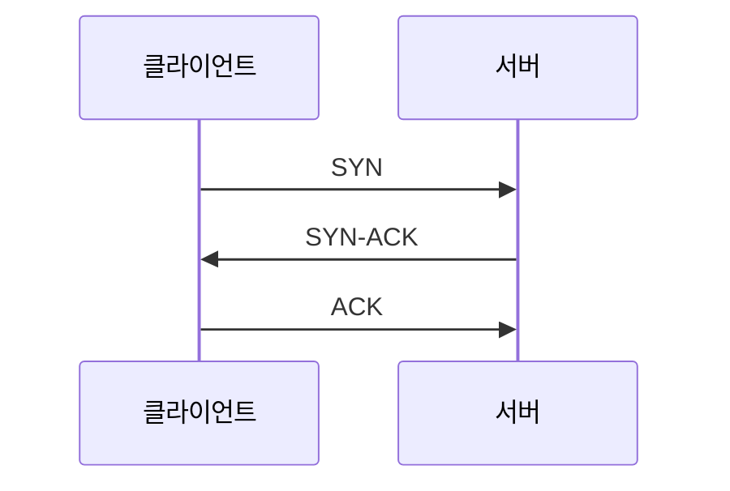

# 🔥 10장 모르면 답답해지는 네트워크 기초

## 🚀 네트워크 기초를 모르면

서버 개발자가 네트워크 엔지니어만큼 네트워크 관련 지식을 깊이 있게 알 필요는 없다고 생각한다.  
하지만 네트워크 지식이 전무하면 네트워크 관련 문제가 생겼을 때 쉽게 해결할 수 있는 문제도 오랜 시간 동안 처리하지 못하게 된다.  
기초적인 네트워크 지식 정도는 알아야 하는 것이다.  

## 🚀 노드, 네트워크, 라우터

데이터를 송수신하는 모든 장치를 노드node 라고 표현한다.  
핸드폰, 노트북, 서버 장비 등이 노드에 해당하며 각 노드가 서로 데이터를 주고 받기 위해 연결된 시스템을 네트워크network 라고 한다.  

### ✅ 패킷
노드가 네트워크를 통해 전송하는 데이터의 단위를 패킷packet 이라고 한다.  
패킷은 헤더와 페이로드로 구성된다.  
헤더는 패킷의 발신자와 수신자 정보를 포함하며 페이로드에는 데이터가 포함된다.  
데이터는 일정 크기를 가진 여러 패킷으로 나뉘어 전송된다.  

서로 다른 네트워크는 직접 패킷을 송수신할 수 없다.  
라우터router 를 통해 네트워크 간에 패킷을 전송하는 역할을 한다.  

## 🚀 IP 주소와 도메인

네트워크에서 각 노드를 구분하기 위해 사용하는 주소를 IP 주소라고 한다.  
현재 일반적으로 사용하는 IP 주소는 IPv4 주소이다.  
IPv4 주소는 1바이트(8비트) 4개의 숫자 블록으로 구성되어 있다.  

IPv6 주소는 128비트를 사용한다.  
하지만 IPv4 주소가 고갈되지 않는 이유는 사설 IP 와 NAT 덕분이다.  

각 노드의 IP 주소를 외우기는 쉽지 않다. 그래서 IP 주소에 기억하기 쉬운 이름을 붙인다.  
바로 DNSDomain-Name-System가 이에 해당한다.  

DNS 는 각 계층이 점(.) 으로 구분되며 오른쪽이 상위 계층이고 왼쪽이 하위 계층이다.  
최상위 계층에는 일반 최상위 도메인이나 국가 최상위 도메인이 있다.  

국가 최상위 도메인은 두 번째 계층까지 미리 정의되어 있다.  
예를 들어 ac.kr 은 대학 같은 교육 기관 용도,  
co.kr 은 기업 용도로 사용하는 식이다.  

### ✅ hosts 파일

각 컴퓨터는 hosts 파일을 갖고 있다.  
리눅스는 /etc, 윈도우는 c:\windows\System32\drivers\etc 에 있다.  
이 팡리은 호스트 이름과 IP 주소에 대한 매핑을 정의하며,  
도메인 서버보다 hosts 파일에 매핑된 설정이 우선이다.  
localhost 에 대한 IP 매핑도 이 파일에 정의되어 있다.   

### ✅ 도메인 이름과 IP 주소 개수

도메인 이름에 매핑되는 IP 주소는 여러 개일 수 있다.  
nslookup 명령어를 사용하면 도메인의 IP 주소를 확인할 수 있다.  
`www.naver.com` 을 확인하면 여러 개의 IP 가 표시된다.  
한 도메인에 여러 개의 IP 를 매핑하는 이유는 부하 분산에 있다.  
DNS 서버는 등록된 IP 를 번갈아 제공한다.  

### 🎯 고정 IP 와 동적 IP

동일 네트워크 상에서 각 노드는 서로 다른 IP 주소를 가져야 한다.  
그렇지 않으면 충돌이 발생한다.  

노드의 IP 주소는 2가지 방식으로 지정한다.  

고정 IP 는 말 그대로 노드가 고정된 IP 를 갖는다.  

동적 IP 는 노드가 네트워크에 연결할 때마다 IP 를 할당한다.  
DHCPDynamic-Host-Configuration-Protocol 서버를 통해 제공받는다.  

동적 IP 를 사용한다고 해서 매번 새로운 IP 를 받는 것은 아니다.  
설정에 따라 일정 시간 동안 동일한 IP 를 할당할 때도 있다.  

### 🎯 공인 IP 와 사설 IP

웹 브라우저에 DNS 를 입력하면 DNS 서버로부터 IP 주소를 받아 접속한다.  
이때 IP 주소는 인터넷에서 접근 가능한 IP 주소로서 공인public IP 주소라고 부른다.  

모든 네트워크에 적용되는 공인 IP 주소와 달리 네트워크 내부에만 적용되는 사설privateIP 주소도 있다.  
특정 네트워크에 속한 노드에 할당하는 주소로서 네트워크 외부에서 접근할 수 없다.  

사설 IP 로 사용할 수 있는 주소 범위는 다음의 세 대역으로 제한되어 있다.  

- 192.168.x.x
- 10.x.x.x
- 172.16.x.x ~ 172.31.x.x

인터넷 초창기에는 회사의 각 PC 마다 공인 IP 를 할당 받아서 사용하기도 했다.  
만약 지금까지 모든 기기가 공인 IP 를 사용했다면 이미 IPv4 는 고갈됐을 것이다.  

## 🚀 NAT

NATNetwork-Address-Translation(네트워크 주소 변환)는 네트워크 주소를 변환하는 기술이다.  
사설 IP 와 인터넷에서 사용하는 공인 IP 주소 간의 변환이 필요한데, NAT 가 이 변환을 담당한다.  

- SNATSource-NAT: 사설 IP → 공인 IP
  

- DNATDestination-NAT: 공인 IP → 사설 IP

## 🚀 VPN

NAT 를 사용하면 공인 IP 를 통해 사설 IP 를 가진 서버에 접근할 수는 있지만,  
노드 개수가 많은 경우 매핑하기도 어렵고, 모든 노드가 공인 IP 로 노출되어 위험하다.  

서버를 운영하려면 서버 네트워크에 구성된 노드에 안전하게 접근할 수 있어야 하는데  
VPNVirtual-Private-Network 로 해결할 수 있다.  

두 네트워크는 마치 하나의 사설 네트워크에 존재하는 것처럼 연결할 수 있다.  
개발자는 전용 VPN 클라이언트를 통해 VPN 에 접근할 수 있다.  
집이나 외부에서 접근할 때 이 방식을 사용한다.  

## 🚀 프로토콜과 TCP, UDP, QUIC

네트워크 상에서 두 노드가 데이터를 주고받기 위해 정의한 규칙을 프로토콜protocol 이라고 한다.  
네트워크는 여러 계층으로 구성되며, 각 계층마다 사용하는 프로토콜이 존재한다.

`TCP/IP 모델의 계층별 프로토콜`

- 애플리케이션 계층 : HTTP, FTP, SMTP
- 전송 계층 : TCP, UDP
- 네트워크 계층 : IP
- 데이터 링크 계층
- 물리 계층

개발자는 주로 전송 계층과 애플리케이션 계층의 프로토콜을 사용한다.  

TCPTransmission-Control-Protocol는 연결 기반 프로토콜이다.  
TCP 에서 두 노드가 연결을 맺기 위한 과정을 3-Way-Handshake 라고 부른다.  

TCP 의 장점은 신뢰성에 있다.  

- 패킷 순서 보장
- 패킷이 유실된 경우 재전송

안정적으로 데이터를 전송할 수 있고 주로 HTTP, SMTP 와 같은 많은 프로토콜이 TCP 를 기반으로 동작한다.  
TCP 가 전송을 보장하기 위해 사용하는 시퀀스 번호, 확인 응답, 재전송 등이 추가되면서 전송 속도는 (UDP 대비) 상대적으로 느려진다.  

예를 들어 일부 패킷이 유실되면 해당 패킷이 도착할 때까지 이후 패킷을 제대로 처리하지 못하는 HOL 블로킹Head-of-Line-Blocking 문제가 있는데,  
이는 전체적인 전송 속도를 느리게 만든다.  

UDPUser-Datagram-Protocol는 연결 과정 없이 바로 데이터를 전송한다.  

- 데이터가 정상적으로 전송됐는지 알 수 없음
- 순서를 보장하지 않음
  
UDP 를 사용하는 어플리케이션은 데이터 유시로가 같은 상황이 발생할 수 있다고 가정하고 개발해야 한다.  
UDP 는 응답 확인이나 패킷 정렬과 같은 과정을 거치지 않기 때문에 전송 속도는 TCP 대비 빠르다.  
UDP 는 속도가 중요하거나 일부 데이터가 유실되더라도 문제되지 않는 통신에 주로 사용된다.  

TCP 는 신뢰성이 있지만 느리다. UDP 는 빠르지만 신뢰성이 없다.  
이 둘을 합쳐놓은 프로토콜이 QUIC 이다.  

QUIC 은 UDP 를 기반으로 한다.  
TCP 의 연결 관리 기능을 QUIC 프로토콜 수준에서 제공한다.  

QUIC 은 데이터에 연결 IDConnection-ID를 포함시키는데,  
이 연결 ID 를 이용해서 두 노드 간의 연결을 유지한다.  
또한 TCP 의 혼잡 제어나 패킷 유실 복구와 같은 기능을 QUIC 프로토콜 수준에서 제어한다.