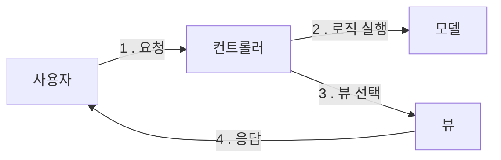
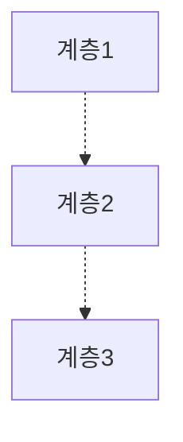
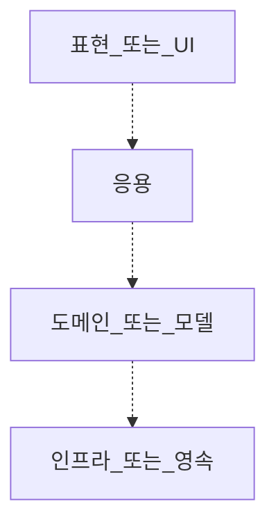

# 🔥 11장 자주 쓰는 서버 구조와 설계 패턴

서버 애플리케이션을 개발하다 보면 자주 반복되는 패턴이 존재하는데 아키텍처 수준에서 알아보자.

## 🚀 MVC 패턴

자바의 스프링 프레임워크, Node.js, Express.js 가 전형적인 MVC 패턴을 사용한다.  
MVC 는 Model-View-Controller 로 구성된 패턴이다.

- 모델: 회원 가입, 암호 변경 등 비즈니스 영역의 로직을 처리한다.
- 뷰: 사용자가 보게 될 결과를 생성해서 사용자에 응답한다.
- 컨트롤러: 사용자의 입력 처리와 흐름 제어를 담당한다.



사용자는 원하는 기능을 처리하기 위한 요청을 컨트롤러에 보낸다.  
모델은 사용자가 요청한 기능을 실행한다.  
컨트롤러는 모델의 처리 결과를 기준으로 사용자에게 보여줄 뷰를 선택한다.

MVC 패턴의 핵심은 다음 2가지다.

1. 비즈니스 로직을 처리하는 모델과 결과를 생성하는 뷰를 분리한다.
2. 애플리케이션의 흐름 제어나 사용자의 요청 처리는 컨트롤러에 집중한다.

모델과 뷰가 분리되어 있기 때문에 서로의 변화에 대한 영향을 덜 받는다.  
MVC 는 관심사에 따라 모델, 뷰, 컨트롤러로 역할을 나누고, 뷰와 모델은 컨트롤러에 의존하지 않는다.

## 🚀 계층형 아키텍처

계층형 아키텍처<sup>Layered-Architecture</sup> 는 오래된 패턴으로 많은 곳에서 사용된다.  
계층형 아키텍처는 각 계층마다 특정 역할을 수행하고 하위에 위치한 계층에만 의존하는 특징을 갖는다.



상황에 따라 바로 하위의 계층에만 의존하도록 강제하거나, 하위에 있는 계층이면 모두 의존을 허용하는 방식으로 나뉜다.



표현<sup>presentation</sup> 또는 UI<sup>User-Interface</sup> 계층은 사용자와의 상호 작용을 담당한다.  
응용 계층은 사용자의 요청을 실제로 처리한다.  
도메인/모델 계층은 도메인 로직을 구현한다.  
인프라/영속 계층은 DB 연동, 문자 발송과 같은 구현 기술을 지원한다.

계층형 아키텍처는 구조가 단순하고 규칙이 명확하기 때문에 코드 실행 흐름을 추적하기 쉽다는 장점이 있다.

### 🎯 흩어지는 도메인 로직

도메인 계층 없이 응용 계층과 인프라 계층만으로 구현하는 경우가 있다.  
단순히 서비스/DAO 로 구성된 계층형 아키텍처를 사용하면 실제로 계층은 3개가 된다.  
도메인 영역이 거의 없는 계층 구조에서는 도메인 로직이 인프라와 응용 계층으로 분산되는 경향이 있어 코드 유지보수를 어렵게 만들기도 한다.

```shell
// MemberDao..updateMemberStatus(id)의 쿼리
update member set status = 20 where member_id = ? and status = 10
```

이 쿼리는 status 가 10인 경우 20으로 바꾸는데 해당 쿼리에는 도메인 로직이 스며들어간 전형적인 예이다.

```java
public static void main(String[] args) {
    int cnt = mdao.updateMemberStatus(id);
    if (cnt == 0) {
        // 변경 건이 없으므로 변경 실패 처리
    }
}
```

이 코드에는 어떤 도메인 로직도 없다.  
단지 회원의 상태를 변경하는 DAO 메서드를 실행하고 결과 건수가 0이면 변경 실패 처리를 한다.  
어떤 조건일 때 상태가 변경되는지 확인하려면 쿼리를 뒤져야 한다.

이것이 도메인 모델이 빈약하거나 없을 때 발생하는 로직 흩어짐 증상이다.  
이렇게 도메인 로직이 쿼리나 컨트롤러와 같은 다른 계층에 흩어지는 것을 방지하려면 도메인 로직을 최대한 한 계층에 모아야 한다.  
도메인 로직을 한 곳에 모으는 방법 중 하나는 DDD 의 전술 패턴을 활용하는 것이다.

## 🚀 DDD 와 전술 패턴

로직이 복잡한 도메인을 구현할 때는 DDD<sup>Domain-Driven-Design</sup>를 검토해보자.

|            구성 요소             |                                                                         설명                                                                          |
|:----------------------------:|:---------------------------------------------------------------------------------------------------------------------------------------------------:|
|       엔티티<br/>(Entity)       |                  각 엔티티 객체는 고유의 식별자를 가지며, 각 엔티티는 식별자로 구분된다.<br/>내부 상태가 바뀌어도 식별자는 바뀌지 않는다.<br/>예를 들어 각 주문 엔티티는 서로 다른 주문번호를 식별자로 갖는다.                  |
|        벨류<br/>(Value)        |                               벨류는 고유의 식별자를 갖지 않으며 개념적인 값을 표현한다.<br/>금액, 배송 주소 같은 값이 밸류가 된다.<br/>값은 불변으로 구현하는 것을 추천한다.                               |
|    애그리거트<br/>(Aggregate)     | 애그리거트는 관련된 객체를 묶어 하나의 개념적인 단위를 표현한다.<br/>예를 들어 주문 애그리거트는 Order 엔티티, OrderLine 벨류 집합, ShippingAddress 벨류로 구성될 수 있다.<br/>애그리거트는 모델의 일관성을 관리하는 단위가 된다. |
|    리포지토리<br/>(Repository)    |                도메인 객체를 물리적인 저장소와 연결할 때 사용하는 모델이 리포지토리이다.<br/>리포지토리는 도메인 객체를 저장하고 조회할 때 사용되는 인터페이스를 제공한다.<br/>리포지토리는 애그리거트 단위로 존재한다.                 |
| 도메인 서비스<br/>(Domain Service) |                                       특정한 애그리거트에 속하지 않은 로직을 구현한다.<br/>외부 연동이 필요한 도메인 로직도 도메인 서비스로 사용해서 표현한다.                                        |
|  도메인 이벤트<br/>(Domain Event)  |                          도메인 내에서 발생한 이벤트를 표현하다.<br/>도메인의 상태가 변경될 때 도메인 이벤트가 발생한다.<br/> 도메인 이벤트는 주로 다른 부분에 변화를 알리기 위해 사용된다.                          |

복잡한 모델을 애그리거트 단위로 관리할 수 있게 함으로써 복잡도를 낮추고 애그리거트에 관련 로직을 모아 응집도를 높인다.  
이는 복잡한 도메인의 유지보수성을 높여준다.

```java
import java.util.Optional;

// DDD 의 전술 패턴은 도메인 로직을 한 곳에 모으는 데 도움이 된다.
public class CancelOrderService {
    private OrderRepository orderRepository;

    @Transactional
    public void cancel(OrderNumber orderNumber) {
        // 응용 서비스는 도메인 모델을 사용해서 사용자 요청을 처리한다.
        Optional<Order> orderOpt = orderRepository.findById(orderNumber);
        Order order = orderOptorElseThrow(() -> new NoOrderException());
        // 주문 취소 로직은 Order 애그리거트에 위치한다.
        order.cancel();
    }
}
```

## 🚀 마이크로서비스 아키텍처

과거에는 하나의 애플리케이션에 모든 것을 구현한 모놀리식 아키텍처가 일반적이었지만  
마이크로서비스 아키텍처는 더 작은 단위로 서비스를 분리하고 각 서비스가 연동되는 구조를 갖는다.

|    | 모놀리식                                                                                                              | 마이크로서비스                                                                                                          |
|:--:|:------------------------------------------------------------------------------------------------------------------|:-----------------------------------------------------------------------------------------------------------------|
| 장점 | - 배포가 단순하다.<br/>- 코드 관리가 더 쉽다.<br/>- 성능을 옾이기 위해 복잡한 구조를 가질 필요가 없다.<br/>- 테스트와 디버깅이 쉽다.                            | - 독립적인 배포와 지속적인 배포가 용이하다.<br/>- 성능 확장이 용이하다.<br/>- 기술에 대한 유연성을 가질 수 있다.<br/>- (보통) 개발자의 만족도가 더 높다.               |
| 단점 | - 규모가 커질수록 개발 속도가 느려질 수 있다.<br/>- 한 기능의 문제가 전체에 영향을 줄 수 있다.<br/>- 구현 기술 변경에 어려움이 있다.<br/>- 작은 변경도 전체를 다시 배포해야 한다. | - 테스트와 디버깅이 어려울 수 있다.<br/>- 모놀리식 대비 인프라가 복잡해진다.<br/>- 소통에 따른 부하가 증가할 수 있다.<br/>- 무분별하게 서비스를 만들면 분산 모놀리식이 될 수 있다. |

마이크로서비스 6가지 핵심 개념

1. 독립적 배포: 
   - 다른 마이크로서비스를 배포하지 않고도 마이크로서비스를 변경, 배포, 출시할 수 있어야 한다.
2. 도메인을 중심으로 모델링:
   - 각 마이크로서비스는 도메인을 기준으로 구분해야 한다. 한 도메인의 기능 구현이 여러 마이크로서비스에 걸쳐 있으면 출시 비용이 증가한다.
3. 자신의 상태를 가짐: 
   - 마이크로서비스는 DB 를 공유하지 않는다.
   - 다른 마이크로서비스의 데이터를 사용할 경우 DB 에 직접 접근하지 않고 API 등을 통해 접근한다.
4. 크기:
   - 마이크로서비스의 크기에 절대적인 기준은 없다.
   - 조직이 감당할 수 있는 수준과 경계 정의에 집중해야 한다.
5. 유연함:
   - 마이크로서비스는 비용을 들여 기술, 확장, 견고함과 같은 유연함을 얻는 구조다.
   - 비용을 감당할 수 있는 수준에서 도입을 고려해야 한다.
6. 아키텍처와 조직을 맞춤:
   - 조직 구조는 아키텍처에 영향을 준다.
   - 비즈니스 도메인이 시스템 아키텍처를 주도하는 주요 원동력이 되도록 설계한다.

마이크로서비스는 만능이 아니다.  
모놀리식 아키텍처 자체가 잘못된 경우는 드물며, 대부분 설계와 품질이 문제다.  
모놀리식 구조를 채택하더라도 구조와 품질에 신경 쓴다면 개발 속도를 유지하면서 짧은 배포 주기를 가질 수 있다.(ex. 모듈라 모놀리식)  

## 🚀 이벤트 기반 아키텍처

이벤트 기반 아키텍처<sup>Event-Driven-Architecture</sup> 는 두 시스템 간에 통신할 때 이벤트를 사용하는 구조다.  
이벤트는 과거에 발생한 사실을 의미하므로 '주문함', '인증에 실패함', '주문을 취소함'처럼 과거형으로 표현한다.  

이벤트 기반 아키텍처는 다음의 3가지 구성 요소로 이루어진다.  

- 이벤트 생산자
- 이벤트 소비자
- 이벤트 브로커 (또는 라우터)

생산자와 소비자가 직접 연결되지 않고 브로커를 통해 간접적으로 연결되므로  
서로 간섭하지 않고 독립적으로 배포할 수 있다. 새로운 소비자 추가도 용이하다.  

### ✅ 이벤트 브로커와 단일 진실 공급원

이벤트 브로커를 단일 진실 공급원<sup>Single-Source-of-Truth</sup>으로 확장해서 사용하는 방식도 있다.  
예를 들어 카프카는 메시지를 삭제하지 않고 저장할 수 있는데, 이 특징을 활용하면 이벤트 생산자가 보낸 모든 이벤트를 영구 보관할 수 있다.  

시스템의 모든 상태 변화가 이벤트로 발생한다면 이벤트 기록만으로도 시스템 상태의 변화를 추적할 수 있다.  
더 나아가 카프카 같은 브로커를 이벤트 소싱 패턴의 이벤트 저장소로도 활용할 수 있다.  

## 🚀 CQRS 패턴

아주 단순한 시스템은 상태 변경과 상태 조회가 동일한 모습을 보이지만,  
조금만 복잡해져도 상태 변경에 사용하는 데이터와 상태 조회 시 사용하는 데이터에 차이가 발생한다.  

CQRS<sup>Command-Query-Responsibility-Segregation</sup> 는 명령과 조회를 분리하는 패턴이다.  
명령 모델이 도메인 로직을 실행할 때 명령(Command) 모델과 조회(Query) 모델이 분리되어 실행한다.  

CQRS 는 명령 모델과 조회 모델을 구분하므로 각 기능에 맞게 모델을 구현할 수 있다.  
조회 모델이 별도로 존재하므로 조회 성능을 향상시키기 쉽다.  

단점으로는 작성해야할 코드가 늘어나고 구현 기술도 늘어날 수 있다.  
높은 트래픽을 처리하기 위해 조회 모델을 별도의 DB 로 나누어 구축하는데,  
DB 간의 데이터 동기화와 추가적인 기술 도입이 필요하다.