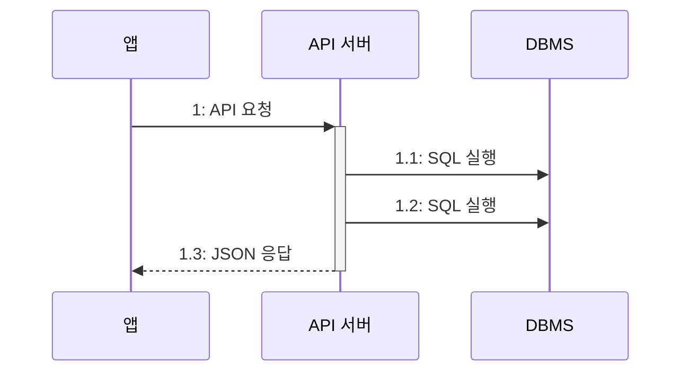
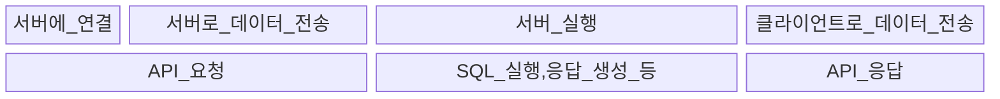

# 2장 느려진 서비스, 어디부터 봐야 할까

## 처리량과 응답 시간

#### API 서버의 간단한 실행 흐름



#### 응답 시간의 구성



1. 서버에 연결: TCP 를 이용해서 서버에 연결한다.
2. 데이터 전송: 정해진 규칙(프로토콜)에 따라 데이터를 서버에 전송한다. 예를 들어, HTTP 프로토콜에 따라 POST 방식으로 JSON 데이터를 보낼 수 있다.

- TTFB(Time to First Byte): 응답 데이터 중 첫 번째 바이트가 도착할 때까지 걸린 시간
- TTLB(Time to Last Byte): 응답 데이터의 마지막 바이트가 도착할 때까지 걸린 시간

서버 성능을 올바르게 평가하려면 데이터 특성이나 네트워크 환경을 고려해 TTFB와 TTLB 중 적절한 지표를 선택해 측정해야 한다.  

```text
응답 시간은 중요하다.
100ms 지연 시: 검색 횟수 0.2% 감소
400ms 지연 시: 검색 횟수 0.6% 감소

응답 시간이 100ms 증가할 때마다 매출이 1% 감소한다는 내용 (google 'Speed Matters for Google Web Search')
```

응답 시간 중 DB 연동과 외부 API 연동이 가장 큰 비중을 차지한다.

```text
example
- 전체 처리 시간: 348ms
- API 연동 1 (외부 네트워크에 존재하는 API 호출): 186ms (53%)
- API 연동 2 (내부 네트워크에 존재하는 API 호출): 44ms (13%)
- DB 연동 (SQL 실행 6회): 101ms(29%)
- 로직 수행: 17ms(5%)
```

#### 처리량

처리량은 시간당 시스템이 처리하는 작업량을 의미하는데 흔히 TPS 나 RPS 로 처리량을 나타낸다.  
- TPS: Transaction per second 초당 트랜잭션 수
- RPS: Request per second 초당 리퀘스트 수

서버가 한 번에 5개의 요청을 처리할 수 있고 요청당 처리 시간이 1초라면 최대 TPS 는 5가 된다.  
동시에 들어오는 요청 수가 최대 TPS 를 초과하면 초과한 요청을 나중에 처리하게 된다.  

최대 TPS 가 5인 서버에 동시에 7개의 요청이 들어오면 5개의 요청은 1초안에 처리되지만, 2개의 요청에 대해서는 총 2초가 걸리게 된다. (기다리는 시간 1초 + 처리 시간 1초)  
응답 시간의 증가는 사용자 이탈로 이어질 수 있다.  

TPS 증가를 위해 다음 2가지 방법을 고려할 수 있다.  

- 서버가 동시에 처리할 수 있는 요청 수를 늘려 대기 시간 줄이기
- 처리 시간 자체를 줄여 대기 시간 줄이기

막연히 성능이 느리다고 이것저것 시도하면 안 된다. 트래픽이 많은 시간대를 파악하여 측정하고, 목표를 수립해 개선안을 도출해야 한다.  
TPS 확인을 위해 스카우터, 핀포인트, 뉴렐릭 같은 도구를 사용해볼 수 있다.