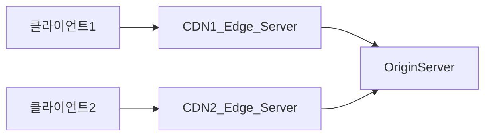

# 2장 느려진 서비스, 어디부터 봐야 할까

## 서버 성능 개선 기초

### 병목 지점

- 순간적으로 모든 사용자 요청에 대한 응답 시간이 심각하게 느려진다.
- 다수의 요청에서 연결 시간 초과와 같은 오류가 발생한다.
- 서버를 재시작하면 일시적으로 해결되다가 다시 응답 시간이 느려지는 현상이 반복된다.
- 트래픽이 줄어들 때까지 심각한 상황이 계속된다.

서버 성능 문제는 주로 DB 연동이나 API 연동 과정에서 발생한다.

### 수직 확장과 수평 확장

수직 확장<sup>scale-up</sup>: CPU, 메모리, 디스크 등의 자원을 증가시키는 것  
수평 확장<sup>scale-out</sup>: 서버를 늘리는 것  

```text
로드 밸런서

서버가 두 대 이상이면 로드 밸런서가 필요하다.
정적인 방식의 대표적인 예로는 라운드 로빈과 IP 해시 방식이 있다.
동적인 방식은 서버의 현재 상태에 따라 트래픽을 분산하는 방식으로 트래픽이 적은 서버에 요청을 보내는 형태로 동작한다.
```

### DB 커넥션 풀

1. DB에 연결한다.
2. 쿼리를 실행한다.
3. 사용이 끝나면 연결을 종료한다.

전체 처리 시간 중 80% 이상이 DB의 연결 및 종료에 쓰인다.  
DB 커넥션 풀은 DB에 연결된 커넥션을 미리 생성해서 보관한다.  
이미 연결된 커넥션을 재사용하기 때문에 응답 시간을 효과적으로 줄일 수 있다.  

DB 커넥션 풀은 다양한 설정을 제공한다.  

- 커넥션 풀 크기 (또는 최소 크기, 최대 크기)
- 풀에 커넥션이 없을 때 커넥션을 구할 때까지 대기할 시간
- 커넥션의 유지 시간(최대 유휴 시간, 최대 유지 시간)

### 커넥션 풀 크기

미리 생성해둘 커넥션 갯수를 지정하는 설정이다.  
커넥션 풀 크기보다 큰 요청이 동시에 들어온 경우 초과한 요청에 대해서는  
다른 요청이 커넥션 사용을 끝내고 풀에 반환할 때까지 기다려야 한다.  

전체 응답 시간과 TPS 를 고려하여 커넥션 풀 크기를 지정해야 한다.  
커넥션 풀의 최소 크기가 10이고 최대 크기가 20이라면,  
요청이 10개를 초과하면 커넥션 수를 늘려서 요청을 처리한다.  
최대 20개까지 커넥션을 늘리고 이후 동시 요청이 20개 이하로 줄어들면 커넥션 풀의 커넥션도 점차 줄어든다.  

일반적으로 트래픽은 증가했다가 감소하는 패턴을 보인다.  
트래픽이 순간적으로 급증하는 패턴을 보인다면 커넥션 풀의 최소 크기를 최대 크기에 맞추는 것이 좋다.  

커넥션 풀 크기를 늘리면 처리량을 높일 수 있지만, DB 서버의 CPU 사용률이 80%에 육박하는 상황에서  
커넥션 풀 크기를 늘리면 DB에 가해지는 부하가 더 커져 쿼리 실행 시간이 급격하게 증가할 수 있다.
DB 서버가 포화 상태에 이르지 않도록 주의해야 한다.  

수평 확장<sup>scale-out</sup>하는 것도 커넥션 풀을 늘리는 것과 동일하다.  
DB 서버의 상태를 면밀히 확인한 후에 수평 확장을 진행해야 한다.  

### 커넥션 대기 시간

대부분의 커넥션 풀은 대기 시간을 설정할 수 있다. HikariCP의 기본 대기 시간은 30초인데 최악의 경우 응답 시간이 30초를 넘길 수도 있다는 뜻이다.  
따라서 응답 시간이 중요한 서비스는 가능한 짧게 설정해야 한다. 트래픽의 양이나 서비스의 특성에 따라 차이는 있지만 보통의 경우라면 0.5~3초 이내로 지정하자.  

긴 응답 시간동안 무응답 상태로 유지되는 것보다 빠르게 에러를 반환하는 것이 사용자 입장에선 훨씬 낫다.

### 최대 유휴 시간, 유효성 검사, 최대 유지 시간

요청이 없는 시간대에는 풀에 있는 커넥션도 사용되지 않으며 커넥션이 사용되지 않는 시간이 길어지면 연결이 끊길 수도 있다.  
MySQL 과 같은 DB 는 클라이언트와 일정 시간 동안 상호작용이 없으면 자동으로 연결을 끊는 기능을 제공한다.  

만약 설정값이 1시간일 때, 1시간 이상 사용자가 없으면 커넥션 풀에 있는 모든 커넥션은 DB와의 연결이 끊기게 된다.  
연결 끊김으로 인해 발생하는 에러를 방지하기 위해 다음 설정을 제공한다.

- 최대 유휴 시간 지정: 사용되지 않는 커넥션을 풀에 유지할 수 있는 최대 시간
- 유효성 검사 지원: 커넥션을 정상적으로 사용할 수 있는 상태인지 여부를 확인
- 최대 유지 시간: 커넥션이 생성된 시점부터 최대 유지할 시간

최대 유휴 시간과 최대 유지 시간을 무한대로 설정하지 않는 것이 좋다. 커넥션 풀의 기본값을 확인한 뒤 이 두 설정의 기본값이 무제한으로 되어 있다면 DB 설정을 참고하여 알맞게 적절한 값으로 지정해야 한다.  

### 서버 캐시

DB 서버를 확장하지 않고도 응답 시간과 처리량을 개선하고 싶다면 캐시<sup>cache</sup> 사용을 고려할 수 있다.  
읽기/쓰기에 관련된 캐시 전략을 참고하자.  

### 적중률과 삭제 규칙

캐시가 얼마나 효율적으로 사용되는지를 적중률<sup>hit rate</sup>로 판단할 수 있다.

- 적중률<sup>hit rate</sup> = 캐시에 존재한 건수 / 캐시에서 조회를 시도한 건수

최대한 많은 데이터를 저장할 수록 적중률은 높아지지만 메모리 자원을 사용하기 때문에 제한적이다.  
캐시가 가득 차 있는 상태에 경우 오래되거나 비교적 덜 조회되는 데이터를 삭제하고 새로운 데이터를 추가해야한다. 이때 삭제 규칙은 다음과 같다.

- LRU(Least Recently Used): 가장 오래전에 사용된 데이터를 제거한다.
- LFU(Least Frequently Used): 가장 적게 사용된 데이터를 제거한다.
- FIFO(First In First Out): 먼저 추가된 데이터를 먼저 삭제한다.

위의 규칙 말고도 서비스 특징에 맞게 규칙을 작성하면 된다.  

### 로컬 캐시와 리모트 캐시

Java 의 Caffeine 이 로컬 캐시이며 Redis 가 대표적인 리모트 캐시이다.
로컬과 리모트는 정반대의 장단점을 가진다. 리모트는 DB 처럼 여러 대의 서버를 이용해 확장할 수 있으며 API 서버(스프링 등)가 재시작하더라도 리모트 서버에 보관된 캐시 데이터를 그대로 사용할 수 있다.  
하지만 네트워크 통신이 필요하므로 로컬 캐시보다는 느리다. 관리, 유지보수, 서버 비용 등이 리모트 캐시에 필요하므로 비용이 더 증가한다.  

데이터의 규모가 작고 변경 빈도도 작다면 혹은 서비스 규모가 작다면 로컬 캐시만으로도 충분하다. 상황에 따라 비즈니스 로직 중 로컬 캐시만으로도 충분히 처리가 가능한 경우가 있다. 이럴 때 로컬 캐시를 선택해도 좋다.  
반면 규모가 크고 트래픽이 많다면 리모트 캐시를 사용할 수 있는 서버를 두어 효과적으로 응답 속도를 개선할 수 있다.  
모놀리식, MSA 등을 막론하고 배포 주기가 짧으며 캐시를 사용했을 때 개선점이 뚜렷하다면 이역시 리모트 캐시를 사용하는 것이 적합하다.  

### 캐시 사전 적재

캐시의 읽기/쓰기 전략을 찾아보면 사전에 캐시 데이터를 어떻게 가지고 오는지 여러 전략들이 있다.  
서비스 상황에 알맞게 캐시 전략을 준비하여 서버 성능을 개선할 수 있다.  
전략을 선택할 땐 적중률도 함께 고려하여 선택하자.  

### 캐시 무효화

캐시에 데이터가 있는 것만으로 만사 해결이 아니다. 적중률, 삭제 전략도 따져야한다. 또 해당 데이터가 무의미해질 때 무효화 전략을 취해야 한다.
즉 적절한 시점에 캐시 데이터를 삭제하여 항상 유효한 데이터들을 캐시에 적재할 수 있도록 해야 한다.  
원본 데이터가 변경됐는데 캐시 데이터가 갱신되지 않는다면 잘못된 데이터를 가지고 로직이 수행되는 불상사가 발생한다.  

캐시는 변경이 없고 자주 조회되는 특징의 데이터들을 적재하는 것이 효율적이다.
그렇지 않다면 그렇지 않은 만큼 무언가 코드를 작성해야 한다.  

### 가비지 컬렉터와 메모리 사용

가비지 컬렉터<sup>Garbage Collector</sup>는 정해진 규칙에 따라 사용하지 않는 메모리를 찾아서 반환한다. 예를 들어 힙 메모리 사용량이 일정 비율을 초과하면 가비지 컬렉터를 실행하거나, 일정 주기로 자동 실행된다.  
그래서 메모리를 직접 관리해야 하는 부담을 줄여주지만, 응답 시간에 영향을 줄 수 있다. 예를 들어 자바에서는 가비지 컬렉터가 실행되는 동안 애플리케이션의 실행이 일시 중단되는데, 이것을 모든 실행이 멈춘다고 해서 'Stop-The-World' 라고도 표현한다.  

당연히 메모리를 많이 사용하면 GC 가 객체를 찾는데 시간이 오래 걸리고 적을 수록 빨리 찾아 처리한다. 이는 JVM에 할당된 힙 메모리 사이즈와도 연관이 있다. 실제 메모리 사용 패턴에 맞게 최대 힙 크기를 설정해야 한다.  
한 번에 대량으로 객체를 생성하는 것도 주의해야 한다. 하나의 조회 API가  10만 개의 게시글을 반환하고 게시글 하나가 0.5KB의 메모리를 사용한다면 대략 50MB의 메모리가 필요하다. 사용자 100명이 동시에 조회할 경우 4.9GB의 메모리가 필요해진다.  
조회 범위를 제한하는 등 트래픽 규모와 메모리 크기에 맞춰 제한해야 한다.  

파일 다운로드와 같은 기능을 구현할 때는 스트림을 활용한다. (ex. `StreamingResponseBody`) 메모리에 한 번에 많은 데이터를 올리기 보다는 스트림에서 처리 가능한 작은 데이터로 잘라서 읽는 것이 더 유리하다.  

### 응답 데이터 압축

응답 시간에는 데이터 전송 시간이 포함된다. 이 전송 시간은 2가지 요인에 영향을 받는다.  

- 네트워크 속도
- 전송 데이터 크기

HTML, CSS, JS, JSON 과 같은 텍스트로 구성된 응답은 압축하면 데이터 정송량을 크게 줄일 수 있다.  
클라우드 환경에선 트래픽 자체가 비용으로 직결된다.  

### 정적 자원과 브라우저 캐시

동일한 페이지에 들어갈 때마다 같은 이미지나 JS 파일을 매번 다운로드하면 서버 입장에서 좋을 게 없다.  
트래픽은 비용과 직결되는데 더 많은 트래픽을 처리하려면 더 큰 비용을 내야 한다.  
Cache-Control 이나 Expires 헤더를 이용해 클라이언트가 응답 데이터를 일정 시간 동안 저장해둘 수 있도록 설정할 수 있다.  

### 정적 자원과 CDN

브라우저 캐시는 브라우저 단위로 동작하기 때문에 동시에 많은 사용자가 접속하면 순간적으로 많은 양의 이미지, JS, CSS 를 전송하게 된다.  
이러한 문제를 해결하기 위해 CDN(Content Delivery Network)을 사용하는 것이다.  



CDN은 여러 지역에 서벌르 두고 사용자는 가까운 곳에 위치한 서버에 연결해서 콘텐츠를 다운로드한다.  
정적 파일을 관리할 때 용량에 주의하자. 서비스를 운영하다 보면 용량이 큰 이미지 파일을 업로드할 때가 있는데  
비용 청구가 올라간 사례가 있다. 계약 조건에 따라 특정 트래픽을 초과하지 못하게 막는 경우에 용량 초과로 서비스가 불능 상태에 빠지기도 한다.

### 대기 처리

사용자가 순간적으로 폭증할 때가 있다. 예를 들어 콘서트 예매같은 경우 1시간도 안 되는 짧은 시간 동안만 트래픽이 폭증한다.  
여러 대안들이 있겠지만 서버를 미리 증설해놓은 방법도 있다. 클라우드 서버를 사용하고 있다면 쉽게 증설이 가능하지만,  
DB 같은 경우는 그렇지 않다. DB 는 미리 증설해두어야 하는데 한 번 증설한 DB 는 다시 줄이기가 쉽지 않다.
전체 서비스 시간 중 1%도 되지 않는 시간을 위해 고정 비용(DB 비용)이 커지는 상황이 발생한다.  

트래픽이 순간적으로 증가할 때 동시에 수용할 사용자 수를 제한하고 나머지 사용자를 대기 처리하면 다음과 같은 이점을 얻을 수 있다.

- 서버를 증설하지 않고도 서비스를 안정적으로 제공할 수 있다.
- 사용자의 지속적인 새로 고침으로 인한 트래픽 폭증도 방지할 수 있다. (순번이 뒤로가기 때문에)

