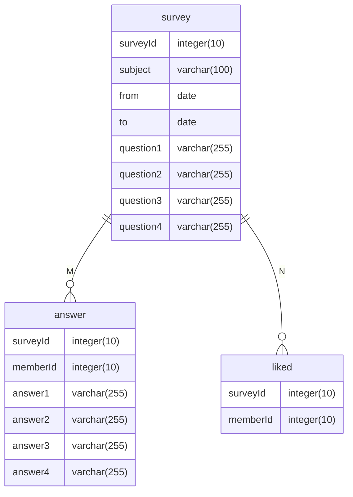
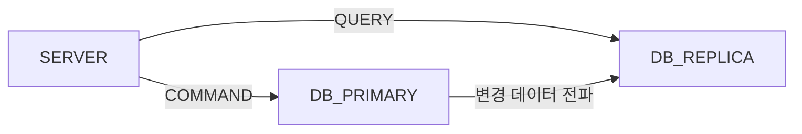
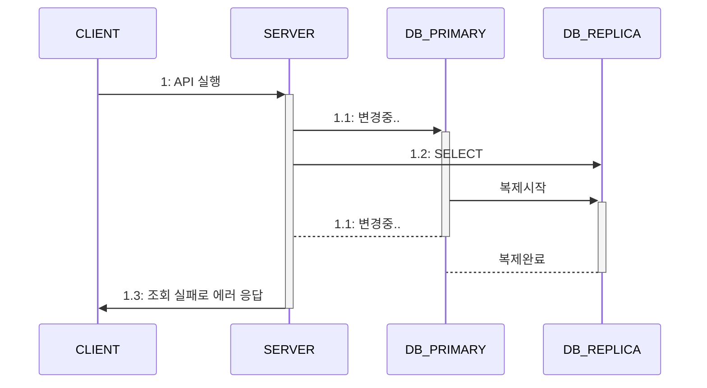

# 🔥 성능을 좌우하는 DB 설계와 쿼리

## 🚀 성능에 핵심인 DB

DB에 부하가 생기면 DB에 연결된 모든 서버의 응답 시간을 증가시키고 이는 다시 클라이언트에 영향을 준다.  
호출 빈도가 높은 기능에 풀 스캔을 유발하는 쿼리를 작성하는 경우 트래픽이 적을 땐 문제가 되지 않지만 서비스 사용이 본격화되면서  
트래픽이 증가하는 경우 서비스 장애로 이어질 수 있다.  

## 🚀 조회 트래픽을 고려한 인덱스 설계

일반적인 시스템에서는 조회 기능의 실행 비율이 높다. (1:9, 2:8)  
같은 게시판이라고 하더라도 사내에서 쓰는 게시판과 인기 커뮤니티 사이트에서 사용하는 게시판은 새로 등록되는 게시글 수에서 차이가 난다.  
DB 테이블을 설계할 때 조회 기능과 트래픽 규모를 고려해야 한다.  

예를 들어 10년 동안 쌓인 게시글 수가 520건에 불과하고 최대 TPS 가 10 미만인 상황에서 조회 성능을 올리기 위해 인덱스를 추가할 필요는 없다.  
반대라면 풀스캔으로 DB 장비의 CPU 사용률이 100%에 도달하지 않도록 적절한 인덱스를 추가해주어야 한다.  

조회 패턴을 기준으로 인덱스를 설계해야 한다.  

`전문 검색 인덱스`

보통 검색 기능은 LIKE '%검색어%' 쿼리를 포함하는데 이는 풀 스캔을 유발한다.  
문자열을 이용한 검색 기능을 위해 엘라스틱서치같은 검색 엔진을 사용하면 DB 를 사용하지 않고 검색 기능을 구현할 수 있다.  
검색 엔진을 구성하기 힘든 상황이라면 전문<sup>full-text</sup> 검색 기능 사용을 고려하자.  
MySQL의 FULL TEXT 인덱스를 사용하면 풀 스캔 없이 문자열 검색 쿼리를 실행할 수 있다.  

### 🎯 단일 인덱스와 복합 인덱스

사용자별 활동 내역을 조회할 목적으로 로그성 테이블(activityLog)에 특정 기간을 조회하는 쿼리를 생각해보자.

```SQL
SELECT * 
FROM activityLog 
WHERE userId = 123 
  AND activityDate = '2025-09-20' 
ORDER BY activityDatetime DESC
```

사용자를 식별할 user_id 컬럼의 인덱스는 당연하겠지만 추가적으로 다른 컬럼(ex. activityDate)을 같이 복합 인덱스로 설정해야할지 고민이 될 것이다.  
사용자당 가질 수 있는 데이터가 얼만큼 되는지 가늠해보면 어떤 인덱스를 사용해야 할지 판단하는데 도움이 된다.  

개별 사용자의 평균 활동 내역이 1년에 약 300건이라면 user_id 컬럼에만 인덱스를 추가하는 선택도 나쁘지 않을 것이다.  
개별 사용자의 평균 활동 내역이 1년에 약 10,000건이라면 user_id 컬럼과 activityDate 을 조합한 복합 인덱스를 추가하는 선택이 좋아보인다.  

activityLog 테이블은 통계를 추출하기 위한 목적으로도 사용될 수 있다.

```SQL
SELECT activityDate, activityType, count(activityType)
FROM activityLog
WHERE activityDate = '2025-09-20'
GROUP BY activityType;
```

activityType 컬럼을 인덱스에 포함시켜야할지 고민이다. 이 경우에 쿼리 실행 빈도와 실행 시간을 검토해서 포함 여부를 결정할 수 있다.  
집계된 내용을 별도 테이블에 저장한다면 쿼리 실행 시간이 30초여도 문제가 없다. (하루에 한 번만 실행하기 때문에)  
서비스가 급격하게 커져서 하루에 쌓이는 데이터가 수백만 개에 이르면 activityType 을 인덱스에 포함시켜 커버링 인덱스를 사용할 수 있도록 바꾸자.  

### 🎯 선택도를 고려한 인덱스 컬럼 선택

인덱스를 생성할 때는 선택도<sup>selectivity</sup> 가 높은 컬럼을 골라야 한다.  
선택도는 인덱스의 특정 컬럼의 고유한 값 비율을 나타낸다.  

- 선택도가 높으면 고유한 값이 많다
- 선택도가 낮으면 고유한 값이 적다

성별 같은 경우 선택도가 낮아, 인덱스로 조회하더라도 수 많은 데이터들을 다시 필터링해야 한다.  
그렇다고 항상 선택도가 높아야하는 것은 아닌데, 작업 큐를 구현한 테이블이 이에 해당한다.  

```SQL
CREATE TABLE jobqueue (
    jobid   VARCHAR(16)  NOT NULL PRIMARY KEY,
    status  CHAR(1)      NOT NULL
    -- 생략
)
```

status 컬럼이 W(대기), P(작업), C(완료) 3개의 값만 있어 선택도가 낮다.  
하지만 대부분 C(완료) 상태이고 W(대기), P(작업) 상태는 적다.  
WHERE 절에 W 조건이나 P 조건으로 조회하는 경우가 많다면 status 컬럼을 인덱스에 추가하는 것이 유리하다.  

### 🎯 커버링 인덱스 활용하기

특정 쿼리를 실행하는데 필요한 모든 컬럼을 포함한 인덱스를 의미한다.  
```SQL
SELECT apple, banana, kiwi
-- 생략
```

apple, banana, kiwi 를 복합 인덱스로 추가하면, 실제 데이터에 접근하지 않는다.  
이미 필요한 컬럼인 apple, banana, kiwi 가 인덱스에 포함되었기 때문이다.  

### 🎯 인덱스는 필요한 만큼만 만들기

userId, activityDate, activityType 3개의 컬럼이 있는데 조회 조건으로 자주 사용되는 2개의 쿼리가 있다.  

- WHERE userId ... activityDate
- WHERE userId ... activityDate ... activityType

첫 번째 쿼리는 userId 와 activityDate 로 조건문을 작성하고 두 번째 쿼리는 userId, activityDate, activityType 로 조건문을 작성한다.  
커버링 인데스를 만들 때 두 번째 인덱스가 효과를 보려면 데이터 갯수가 조회 성능에 영향을 줄만큼 많아야 한다.  

인덱스는 조회 성능을 향상 시켜주지만, 데이터의 추가, 변경, 삭제에서는 인덱스 관리에 따른 비용(시간)이 추가되기 때문에 무분별한 추가는 권장되지 않는다.  
새로 추가할 쿼리가 기존에 존재하는 인덱스를 활용하지 못하는 경우 요구 사항을 일부 변경할 수 있는지 검토해보자.  

## 🚀 몇 가지 조회 성능 개선 방법

인덱스가 아니어도 조회 성능을 개선할 수 있는 방법을 알아보자.

### 🎯 미리 집계하기

- 각 설문은 질문이 4개로 고정되어 있다.
- 회원은 각 설문 조사마다 '좋아요' 를 할 수 있다.
- 설문 조사 목록을 보여줄 때 답변 수와 '좋아요' 수를 표시한다.



목록을 표시할 때 설문에 답변한 회원 수와 '좋아요' 수를 표시하기 위해 SELECT 절에 서브쿼리에서 집계 함수를 사용할 수 있다.  

```SQL
SELECT * s.id, s.subject,
    (SELECT COUNT(*) FROM answer a WHERE a.surveyId = s.id) as answerCnt,
    (SELECT COUNT(*) FROM liked l WHERE l.surveyId = s.id) as likeCnt
FROM srvey s
ORDER BY s.id DESC
LIMIT 30;
```

위의 쿼리는 성능 문제가 발생할 수 있다.  
30개의 설문, 평균 답변자 수가 100_000 명, '좋아요'를 한 회원 수가 10_000 명이라고 가정한다.  

- 목록 조회 1번
- 답변자 수를 세는 쿼리 30번 : 각 쿼리는 100_000 개를 센다
- '좋아요' 수를 세는 쿼리 30번 : 각 쿼리는 10_000 개를 센다

논리적으로 61번의 쿼리가 실행되는데, 목록 조회 쿼리가 0.01 초  
답변자 수를 세는 쿼리가 0.1초 좋아요 수를 세는 쿼리가 0.05 초라면 총 4.51초가 걸리게 된다.  
(0.01 * 1) + (0.1 * 30) + (0.05 * 30) = 4.51s  

트래픽이 몰리면 병목이 생기므로 집계 데이터를 미리 계산하여 별도의 컬럼, 테이블 등에 저장하면 된다.  

이때 주의할 점은 비정규화 문제로 무결성이 깨진다는 것인데 약간의 불일치를 감수하더라도 성능에 이점이 있으므로 트레이드 오프를 할만하다.  
또 정확한 값은 언제든 계산할 수 있다.  

동시성 문제에서는 DB 가 원자적<sup>atomic</sup> 연산으로 처리하게 되면 문제가 없으므로,  
DBMS 가 지정한 트랜잭션 격리 수준에서 원자적으로 처리하는지 검증해야 한다.  

### 🎯 페이지 기준 목록 조회 대신 ID 기준 목록 조회 방식 사용하기

페이지네이션 처리를 위해 offset 을 사용한다.  
게시글 데이터가 100_000 개인데, 99_991번 째 페이지를 가져오기 위해  
OFFSET 99990 구문을 추가해 쿼리를 날릴 것이다. DB 는 99,990 개를 세고 나서 10개의 데이터를 조회하게 된다.  
인덱스에 포함되어 있지 않은 컬럼이 WHERE 절에 포함되면 시간은 더 증가한다.(ex. 논리 삭제 is_deleted 컬럼같은 것이 추가되거나)  

지정한 OFFSET 으로 이동하기 위해 데이터를 세는 시간을 줄이는 방법 중 하나는 특정 ID 로 조회하는 것이다.  
id 는 인덱스이므로 DB 입장에선 OFFSET 보다 빠르게 데이터를 찾을 수 있다.  

모바일 화면같은 경우 페이지 단위로 이동하기 보다는 스크롤을 통해 다음 데이터를 읽어오는 방식이 많다.  
ID 를 기준으로 조회하는 방식이 더 잘 들어맞고 클라이언트에서 페이지 번호 대신 마지막으로 조회한 ID 를 기준으로 다음 데이터를 요청함으로써 조회 속도를 높일 수 있다.  
응답 결과에 다음 데이터 존재 유무를 알려주는 속성을 추가하면 더 효과적이다.  

```SQL
SELECT * FROM article
WHERE id < 1001 AND deleted = FALSE
ORDER BY id DESC
LIMIT 11;
```

10개만큼 데이터를 응답하기로 했을 때, 조회 결과가 11개면 다음에 읽을 데이터가 존재하는 것이다.  
이떄는 처음 10개를 응답으로 제공하고 존재 여부를 TRUE 로 넘기면 된다.  

### 🎯 조회 범위를 시간 기준으로 제한하기

일간, 월간 등으로 범위를 제한할 경우 갯수에 따라 달라지겠지만 추가 인덱스 없이 간단한 쿼리로 성능 문제를 피할 수 있다.  
또 조회 범위를 최신 데이터로 제한하는 경우에도 마찬가지다.  
제품 담당자와 협의하여 기능을 줄이고 구현을 단순화할 수 있을 것이다.  
일반적으로 최신 데이터일 수록 조회 빈도가 높다. 최신 데이터를 캐시할 경우 캐시 적중률도 높일 수 있으므로 응답 속도도 빨라진다.  

### 🎯 전체 갯수 세지 않기

데이터가 적을 때 COUNT 쿼리는 큰 문제가 되지 않는다. 커버링 인덱스를 사용하더라도 전체 인덱스를 스캔해야 하고 아닌 경우에는 실제 데이터를 전부 읽어야 한다.  
전체 갯수를 화면에 표시하지 않는다거나 따로 별도의 테이블(혹은 컬럼)로 관리해야 한다.  

### 🎯 오래된 데이터 삭제 및 분리 보관하기

로그인 시도 내역은 장기간 보관할 필요가 없다. 이상 징후를 탐지하기 위한 목적이므로 최근 몇 달 치 내역만 있으면 충분한다.  
데이터 갯수가 늘어나면 쿼리 실행 시간은 증가한다.  
필요 없는 데이터는 삭제하거나 분리하자.  

DELETE 쿼리를 이용해 테이블의 데이터를 삭제하게되면 그 과정에서 데이터가 흩어져 저장되고 빈 공간이 생기는 단편화<sup>fragmentation</sup> 현상이 발생한다.  
단편화로 인한 성능 저하를 해결하는 방법 중 하나는 최적화 작업이다.  
최적화는 데이터를 재배치해 단편화를 줄이고 물리적인 디스크 사용량까지 줄여주는 효과가 있다.  

### 🎯 DB 장비 확장하기

부하 증가로 인해 성능 문제가 발생하는 경우, DB 장비를 수직 확장하여 서비스를 가능한 상태로 만들어 개선할 시간을 벌 수 있다.  
수평 확장도 고려해볼 수 있다. DB 가 처리할 수 있는 트래픽을 늘릴 수 있다.  
주 DB - 복제 DB<sup>Primary-Replica</sup> 구조를 사용해 처리량을 효과적으로 증가시킬 수 있다.  



읽기 전용 복제 DB 를 추가해 처리량을 높일 수 있다.  

### 🎯 별도 캐시 서버 구성하기

DB 만으로 모든 트래픽을 처리하기 어려워질 수 있다.  
캐시 서버를 잘 사용하면 DB 확장 대비 적은 비용으로 더 많은 트래픽을 처리할 수 있다.  

## 🚀 알아두면 좋을 몇 가지 주의 사항

### 🎯 쿼리 타임 아웃

응답 시간은 처리량에 큰 영향을 준다. 동시 사용자가 증가할 때 응답 시간이 길어지면 그에 반비례해 처리량은 감소한다.  
사용자의 재시도는 서버 부하를 가중시키는데 쿼리 실행 시간을 제한(타임아웃 설정)하는 방법도 있다.  

쿼리 실행 시간을 5초로 제한한 경우 폭증하는 트래픽으로 5초를 넘기게 될 경우 제한 시간 초과 에러가 발생한다.  
사용자는 에러 화면을 보게 되지만 서버 입장에선 정상적으로 종료한 셈이다.  
사용자가 재시도하더라도 이전 요청이 여전히 처리중이 아니므로 동시 요청 수의 폭증을 막을 수 있다.  

쿼리 타임아웃은 서비스와 기능의 특성에 따라 다르게 설정해야 한다.  
게시글 조회같은 경우 짧게 설정해도 되지만, 결제와 같은 경우는 긴 타임아웃을 설정해야 한다.  
결제 처리 중 타임아웃으로 에러가 발생하면 후속 처리와 데이터 정합성이 복잡해질 수 있다.  

### 🎯 상태 변경 기능은 복제 DB에서 조회하지 않기


변경은 주 DB, 조회는 복제 DB 를 사용한다. 이를 잘못 이해해 모든 SELECT 를 복제 DB 에서 하면 안 된다.  

1. 주 DB 와 복제 DB 의 순간 불일치

- 네트워크를 통해 복제 DB에 전달
- 복제 DB는 자체 데이터에 변경 내용을 반영



주 DB에 변경사항을 복제 DB에 반영하는 사이에 조회하므로 요청을 제대로 처리할 수 없게 된다.  

2. 트랜잭션 문제 발생

주 DB 와 복제 DB 간 데이터 복제는 트랜잭션 커밋 시점에 이뤄진다.  
주 DB 의 트랜잭션 범위 내에서 데이터를 변경하고 복제 DB 에서 변경 대상이 될 수 있는 데이터를 조회하면 데이터 불일치로 인해 문제가 생긴다.  

상황에 따라 주 DB 에서 조회해야 이와 같은 문제를 방지할 수 있다.  

### 🎯 배치 쿼리 실행 시간 증가

배치 프로그램은 데이터를 일괄로 조회하거나 집계하거나 생성하는 작업을 수행한다. 데이터가 적을 땐 문제가 없다가, 특정 임계치를 넘으면  
실행 시간이 예측할 수 없을만큼 길어질 수 있다. 쿼리의 실행 시간을 지속적으로 추적하고 추적을 통한 원인을 찾아 해결할 수 있다.  

가장 빠른 해결책은 DB 장비의 사양을 높이는 것이고 커버링 인덱스를 활용하거나 일정한 크기로 나누어서 처리하는 방법도 있다.  
시간 단위, 일 단위, 주 단위 등 상황에 맞게 일정한 크기로 나누어 처리하면 적어도 결과를 끊김 없이 구할 수 있다.  
배치 프로그램의 쿼리가 크다면 작은 단위로 쿼리를 분리하여 한 번에 처리하던 범위를 작게 나누는 방식으로 해결할 수도 있다.  

### 🎯 타입이 다른 컬럼 조인 주의

서로 다른 컬럼을 조인하게 되면 인덱스를 사용하지 못한다. 컬럼의 값을 비교하는 과정에서 DB 는 타입 변환을 수행한다.  
타입을 변환하는 쿼리를 작성해주면 인덱스를 사용할 수 있고 문자열인 경우 캐릭터셋이 같은지도 확인해야 한다.  

### 🎯 테이블 변경은 신중하게

데이터가 많은 테이블에 새로운 컬럼을 추가하거나 기존 열거 타입 컬럼을 변경할 때는 매우 주의해야 한다.  
무심코 컬럼을 변경했다가 서비스가 장시간 중단되는 상황이 발생할 수 있다.  

이유는 DB 의 테이블 변경 방식 때문인데 MySQL 의 경우 새 테이블을 생성하고 원본 테이블의 데이터를 복사한 뒤 복사가 완료되면 새 테이블로 대체한다.  
이 과정에서 UPDATE, INSERT, DELETE 같은 DML 작업을 허용하지 않기 때문에 복사 시간만큼 서비스가 멈춘다.  

DML 을 허용하면서 테이블을 변경하는 기능도 있지만 항상 가능한 것은 아니다.  
그래서 데이터가 많은 테이블은 점검 시간을 잡고(서비스 잠시 중단) 변경하는 것이 안정정이다.  

### 🎯 DB 최대 연결 갯수

다음과 같은 상황을 가정해보자.

- API 서버 3대
- 트래픽이 증가하고 있어 수평 확장 필요
- DB 서버의 CPU 사용률은 20% 수준으로 여유 있음

트래픽 증가를 감당하기 위해 API 서버를 추가할 수 있다. 그런데 새로 추가한 API 서버에서 DB 커넥션 생성에 실패한다면  
DB 서버 자원에는 여유가 있지만 API 서버에서 DB 에 연결되지 않는다면 DB 에 설정된 최대 연결 개수를 확인해야 한다.  

DB 의 최대 연결 개수가 100개이고 API 서버의 커넥션 풀 개수가 30개 일 때 API 서버 3대까지는 90개로 괜찮다.  
하지만 API 서버를 늘리면서 총 120개가 필요한 경우 나머지 20개에 대해서 연결 실패가 발생하게 된다.  

이 경우에는 DB의 최대 연결 개수만 늘려주는 것으로 해결할 수 있다.  
DB CPU 사용률이 70% 이상으로 높다면 부하가 증가하고 성능 저하로 이어지므로 주의해야 한다.  

## 🚀 실패와 트랜잭션 고려하기

