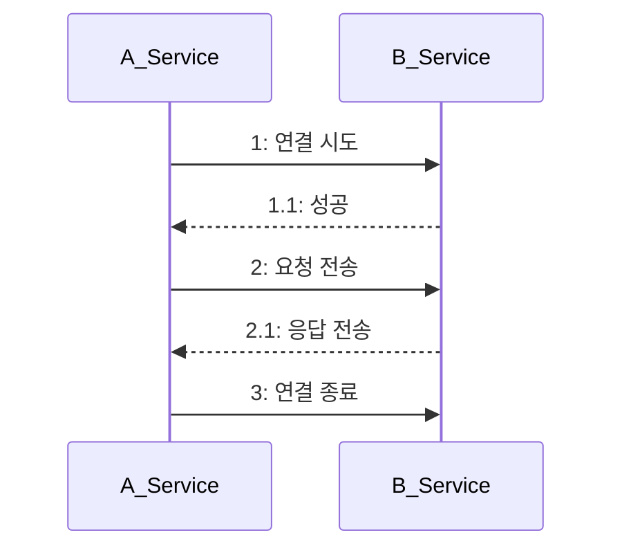
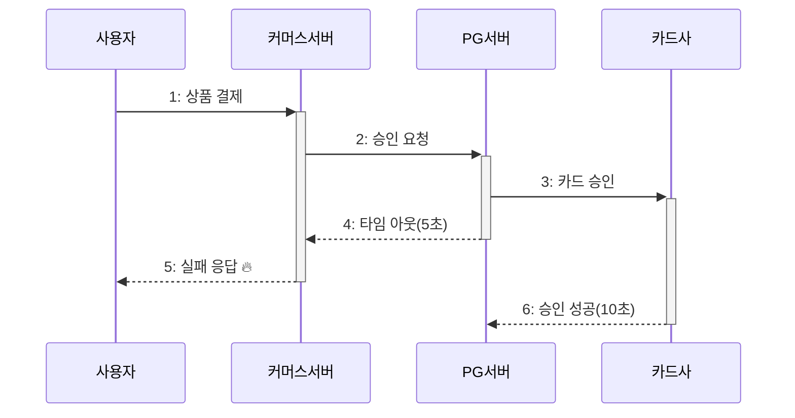
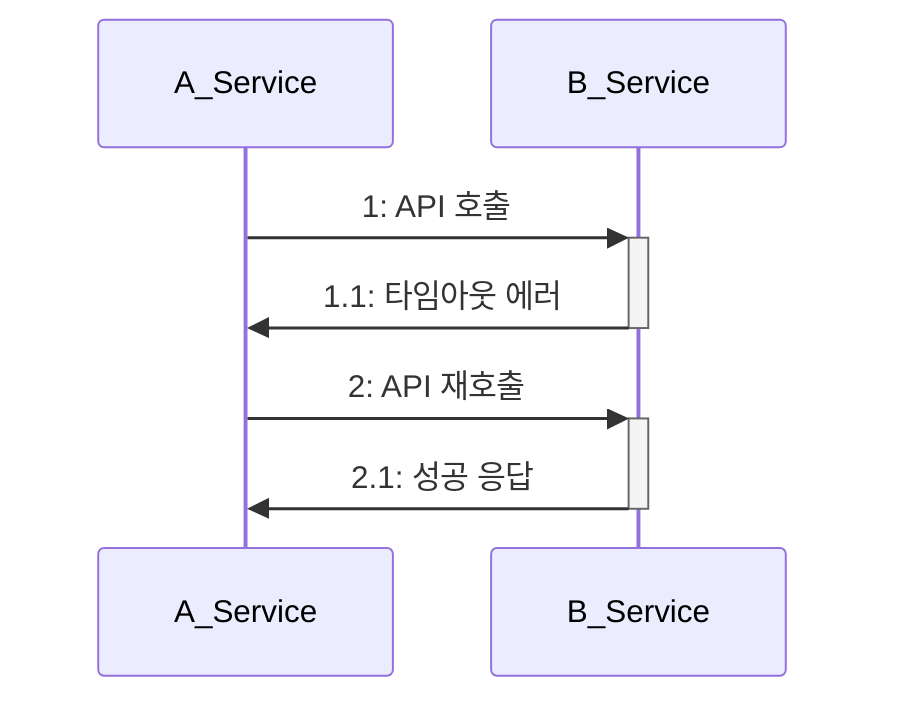
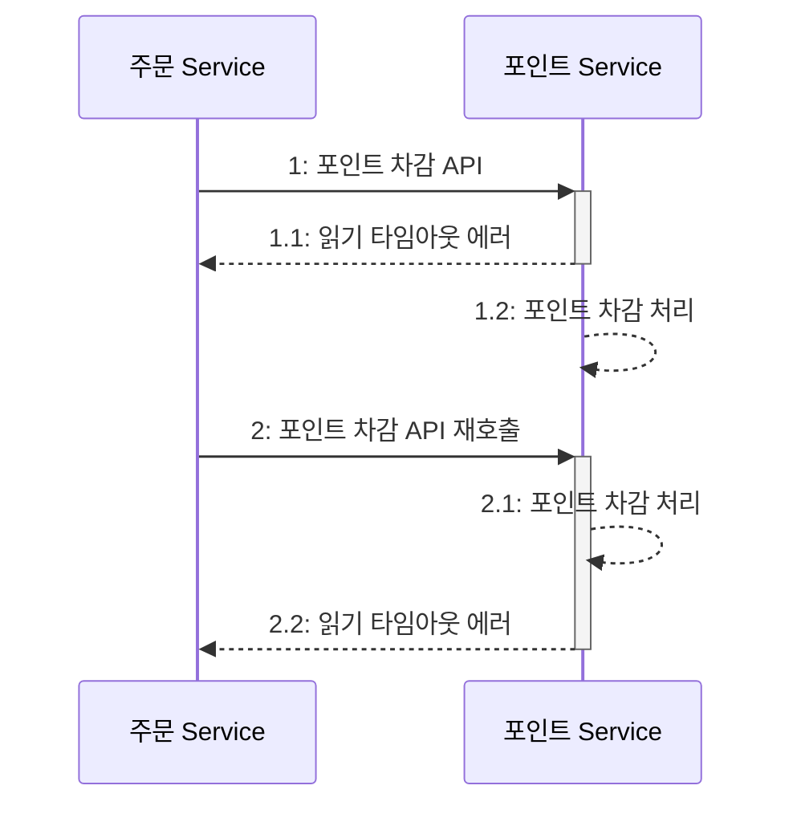

# 🔥 외부 연동이 문제일 때 살펴봐야 할 것들

## 🚀 우리는 문제가 없는데

내부/외부 서비스 간 연동은 계속 증가하는 추세이며, 주의를 기울이지 않으면 심각한 장애를 겪을 수 있다.  
한 서비스의 장애는 연동된 다른 서비스에도 영향을 주며, 연동된 서비스의 문제를 완벽하게 차단하기는 어렵다.  
연동 서비스의 영향을 최소화하여 시스템이 안정적으로 돌아갈 수 있는 방법을 알아보자.

## 🚀 타임아웃

응답과 관련하여 언급한 타임아웃과 같은 맥락이다. 데이터베이스와 마찬가지로 외부 서비스 연동도 타임아웃을 적절히 설정해주어야 한다.  

- A 서비스는 톰캣이고 쓰레드 풀 크기가 200 이다. (즉 동시 요청 처리 수는 200)
- A 서비스는 B 서비스를 호출한다.
- B 서비스에 성능 문제가 생겨 응답 시간이 60초를 넘기기 시작했다.

A 서비스는 200개의 요청을 처리할 수 있으므로 100개의 요청(1번째 요청)이 들어오면 문제없이 처리하기 시작한다.  
이 요청들이 모두 B 서비스를 호출할 때 A 서비스의 쓰레드는 모두 응답을 기다리며 대기 상태가 된다.  

잠시 후(2번째 요청), 또 다른 100명이 A 서비스에 요청을 보내면 그 순간 200개의 요청을 동시에 처리하게 되고 있고 모두 B 서비스의 응답을 기다리게 된다.  
잠시 후(3번째 요청), 또 다른 100명이 요청을 보내면, 아직 200개의 쓰레드가 요청을 처리하고 있는 상황이므로 새로 들어온 요청은 처리되지 않는다.  

연동 서비스에 대한 타임아웃을 적절하게 설정하지 않으면 연동 서비스의 응답이 느릴 때 처리량이 급격히 떨어진다.  

- 3번째 요청이 B 서비스를 호출하지 않는 요청인 경우에도 대기하므로 최악.
- 사용자는 응답이 올 때까지 기다리지 않는다. 새로 고침과 같은 방법으로 새로운 요청을 보낸다. 최악.

타임아웃을 설정하여 에러화면을 보더라도 서버 입장에선 다른 요청들(외부 서비스 연동을 필요로하지 않는.)을 잘 처리할 수 있고  
서버는 자원이 포화되기 전에 응답하게 되므로 영향을 줄일 수 있다.  

### 🎯 2가지 타임아웃: 연결 타임아웃, 읽기 타임아웃 

API 연동에서 통신 과정을 단순화하면 아래와 같다.  

1. 연결 시도를 위한 네트워크 통신이 오래 걸리면 대기 시간도 함께 증가한다. 연결 타임아웃connection timeout을 설정해 연결 대기 시간을 제한해야 한다.  
2. 응답을 기다리는 시간이 오래 걸리면 대기 시간도 함께 증가한다. 읽기 타임아웃read timeout을 설정해 응답 대기 시간을 제한해야 한다.  

추이를 보면서 조정하는 것이 좋지만 초기값은 아래와 같이 셋팅하는 것을 추천한다.  

- 연결 타임아웃: 3초 ~ 5초
- 읽기 타임아웃: 5초 ~ 30초

읽기 타임아웃이 너무 짧으면 연동 서비스가 잘 처리했음에도 불구하고 응답이 실패로 돌아갈 수 있다.  

#### ✅ 소켓 타임아웃과 읽기 타임아웃

읽기 타임아웃을 지정할 때는 실제로 설정하는 값이 무엇인지 확인해야 한다.  

Apache HttpClient 는 소켓 타임아웃을 설정한다.  
패킷 단위를 기준으로 하므로 전체 응답 시간에 대한 타임아웃을 의미하지 않는다.  

OkHttp 는 읽기 타임아웃과는 별개로 호출 타임아웃call timeout을 설정할 수 있다.  
호출 타임아웃은 요청 시작부터 응답까지의 전체 시간 기준으로 설정된다.  
소켓 타임아웃을 5초로, 호출 타임아웃을 10초로 설정하면 패킷은 계속 수신되지만 전체 처리 시간이 오래 걸리는 경우에 타임아웃을 발생시킬 수 있다.  

## 🚀 재시도

외부 서비스 연동에 실패했을 때 처리 방법 중 하나는 재시도를 하는 것이다.  

### 🎯 재시도 가능 조건

재시도를 통해 연동 실패를 줄일 수 있지만 항상 재시도할 수 있는 것은 아니다. 연동 API 를 다시 호출해도 되는 조건인지 확인해야 한다.  

이와 같이 재시도해도 문제가 없는 경우에만 재시도를 시도해야 한다.  
재시도를 해도 되는 조건은 다음 3가지로 정리할 수 있다.  

- 단순 조회 기능
- 연결 타임아웃
- 멱등성(idempotent)을 가진 변경 기능

1. 단순 조회 기능은 재시도를 통해 성공 확률을 높일 수 있다. 상태의 변경도 없으므로 일시적인 문제는 재시도로 해결할 수 있다.  
2. 연결 타임아웃도 마찬가지다. 연동 서비스와 아직 연결되지 않았다는 뜻이므로 순간적인 네트워크 문제였다면 재시도를 통해 해결할 수 있다.  
3. 읽기 타임아웃은 주의해야 한다. 연동 서비스가 이미 요청을 처리하고 있는 상태이므로 예시처럼 포인트 차감 처리가 중복될 수도 있다.

상태를 변경하는 연동 API 는 재시도할 때 멱등성을 고려해야 한다.  
멱등성이란 연산을 여러번 적용해도 결과가 달라지지 안흔 성질을 말한다.  
같은 API 라도 실패 원인에 따라 재시도 여부를 결정해야 한다. 검증 오류가 발생했다면 재시도를 하더라도 결과는 동일할 것이다.  

### 🎯 재시도 횟수와 간격

재시도를 할 때는 '횟수'와 '간격'을 적절하게 설정해야 한다. 재시도를 무한정할 수는 없다.  
횟수는 1~2번 정도가 적당하다. 2번 재시도를 하면 총 3번의 요청을 보낸 것인데 이 모두를 실패했다면 간헐적인 오류보다는 다른 근본적인 문제일 가능성이 높다.  
간격은 네트워크 상태가 안 좋은 경우 바로 재시도할 경우 똑같은 상황이 발생할 것이다.  
여러 차례 재시도할 때는 점진적으로 간격을 늘리거나 적당한(ex 3초) 간격으로 설정한다.  
이를 통해 외부 서버에 부하도 일부 완화할 수 있다.  

### 🎯 재시도 폭풍(retry storm) 안티패턴

앞서 얘기한 것처럼 외부 API 서버는 이미 요청 처리 중에 있는데 여러 번 재시도를 하게 되면 부하를 추가하는 것과 다름이 없다.  
따라서 재시도를 검토할 때는 외부 API 서버의 성능 상황도 함께 고려해야 한다.  

## 🚀 동시 요청 제한

## 🚀 서킷 브레이커

## 🚀 외부 연동과 DB 연동

### 🎯 외부 연동과 트랜잭션 처리

### 🎯 외부 연동이 느려질 때 DB 커넥션 풀 문제

## 🚀 HTTP 커넥션 풀

## 🚀 연동 서비스 이중화

