# 🔥 외부 연동이 문제일 때 살펴봐야 할 것들

## 🚀 우리는 문제가 없는데

내부/외부 서비스 간 연동은 계속 증가하는 추세이며, 주의를 기울이지 않으면 심각한 장애를 겪을 수 있다.  
한 서비스의 장애는 연동된 다른 서비스에도 영향을 주며, 연동된 서비스의 문제를 완벽하게 차단하기는 어렵다.  
연동 서비스의 영향을 최소화하여 시스템이 안정적으로 돌아갈 수 있는 방법을 알아보자.

## 🚀 타임아웃

응답과 관련하여 언급한 타임아웃과 같은 맥락이다. 데이터베이스와 마찬가지로 외부 서비스 연동도 타임아웃을 적절히 설정해주어야 한다.  

- A 서비스는 톰캣이고 쓰레드 풀 크기가 200 이다. (즉 동시 요청 처리 수는 200)
- A 서비스는 B 서비스를 호출한다.
- B 서비스에 성능 문제가 생겨 응답 시간이 60초를 넘기기 시작했다.

A 서비스는 200개의 요청을 처리할 수 있으므로 100개의 요청(1번째 요청)이 들어오면 문제없이 처리하기 시작한다.  
이 요청들이 모두 B 서비스를 호출할 때 A 서비스의 쓰레드는 모두 응답을 기다리며 대기 상태가 된다.  

잠시 후(2번째 요청), 또 다른 100명이 A 서비스에 요청을 보내면 그 순간 200개의 요청을 동시에 처리하게 되고 있고 모두 B 서비스의 응답을 기다리게 된다.  
잠시 후(3번째 요청), 또 다른 100명이 요청을 보내면, 아직 200개의 쓰레드가 요청을 처리하고 있는 상황이므로 새로 들어온 요청은 처리되지 않는다.  

연동 서비스에 대한 타임아웃을 적절하게 설정하지 않으면 연동 서비스의 응답이 느릴 때 처리량이 급격히 떨어진다.  

- 3번째 요청이 B 서비스를 호출하지 않는 요청인 경우에도 대기하므로 최악.
- 사용자는 응답이 올 때까지 기다리지 않는다. 새로 고침과 같은 방법으로 새로운 요청을 보낸다. 최악.

타임아웃을 설정하여 에러화면을 보더라도 서버 입장에선 다른 요청들(외부 서비스 연동을 필요로하지 않는.)을 잘 처리할 수 있고  
서버는 자원이 포화되기 전에 응답하게 되므로 영향을 줄일 수 있다.  

### 🎯 2가지 타임아웃: 연결 타임아웃, 읽기 타임아웃 

API 연동에서 통신 과정을 단순화하면 아래와 같다.  

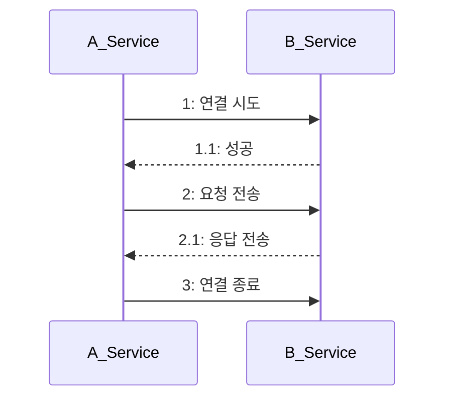

1. 연결 시도를 위한 네트워크 통신이 오래 걸리면 대기 시간도 함께 증가한다. 연결 타임아웃connection timeout을 설정해 연결 대기 시간을 제한해야 한다.  
2. 응답을 기다리는 시간이 오래 걸리면 대기 시간도 함께 증가한다. 읽기 타임아웃read timeout을 설정해 응답 대기 시간을 제한해야 한다.  

추이를 보면서 조정하는 것이 좋지만 초기값은 아래와 같이 셋팅하는 것을 추천한다.  

- 연결 타임아웃: 3초 ~ 5초
- 읽기 타임아웃: 5초 ~ 30초

읽기 타임아웃이 너무 짧으면 연동 서비스가 잘 처리했음에도 불구하고 응답이 실패로 돌아갈 수 있다.  

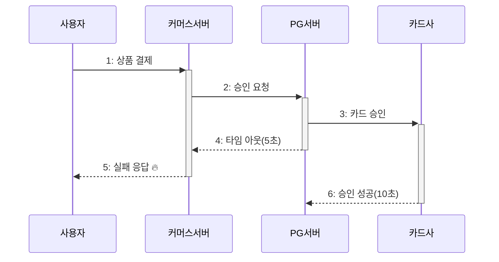

#### ✅ 소켓 타임아웃과 읽기 타임아웃

읽기 타임아웃을 지정할 때는 실제로 설정하는 값이 무엇인지 확인해야 한다.  

Apache HttpClient 는 소켓 타임아웃을 설정한다.  
패킷 단위를 기준으로 하므로 전체 응답 시간에 대한 타임아웃을 의미하지 않는다.  

OkHttp 는 읽기 타임아웃과는 별개로 호출 타임아웃call timeout을 설정할 수 있다.  
호출 타임아웃은 요청 시작부터 응답까지의 전체 시간 기준으로 설정된다.  
소켓 타임아웃을 5초로, 호출 타임아웃을 10초로 설정하면 패킷은 계속 수신되지만 전체 처리 시간이 오래 걸리는 경우에 타임아웃을 발생시킬 수 있다.  

## 🚀 재시도

외부 서비스 연동에 실패했을 때 처리 방법 중 하나는 재시도를 하는 것이다.  

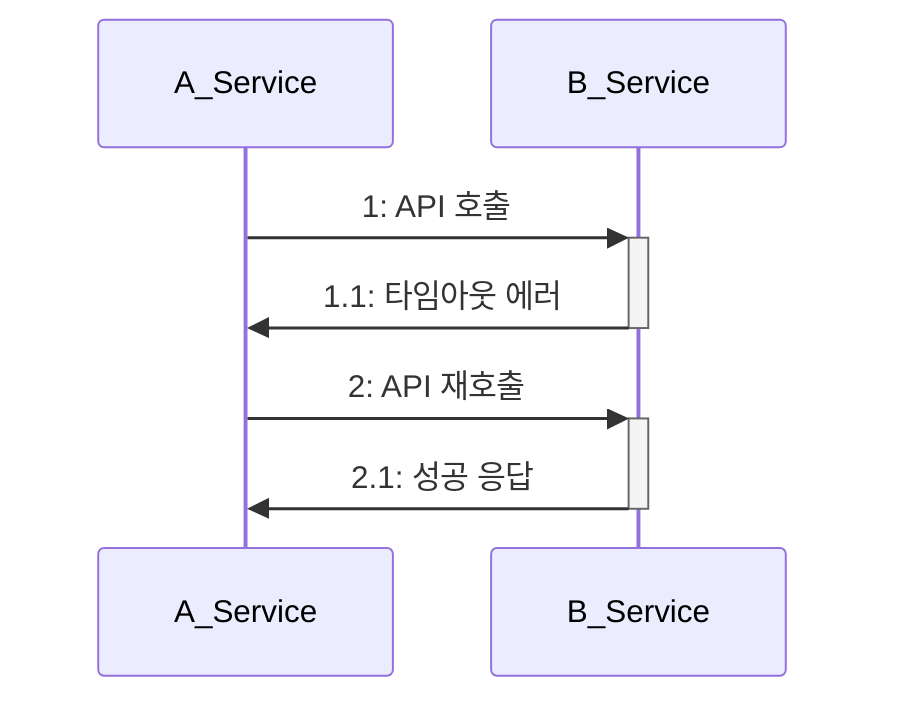

### 🎯 재시도 가능 조건

재시도를 통해 연동 실패를 줄일 수 있지만 항상 재시도할 수 있는 것은 아니다. 연동 API 를 다시 호출해도 되는 조건인지 확인해야 한다.  

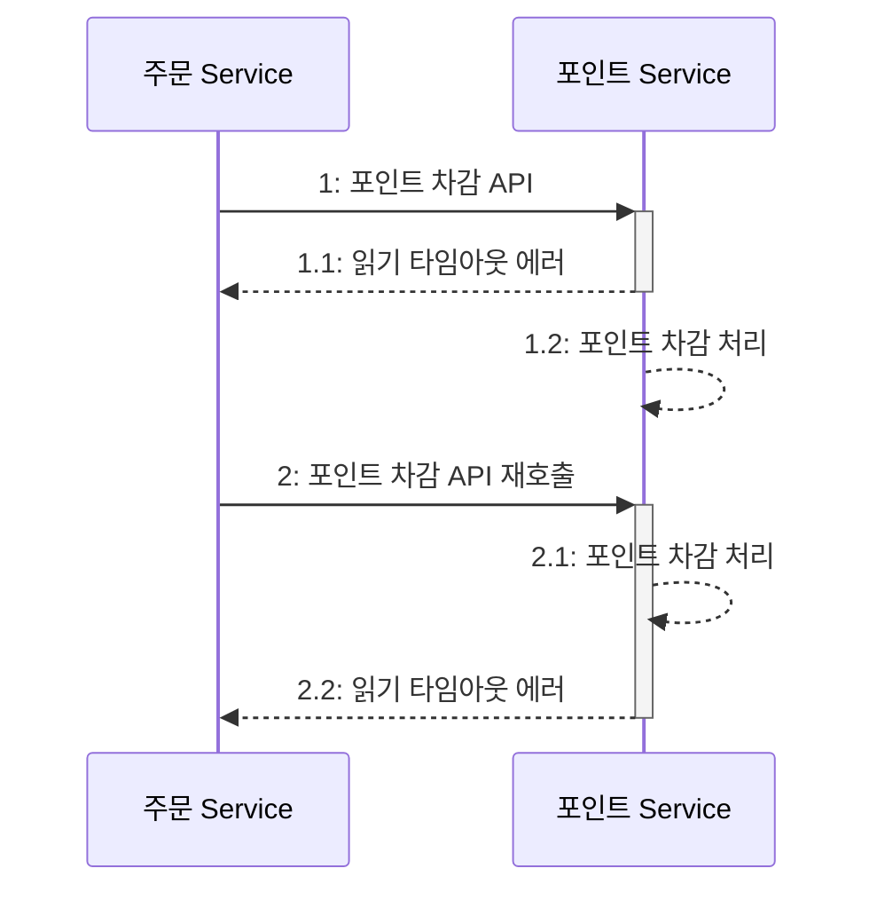

이와 같이 재시도해도 문제가 없는 경우에만 재시도를 시도해야 한다.  
재시도를 해도 되는 조건은 다음 3가지로 정리할 수 있다.  

- 단순 조회 기능
- 연결 타임아웃
- 멱등성(idempotent)을 가진 변경 기능

1. 단순 조회 기능은 재시도를 통해 성공 확률을 높일 수 있다. 상태의 변경도 없으므로 일시적인 문제는 재시도로 해결할 수 있다.  
2. 연결 타임아웃도 마찬가지다. 연동 서비스와 아직 연결되지 않았다는 뜻이므로 순간적인 네트워크 문제였다면 재시도를 통해 해결할 수 있다.  
3. 읽기 타임아웃은 주의해야 한다. 연동 서비스가 이미 요청을 처리하고 있는 상태이므로 예시처럼 포인트 차감 처리가 중복될 수도 있다.

상태를 변경하는 연동 API 는 재시도할 때 멱등성을 고려해야 한다.  
멱등성이란 연산을 여러번 적용해도 결과가 달라지지 안흔 성질을 말한다.  
같은 API 라도 실패 원인에 따라 재시도 여부를 결정해야 한다. 검증 오류가 발생했다면 재시도를 하더라도 결과는 동일할 것이다.  

### 🎯 재시도 횟수와 간격

재시도를 할 때는 '횟수'와 '간격'을 적절하게 설정해야 한다. 재시도를 무한정할 수는 없다.  
횟수는 1~2번 정도가 적당하다. 2번 재시도를 하면 총 3번의 요청을 보낸 것인데 이 모두를 실패했다면 간헐적인 오류보다는 다른 근본적인 문제일 가능성이 높다.  
간격은 네트워크 상태가 안 좋은 경우 바로 재시도할 경우 똑같은 상황이 발생할 것이다.  
여러 차례 재시도할 때는 점진적으로 간격을 늘리거나 적당한(ex 3초) 간격으로 설정한다.  
이를 통해 외부 서버에 부하도 일부 완화할 수 있다.  

### 🎯 재시도 폭풍(retry storm) 안티패턴

앞서 얘기한 것처럼 외부 API 서버는 이미 요청 처리 중에 있는데 여러 번 재시도를 하게 되면 부하를 추가하는 것과 다름이 없다.  
따라서 재시도를 검토할 때는 외부 API 서버의 성능 상황도 함께 고려해야 한다.  

## 🚀 동시 요청 제한

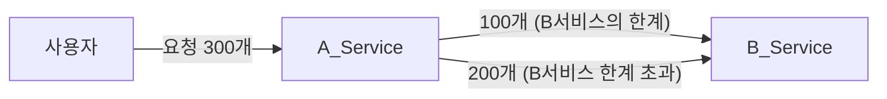

외부 연동 서비스의 최대 처리량를 초과한 요청은 연동 서비스를 느려지게 하고 덩달아 우리 서비스도 함께 느려진다.  
외부 연동 서비스의 최대 처리량을 고려하여 A_Service 에서 요청을 제한한다면 B_Service 성능 저하 문제없이 안정적으로 처리할 수 있다.  

벌크헤드 패턴을 적용한다면 아래와 같다.  
- 벌크헤드 패턴: 각 구성 요소를 격리함으로써 한 구성 요소의 장애가 다른 구성 요소에 영향을 주지 않도록 하는 설계 패턴

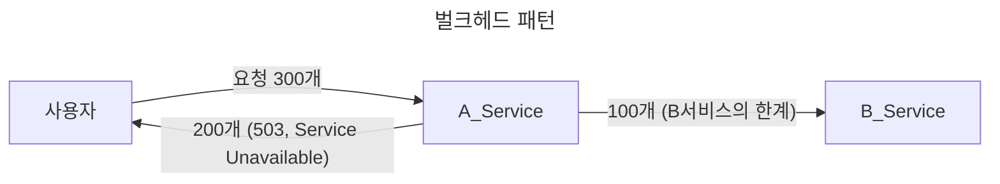

## 🚀 서킷 브레이커

연동 서비스가 에러가 발생한 상황이라면 정상화되기 전까지 요청을 보내도 계속 에러만 발생한다.  

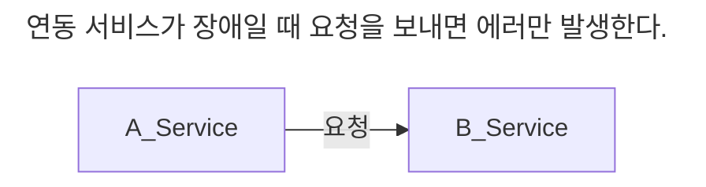

B 서비스가 정상이 아닐 때, B 서비스에 요청을 보내지 않고 바로 에러를 응답하는 것이 낫다.  
B 서비스의 문제가 A 서비스에 주는 영향(응답 시간 증가, 처리량 감소 등)을 줄일 수 있기 때문이다.  

또한 사용자 입장에서도 수 초동안 기다리는 것보다 곧바로 에러 화면을 보는 것이 낫다.  

연동 서비스가 장애 상황일 때는 연동 대신 바로 에러를 응답하고, 정상화되었을 때 연동을 재개하면  
연동 서비스의 장애가 주는 영향을 줄일 수 있다.  

이는 서킷 브레이커Circuit Breaker 가 동작하는 방식과 같다.  
서킷 브레이커는 닫힘Close, 열림Open, 반열림Half-Open 의 3가지 상태를 갖는다.

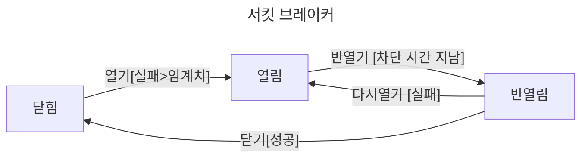

서킷 브레이커는 닫힘 상태로 시작한다.  
- 닫힘: 항상 연동 서비스에 요청을 전달한다.  

#### 닫힘

항상 연동 서비스에 요청을 전달한다.  
외부 연동 과정에서 오류가 발생하기 시작하면 설정한 임계치를 초과했는지 확인 후 열림 상태로 전환된다.  

- 시간 기준 오류 발생 비율 (ex. 10초 동안 오류 비율 50% 초과)  
- 개수 기준 오류 발생 비율 (ex. 100개 요청 중 오류 비율 50% 초과)  

#### 열림

연동 요청은 수행하지 않고 곧바로 에러를 응답한다.  
지정된 시간동안 유지되며 반열림 상태로 전환된다.  

#### 반열림

일부 요청에 한해 연동을 시도한다.  
일정 개수 또는 일정 시간 동안 반열림 상태를 유지한다.  
이 기간 동안 연동에 성공하면 닫힘 상태로, 실패하면 열림 상태로 전환된다.  

빠른 실패는 부하를 방지하고 불필요한 자원 낭비를 줄여준다.  

## 🚀 외부 연동과 DB 연동

외부 서비스의 저장소에도 정보가 잘 저장되는지, 저장하는 과정에서 실패할 수도 있고 외부 서비스를 연동하는 도중에 에러가 발생할 수도 있다.  

### 🎯 외부 연동과 트랜잭션 처리

DB 연동과 외부 연동을 함께 실행할 때는 트랜잭션을 어떻게 처리할지 알맞게 판단해야 한다.  

- 외부 연동에 실패했을 때 트랜잭션을 롤백
- 외부 연동은 성공했지만 DB 연동에 실패해 트랜잭션을 롤백

예시를 보자.  

- 외부 연동에 실패하면 트랜잭션을 롤백할 수 있다.

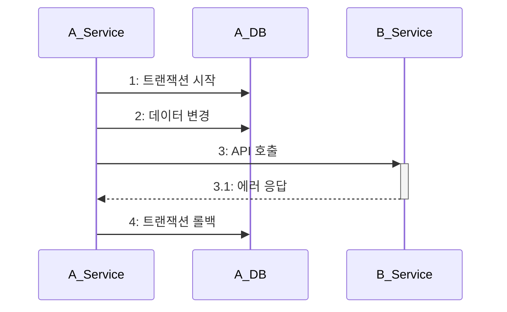

- 읽기 타임아웃 에러가 발생할 때는 외부 연동이 성공했을 가능성도 고려해야 한다.

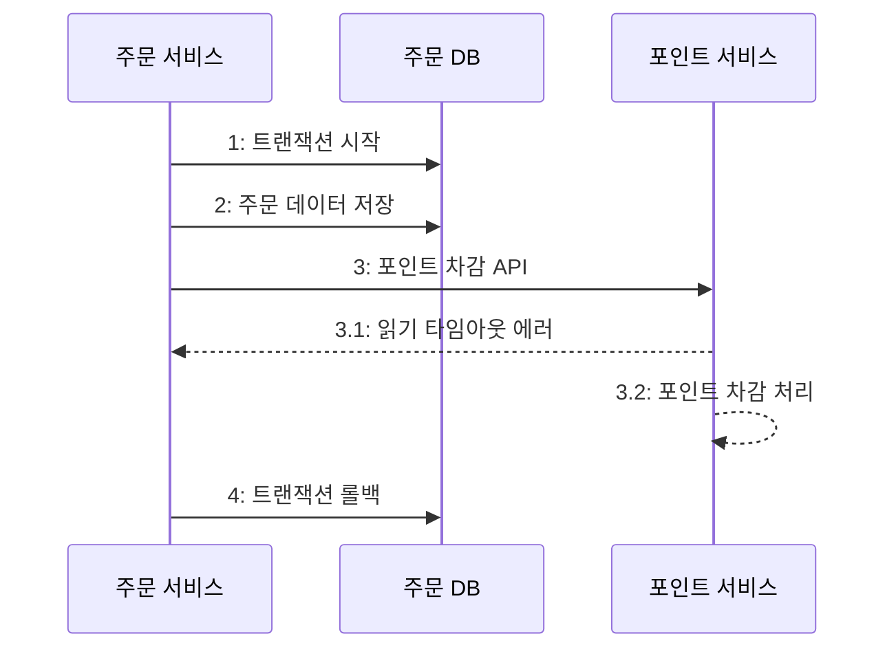

트랜잭션을 롤백했지만 실제로 외부 서비스는 성공했을 경우를 대비해야 한다.  
첫 번째는 주기적으로 두 시스템의 데이터가 일치하는지 확인하는 방법(수동 혹은 자동)과  
두 번째는 성공 확인 API 를 호출하는 것이다. (비슷한 방식으로 취소 API 를 호출하는 방법도 있다)  

- 외부 연동은 성공했는데 DB 연동에 실패해서 트랜잭션을 롤백

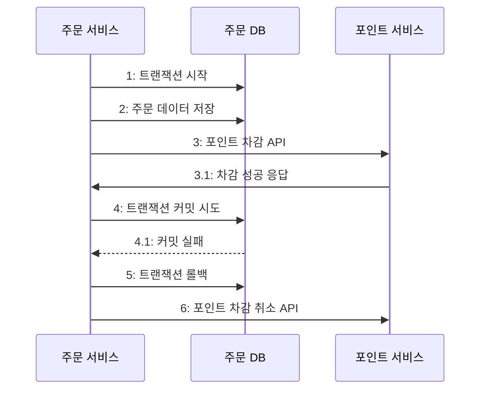

일관성이 중요한 경우 역시나 주기적으로 두 시스템의 데이터가 일치하는지 확인하는 프로세스를 갖추는 것이 좋다.

### 🎯 외부 연동이 느려질 때 DB 커넥션 풀 문제

DB 트랜잭션 범위 안에서 외부 연동을 수행할 때 외부 연동이 느려지면서 커넥션 풀 부족 현상이 발생할 수 있다.  

1. 커넥션 풀에서 커넥션은 가져온다.
2. DB 쿼리 실행 (0.1초)
3. 외부 연동 API 호출 (4.8초)
4. DB 쿼리 실행 (0.1초)
5. 커넥션을 풀에 반환

DB 커넥션은 총 0.2초를 사용하지만 외부 연동 때문에 5초동안 커넥션을 점유하게 된다.  
커넥션 풀 크기는 제한적인데 외부 연동으로 인해 커넥션 풀 부족 현상이 발생할 수 있다.  

- 커넥션 풀 크기가 5, TPS 1, 외부 연동 포함 총 처리 시간 5초 = 커넥션 풀 부족 현상 X

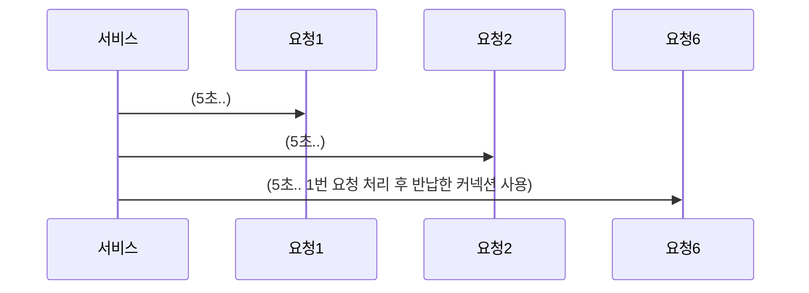

- 커넥션 풀 크기가 5, TPS 1, 외부 연동 포함 총 처리 시간 6.8초 = 커넥션 풀 부족 현상 O

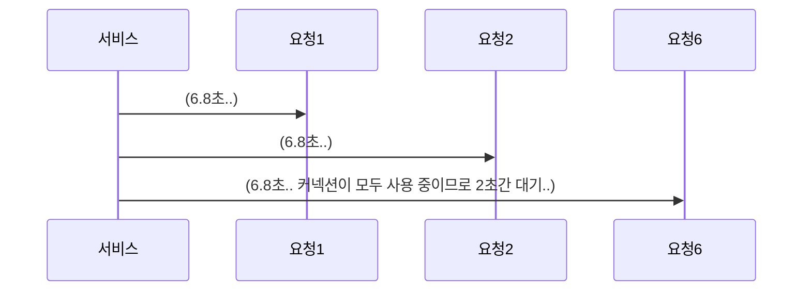

이처럼 외부 서비스의 요청 처리 지연 시간으로 인해 커넥션 부족 현상이 발생할 수 있는데  
DB 연동과 무관하게 외부 연동을 실행할 수 있다면 DB 커넥션을 사용하기 전이나 후에 외부 연동을 시도하는 방안도 고려해볼 수 있다.  
단, 이 방식은 트랜잭션 범위 밖에서 외부 연동이 수행되므로 보상 트랜잭션을 사용하거나 후보정 처리를 해주어야 한다.  

## 🚀 HTTP 커넥션 풀

URL 의 처리 시간을 보면 연결 시간이 차지하는 비중이 크다.  
DB 커넥션 풀이 DB 연결에 걸리는 시간을 줄여 성능을 높이는 것처럼 HTTP 연결도 커넥션 풀을 사용하면 연결 시간을 줄일 수 있다.  

- HTTP 커넥션 풀의 크기
- 풀에서 HTTP 커넥션을 가져올 때까지 대기하는 시간
- HTTP 커넥션을 유지할 시간 (keep alive)

연동 서비스의 성능을 고려하여 HTTP 커넥션 풀의 크기를 설정해야 한다.  
순간적으로 많은 트래픽이 몰릴 경우에 연동 서비스의 처리 대기 시간이 전체 시스템에 영향을 미치기 때문이다.  

대기 시간 설정도 고려 대상인데, 커넥션을 확보하지 못한 요청에 대해 무한정 대기하게 할 수 없다.(커넥션 반환 후 획득까지)  
대기 시간이 길어지는 것 역시 전체 응답 시간에 영향을 주므로 수 초 이내의 짧은 시간으로 설정하는 것이 좋다. (필자의 경험은 1~5초 추천)  

커넥션 유지 시간은 server 에서 설정한 Keep-Alive 헤더로 연결 유지 시간을 설정하는데 이를 고려해 설정해야 한다.  
Keep-Alive 헤더에 설정된 시간이 지나면 서버는 연결을 끊기 때문에 클라이언트의 커넥션 풀도 이 값보다 더 오래 커넥션을 유지하면 안 된다.  

## 🚀 연동 서비스 이중화

여력이 된다면 핵심 연동 서비스를 이중화해서 장애에 대응한다. 개발과 유지에 비용이 증가하므로 다음 2가지를 반드시 따져보자.  

- 해당 기능이 서비스의 핵심인지?
- 이중화 비용이 감당 가능한 수준인지?

핵심이 아닌 기능에 예산을 사용하는 것은 쉽지 않다. 또한 재정적으로 이중화를 감당할 수 있어야 하는데,  
연동 서비스 장애로 인한 손실보다 이중화에 드는 비용이 더 크다면 이중화를 결정하기는 쉽지 않을 것이다.  