# 🔥 비동기 연동, 언제 어떻게 써야 할까

## 🚀 동기 연동과 비동기 연동

동기synchronous 방식은 순차적으로 실행되며 한 작업이 끝날 때까지 다음 작업이 진행되지 않는다.  
동기 방식에서는 코드의 순서가 곧 실행 순서가 된다.

- 포인트 지급을 실행한 뒤에 로그인 내역을 기록하는 동기 방식

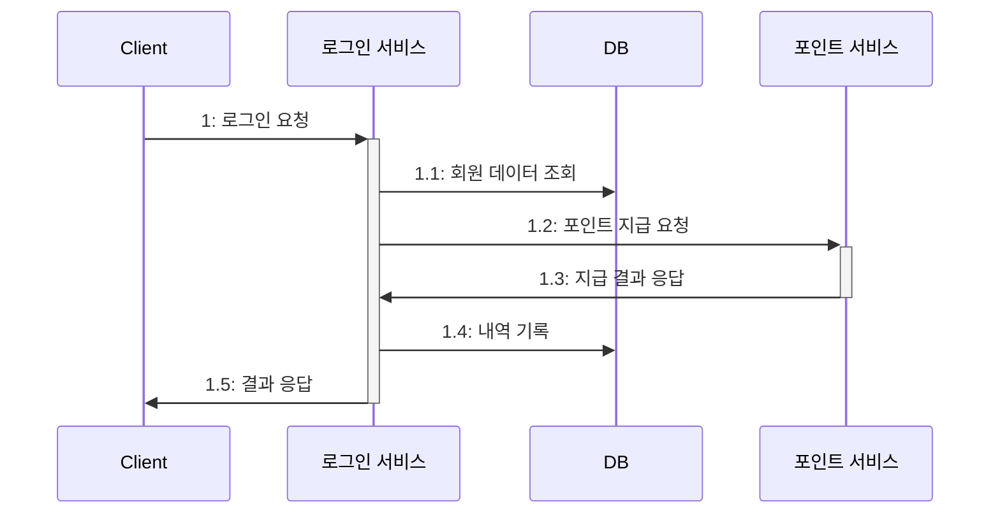

동기 방식은 외부 연동을 만나면 고려해야할 게 있다.  
포인트 지급 서비스가 외부 연동일 때 포인트 지급 요청에 대한 결과가 실패한 경우 로그인이 실패되는 것은 옳지 않다.  
실패 시 후처리를 할 수 있도록 지급 실패 내역을 따로 관리해야 한다.

연동하는 외부 서비스의 응답 시간도 고려해야 한다.  
반드시 외부 연동 결과가 필요한 게 아니라면 비동기Asynchronous 방식을 고민해보자.  
비동기 방식은 한 작업이 끝날 때까지 기다리지 않고 바로 다음 작업을 처리한다.

- 비동기로 외부 연동을 하면 사용자는 빠르게 응답을 받을 수 있다.

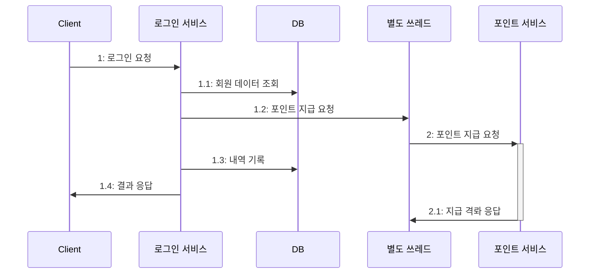

바로 포인트가 쌓이지 않으면 문제가 될 것 같지만 수 초 이내에 포인트가 쌓이면 문제가 되지 않을 때가 많다.  
사용자는 로그인 시간이 느린 것보다는 로그인을 빨리 하고 서비스를 사용하는 것을 원한다.

다음은 비동기 방식이 문제가 되지 몇 가지 예이다.

- 쇼핑몰에서 주문이 들어오면 판매자에게 푸시 보내기 (푸시 서비스 연동)
- 학습을 완료하면 학생에게 포인트 지급 (포인트 서비스 연동)
- 컨텐츠를 등록할 때 검색 서비스에도 등록 (검색 서비스 연동)
- 인증 번호를 요청하면 SMS 로 인증 메시지 발송 (SMS 발송 서비스 연동)

1. 약간의 시차가 생겨도 문제가 없음
2. 일부 기능은 실패 시 재시도 가능
3. 연동 실패 시 수동 처리 가능
4. 연동 실패 시 아예 무시해도 무방

여러 특징들을 살펴보고 비동기 방식으로 처리할 수 있는지 검토하여 성능을 개선할 수 있다.

## 🚀 별도 스레드로 실행하기

비동기 연동을 하는 가장 쉬운 방법은 별도 스레드로 실행하는 것이다.  
매번 스레드를 생성하는 대신 스레드 풀을 사용하는 방법도 있다.

@Async 어노테이션을 사용할 때는 메서드 이름에 비동기 실행과 관련된 단어를 추가하는 것이 좋다.
@Transactional 어노테이션을 사용하여도 비동기는 롤백되지 않고 익셉션도 전파되지 않는다.  
비동기는 오류를 직접 처리해야 하고 코드를 읽는 사람은 비동기로 실행된다는 사실을 알아채기 어렵다.

### 🎯 스레드와 메모리

스레드는 자체적으로 일정 크기의 메모리를 사용한다.  
운영체제, 언어에 따라 다르지만 순간적으로 많은 스레드를 생성하게 되면 시간이 오래 걸린다.

스레드 풀을 사용하면 스레드를 일정 개수로 유지할 수 있어 메모리 사용량도 일정하게 유지된다.  
하지만 풀에 생성된 스레드 개수보다 더 많은 작업을 동시에 실행하려면 일부 작업은 다른 작업이 끝날 때까지 대기해야 한다.

비동기로 실행할 코드가 외부 API 호출이나 DB 연동과 같은 네트워크 IO 작업이라면 자바의 가상 스레드를 사용하는 것도 방법이다.  
경상 스레드로 적은 메모리를 사용한다.

## 🚀 메시징

- 메시징 시스템을 이용한 비동기 연동 처리

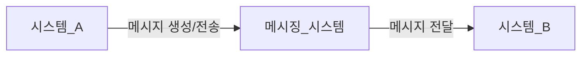

구조가 복잡해지지만 다른 이점을 얻을 수 있다.

- 첫 번째, 두 시스템이 서로 영향을 주지 않는다.

시스템 A 의 트래픽이 급증하여도 시스템 B 의 처리량과 상관없다.  
시스템 B 는 자기 처리량에 맞게 처리하면 될뿐 시스템 A 에 영향을 주지 않는다.
메시징 시스템은 시스템 A 가 보낸 메시지를 일단 저장하고 B 시스템의 성능에 맞게 처리하게 된다. (메시징 시스템마다 다르지만.)

- 두 번째, 확장이 용이하다.

예를 들어 시스템 A 가 시스템 C 에도 데이터를 전송해야 할 경우 시스템 A 에 관련 코드를 작성하는 것이 아닌,  
시스템 C 가 해당 메시지를 구독하면 된다.

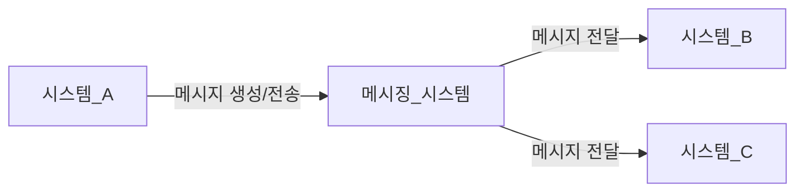

메시징 시스템은 대표적으로 카프카, 래빗 MQ, Redis 등이 있으며  
카프카는 다음과 같은 특징을 가진다.

- 높은 처리량. 초당 백만 개 이상의 메시지를 처리할 수 있다.
- 수평 확장 용이. 서버(브로커), 파티션, 소비자를 늘리면 된다.
- 카프카는 메시지를 파일에 보관해서 메시지가 유실되지 않는다.
- 1개의 토픽이 여러 파티션을 가질 수 있는데, 파티션 단위로 순서를 보장한다. 하지만 토픽 수준에서는 순서를 보장할 수 없다.
- 소비자는 메시지를 언제든지 재처리할 수 있다.
- 풀(pull) 모델을 사용한다. 소비자가 카프카 브로커에서 메시지를 읽어 가는 방식이다.

래빗MQ 는 다음과 같은 특징을 가진다.

- 클러스터를 통해 처리량을 높일 수 있다. 단, 카프카보다 더 많은 자원을 필요로 한다.
- 메모리에만 메시지를 보관하는 큐 설정을 사용하면 장애 상황 시 메시지가 유실될 수 있다.
- 메시지는 큐에 등록된 순서대로 소비자에 전송된다.
- 메시지가 소비자에 전달됐는지 확인하는 기능을 제공한다.
- 푸시push 모델을 사용한다. 래빗MQ 브로커가 소비자에 메시지를 전송한다. 소비자의 성능이 느려지면 큐에 과부하가 걸려 전반적으로 성능 저하가 발생할 수 있다.
- 다재 다능하다. AMQP, STOMP 등 여러 프로토콜을 지원하고, 게시/구독 패턴뿐만 아니라 요청/응답, 점대점point-to-point 패턴을 지원한다. 또한 우선순위를 지정해서 처리
  순서를 변경할 수도 있다.

Redis(pub/sub) 는 다음과 같은 특징을 가진다.

- 메모리를 사용하므로 지연 시간이 짧고, 래빗MQ 대비 처리량이 높다.
- 구독자가 없으면 메시지가 유실된다.
- 기본적으로 영구 메시지를 지원하지 않는다.
- 모델이 단순해서 사용하기 쉽다.

메시지가 유실되어도 상관없다면 레디스 pub/sub 기능을 고려해보자.  
대량의 트래픽(초당 수 십만에서 수 백만 이상)이 발생한다면 카프카를 고려해보자.  
트래픽 규모가 크지 않고 메시지를 정확하게 순서대로 소비자에게 전달해야 하거나 AMQP, STOMP 프로토콜로 연동해야 한다면 래빗MQ 를 고려해보자.

### 🎯 메시징 생성 측 고려 사항

메시지 유실에 대해 고려해야 한다.  
전송 과정에서의 타임아웃은 네트워크 연결이 불안정할 때 언제든지 발생할 수 있다.  
이때 오류 처리를 위해 다음과 같은 방법을 선택할 수 있다.

- 무시
- 재시도
- 실패 로그 기록

첫 번째는 메시지가 유실되어도 상관없다면 무시하는 방법이 가장 쉬운 방법이다.

두 번째는 일시적인 네트워크 불안정과 같은 오류는 재시도를 통해 해결할 수 있다.  
다만, 메시지가 중복될 수 있으므로 고유 식별자를 사용해서 중복 여부를 판단하는 방법 등으로 알맞게 처리해야 한다.

세 번째는 실패 로그를 기록하여 후처리에 사용하는 방법이다.

메시지 생산자는 DB 트랜잭션과의 연동도 고려해야 한다.

- 메시지를 전송한 뒤 DB 트랜잭션이 롤백되면 잘못된 메시지가 전송될 수 있다.

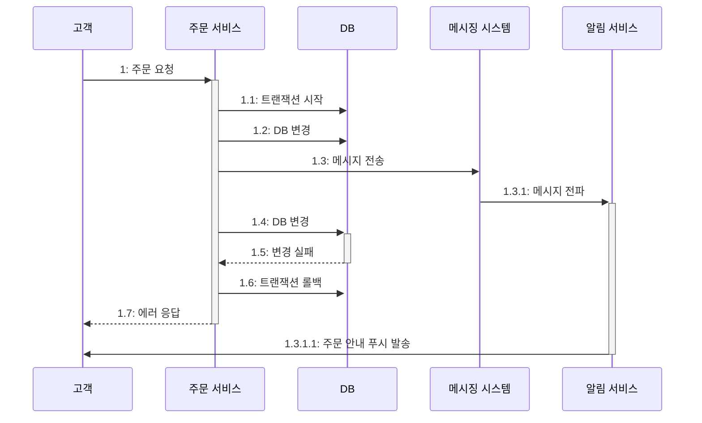

잘못된 메시지가 전송되는 문제를 방지하려면 트랜잭션이 끝난 뒤에 메시지를 전송해야 한다.

- 트랜잭션이 완료(커밋/롤백)된 뒤에 메시지를 전송한다.

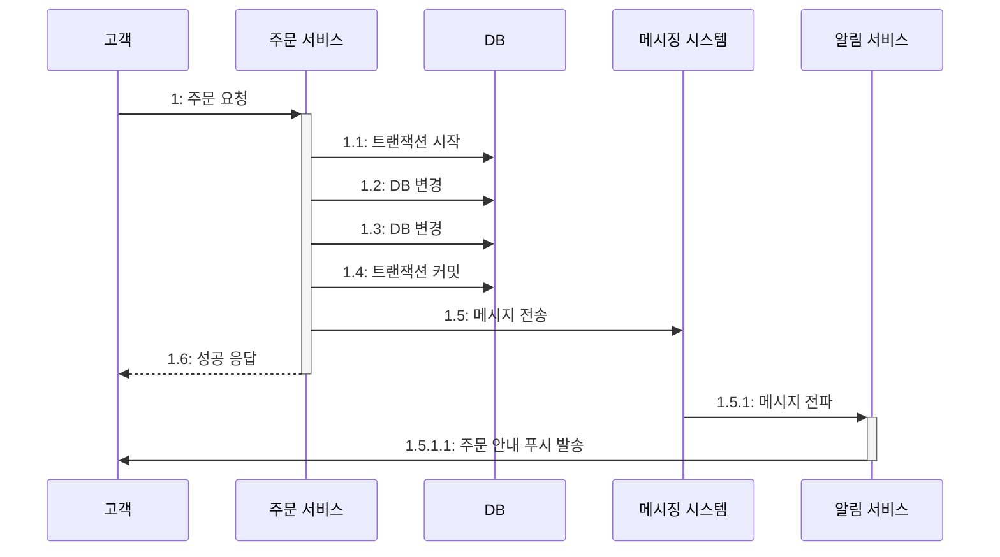

### 🎯 글로벌 트랜잭션과 메시지 연동

여러 DB 를 하나의 트랜잭션으로 묶어서 처리할 수 있는 것을 글로벌 트랜잭션global transaction이라 한다.  
A DB 와 B DB 를 처리할 때 오류가 발생하면 A 와 B 를 모두 롤백해주며 글로벌 트랜잭션을 구현하는 알고리즘으로 2단계 커밋2-Phase Commit을 사용한다. (글로벌 트랜잭션을
2PC 라고 표현하기도 한다.)

액티브MQ 는 글로벌 트랜잭션을 지원하여 실패에 대한 대응 처리를 단순화할 수 있다.  
모든 메시징 시스템이 지원해주는 것은 아니며 2단계 커밋을 처리하는 과정이 추가되면서 처리 속도가 느려질 수 있다.

글로벌 트랜잭션이 반드시 필요한 상황이 아니라면 DB 처리와 메시지 연동을 묶지 말자.  
차라리 트랜잭션 아웃박스 패턴을 검토해보자.

### 🎯 메시징 소비 측 고려 사항

소비자는 다음과 같은 이유로 메시지를 중복 처리할 수 있다.

- 메시지 생산자가 같은 데이터를 가진 메시지를 메시징 시스템에 2번 전송
- 소비자가 메시지를 처리하는 과정에서 오류가 발생하여 메시지 재수신

메시지에 식별 가능한 고유 ID 를 부여하면 중복 처리를 방지할 수 있다.

메시지를 처리하는 과정에서 오류가 발생하면 재처리를 위해 메시지를 다시 수신할 수 있다.  
읽기 타임아웃이 발생하여 메시지 처리에 실패한다면 같은 메시지를 재수신하여 재시도할 수 있다.

멱등성을 갖도록 API 를 구현한다면 매 요청마다 같은 결과를 얻을 수 있으므로 중복 메시지 처리에 유용하다.

중복 메시지 처리와 함께 고려해야할 것은 소비자가 메시지를 잘 처리하고 있는지다.  
소비자의 처리 속도가 느려지면 메시징 시스템에 메시지가 쌓이게 되고 생산자가 메시징 시스템에 메시지를 추가할 수 없는 상황이 발생할 수 있다.  
소비자의 성능 저하가 생산자까지 영향을 줄 수 있는 것이다.

### 🎯 메시지 종류: 이벤트와 커맨드

메시지에는 크게 2가지 종류가 있다. 바로 이벤트event와 커맨드command이다.

| 이벤트          | 커맨드             |
|:-------------|:----------------|
| - 주문함        | - 포인트 지급하기      |
| - 로그인에 실패함   | - 로그인 차단하기      |
| - 상품 정보를 조회함 | - 배송 완료 문자 발송하기 |
| - 배송을 완료함    |                 |

이벤트는 어떤 일이 발생했음을 알려주는 메시지다.  
이벤트는 상태(데이터) 변경과 관련이 있거나 어떤 활동이 일어났음을 나타내는 경우도 있다.

커맨드는 무언가를 요청하는 메시지다.  
커맨드 메시지를 수신하는 소비자는 메시지로 요구한 기능을 실행한다.  
커맨드 메시지는 메시지를 수신할 측의 기능 실행에 초점이 맞춰져 있다.

반면에 이벤트 메시지는 정해진 수신자가 없다. 발생한 사건에 관심이 있는 소비자가 메시지를 수신하는 방식이다.  
'배송을 완료함' 과 같은 이벤트 메시지는 배송이 완료됐다는 사실만 포함하고 있으며 어떠한 기능 실행은 해당 메시지를 소비하는 소비자 측에서 결정한다.  
이벤트 메시지는 소비자 확장에 적합하다.

### 🎯 궁극적 일관성 (eventual consistency)

문서에 따라 최종적 일관성, 결과적 일관성이라고 표현하기도 한다. 궁극적 일관성은 주로 분산 시스템에서 데이터 복제를 다룰 때 사용된다.  
이 모델은 두 데이터 저장소 간의 일관성을 보장하긴 하지만, 즉시가 아닌 일정 시간이 지난 후에야 일관성이 맞춰진다는 특징을 가진다.  
즉, 일시적 불일치가 발생할 수 있다.

비동기 메시징 방식도 이 궁극적 일관성과 유사한 특성을 갖는다.  
메시지가 전파되기 전까지는 두 시스템 간의 상태가 서로 불일치할 수 있다.

## 🚀 트랜잭션 아웃박스 패턴

잘못된 메시지 발송을 막기 위해 DB 트랜잭션이 완료된 후에 메시지를 전송하여도 완벽하게 해결되는 것은 아니다.  
메시지 전송을 위한 재시도 및 예외 처리를 추가하더라도 메시징 시스템 연동에 실패할 수 있기 때문이다.

메시지 데이터 자체가 유실되지 않도록 DB 에 저장하는 것이 트랜잭션 아웃박스 패턴Transactional Outbox Pattern의 핵심이다.  
트랜잭션 아웃박스 패턴은 하나의 DB 트랜잭션 안에서 다음 2가지 작업을 수행한다.

- 실제 업무 로직에 필요한 DB 변경 작업을 수행
- 메시지 데이터를 아웃박스 테이블에 추가한다.

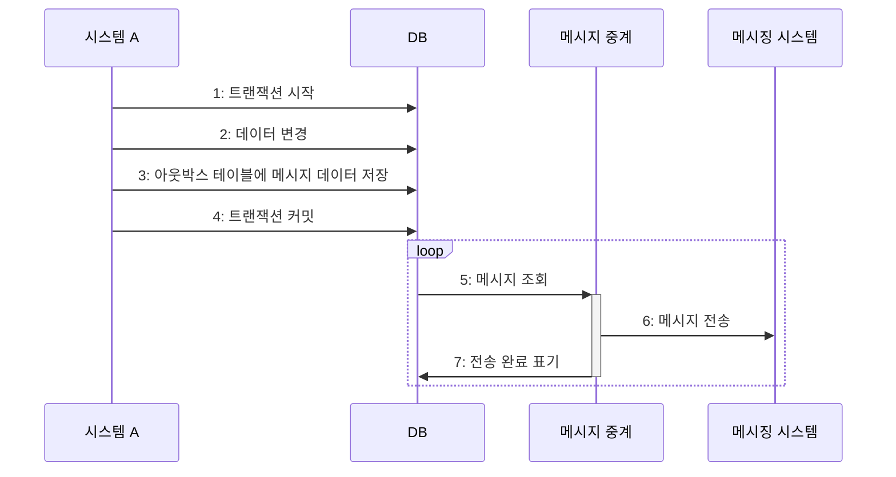

메시지 중계 서비스는 과정5 ~ 과정7을 반복한다.  
전송에 성공하면 전송 완료 처리를 하여 중복 전송되는 일을 막는다.

아웃박스 테이블에 저장된 메시지를 순서대로 보내는 것이 중요하다면  
특정 메시지를 전송하는데 실패 시 해당 루프를 종료해야 한다.  
5번 메시지에서 전송이 실패한 경우 6번 메시지로 넘어가 전송이 완료되면 메시지의 순서가 꼬이기 때문이다.

아웃박스 테이블에 특정 컬럼으로 전송이 되었는지 표기하는 방법과  
성공적으로 전송한 마지막 메시지 ID를 별도로 표기해두는 방법이 있다.

### 🎯 아웃박스 테이블 구조

특정 컬럼을 메시지 처리 상태로 둔 경우 보통 '대기', '완료', '실패'와 같은 3가지 상태가 있을텐데 어떤 조건에서 '실패함' 상태로 바꿀지 결정해야 한다.  
예를 들어 실패 횟수를 기준으로 '실패' 로 바꿀 수도 있고 모니터링 시스템을 통해 수동으로 바꿀 수도 있다.

'실패' 상태에서는 후속 조치를 통해 데이터의 일관성을 보장해야 한다.  
상태 값에 '제외함(excluded)'을 추가할 수도 있다.

메시지 발송에 실패했다고 곧바로 '실패' 상태로 바꾸지는 말자. 일시적인 네트워크 오류라면 재시도를 통해 해결할 수 있기 때문이다.

## 🚀 배치 전송

데이터를 비동기로 연동하는 가장 전통적인 방법이다. 메시징 시스템이 거의 실시간이라면 배치는 일정 간격으로 데이터를 전송한다.  
배치로 전송하는 전형적인 실행 과정은 다음과 같다.

- DB 에서 전송할 데이터를 조회한다.
- 조회한 결과를 파일로 기록한다.
- 파일을 연동 시스템에 전송한다.

파일 전송은 FTP 나 SFTP 같은 파일 전송 프로토콜 혹은 SCP 와 같은 명령어를 이용해 수행한다.  
주로 사용하는 파일 형식은 다음과 같다.

- 값1(구분자)값2(구분자)값3(구분자)
- 이름1=값1 이름2=값2 이름3=값3
- JSON 문자열

첫 번째 형식은 특정 구분자를 이용해 데이터를 구분하는 방식이다.  
두 번째 형식은 이름과 값을 한 쌍으로 묶어 키-벨류로 구분하는 방식이다.  
세 번째 형식은 각 줄마다 JSON 형식으로 데이터를 전달하는 방식이다.

파일로 데이터를 주고받는 시스템은 형식 외에도 다음 항목들을 함께 정해야 한다.

- 송수진 주체
- 시간
- 경로

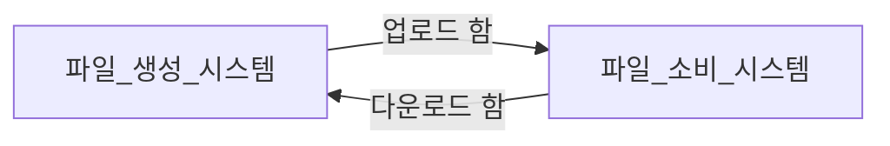

파일 생산자와 소비자 중 누가 파일을 전송할 지 미리 정해야 한다. 공격적으로 확장하는 서비스는 소비자에 맞춰서 업로드해 주는 경우가 많다.  

소비자는 특정 시점에 데이터가 필요하므로 시간도 중요한 요소다.  
글로벌 서비스라면 국내 시간대가 아닌 다른 시간대를 기준으로 파일을 받아야 하며  
이 경우 생산자 시스템이 보내줄 수 있는 시간에 맞춰 소비자 시스템의 처리 시간을 변경해야 한다.  

한 시스템이 여러 서비스로부터 파일을 받을 수 있으므로 경로나 이름이 충돌하지 않아야 한다.  

파일 외에도 API 역시 마찬가지며 상황에 따라 DB 에 바로 적재해야하는 경우도 있다. 연동 구현 방식만 다를 뿐 개념적으론 비슷하다.  

### 🎯 재처리 기능 만들기

네트워크 상황이 좋지 않아 전송에 실패하거나 어떤 이유에서든 전송에 실패하면  
일정 시간이 지난 후에 재시도할 수 있도록 관리하자.  

한 두번 정도만 재시도해도 수작업으로 재처리하는 번거로움을 상당 부분 줄일 수 있다.  
데이터가 없는 경우에도 전송하지 않는 것이 아닌 빈 데이터를 전송해야 혼란 없이 판단할 수 있다.  

## 🚀 CDC

CDCChange Data Capture 는 변경된 데이터를 추적하고 판별해서 변경된 데이터로 작업을 수행할 수 있또록 하는 소프트웨어 설계 패턴이다.  

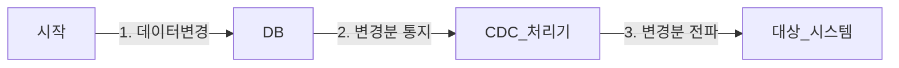

변경 데이터는 레코드 단위로 전송되며,  변경분 데이터는 추가인지 수정인지 삭제인지를 구분할 수 있는 플래그를 포함한다.  
CDC 는 변경 데이터를 그대로 대상 시스템에 전파하거나 가공하여 전파한다.  

CDC 처리기 뒤에 메시징 시스템을 두면 확장에 유리하다.  

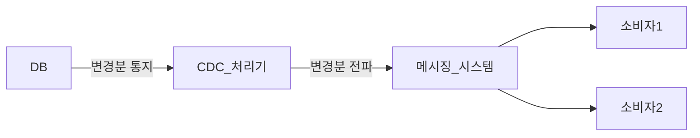

### 🎯 CDC 와 데이터 위치

CDC 처리기는 변경 데이터를 어디까지 처리했는지 기록해야 한다.  
MySQL 은 바이너리 로그를 이용해서 CDC 를 구현하는데 이 위치를 기록해야 CDC 를 재시작할 때 데이터를 놓치지 않을 수 있다.  

### 🎯 CDC 가 유용할 때

시스템이 복잡해서 연동 코드를 넣기 부담스러울 때 CDC 를 활용하면 좋다.  
기존 시스템의 코드를 수정하지 않고도 CDC 를 사용해 타 시스템에 관련 데이터를 전파할 수 있다.  

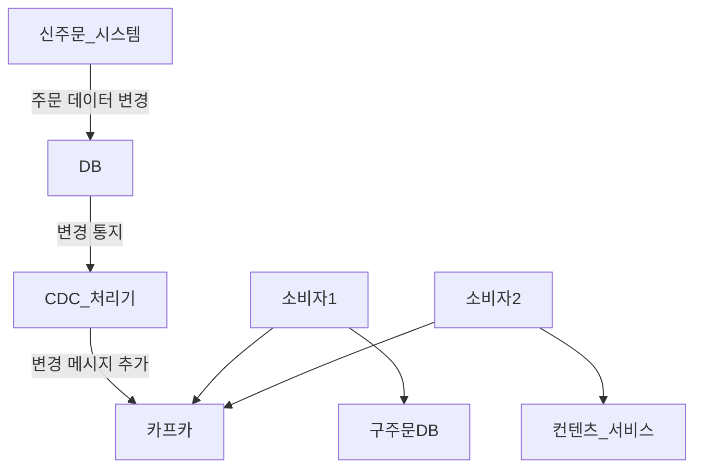

비동기로 구현하면 구조가 더 복잡해지고 두 시스템 간에 데이터가 일시적으로 불일치하여 신경 써야 할 게 많아진다.  
하지만 성능, 안정성, 자율성 등에서 유리한 측면이 많으니 적절하게 트레이드 오프하여 선택하자.  