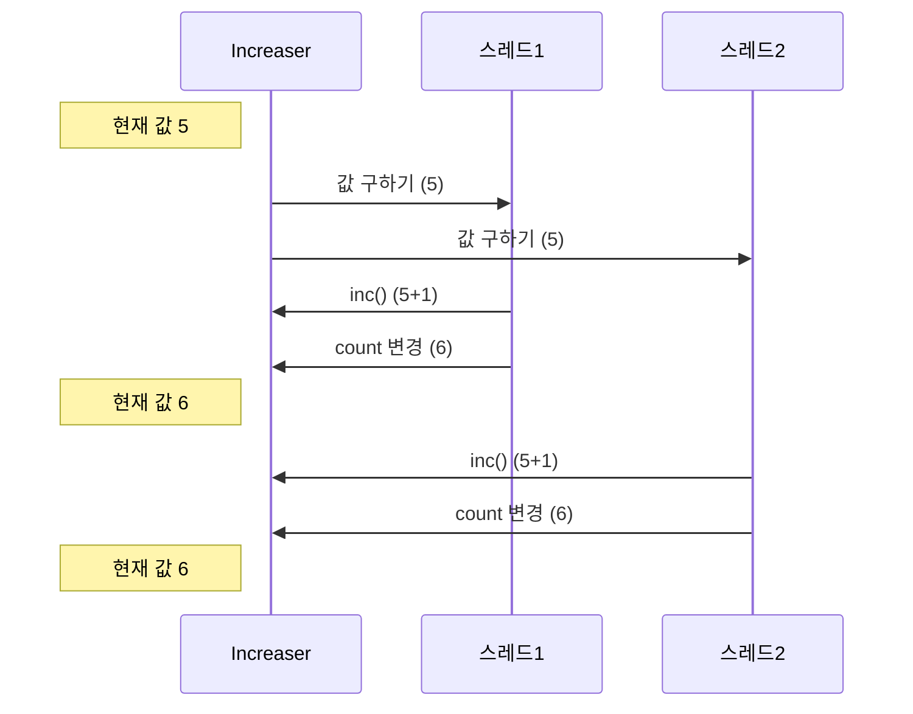
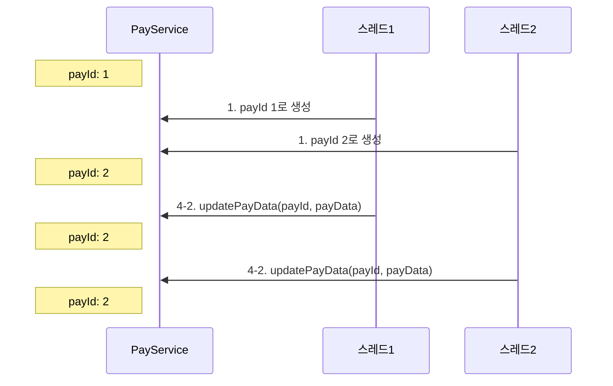
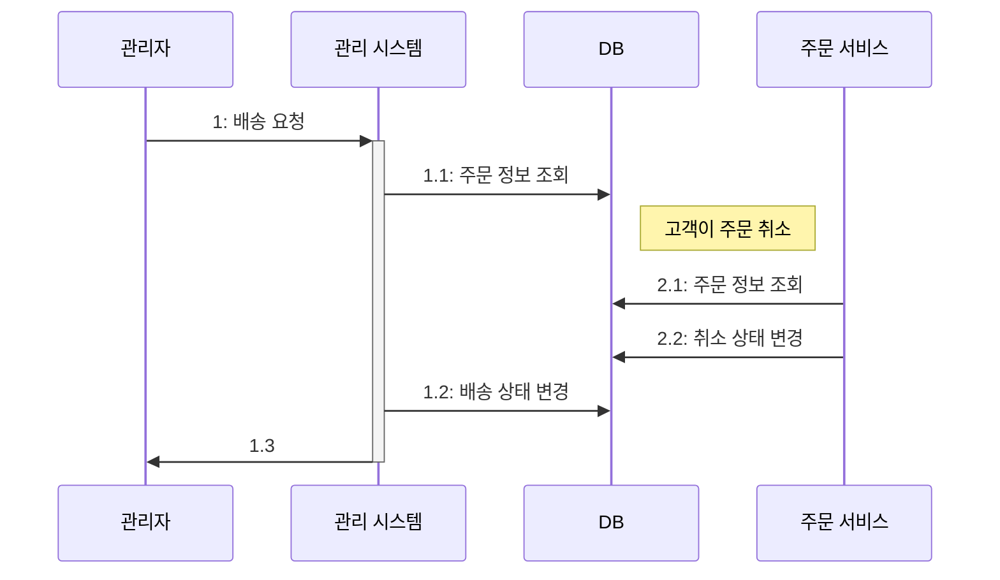
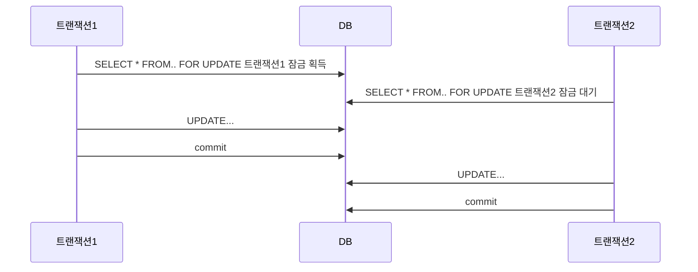
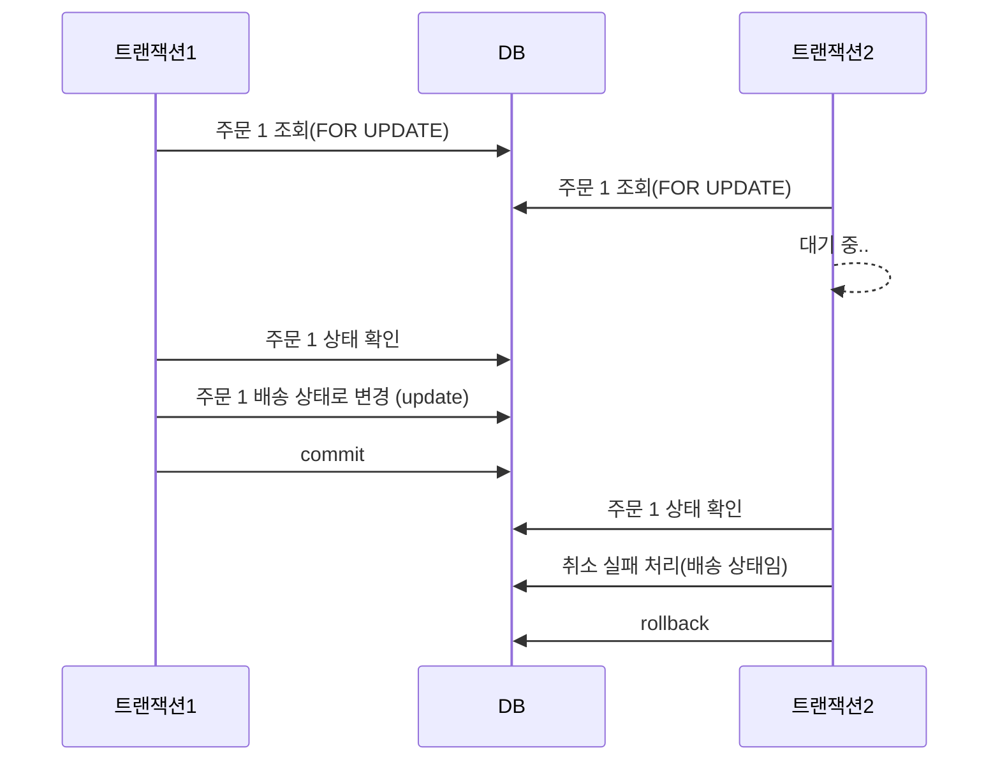
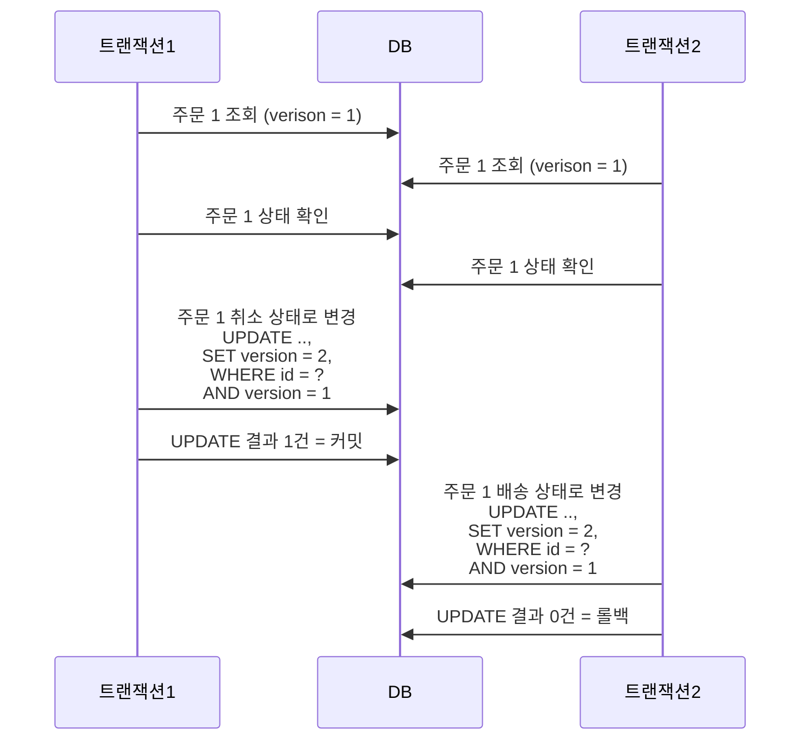
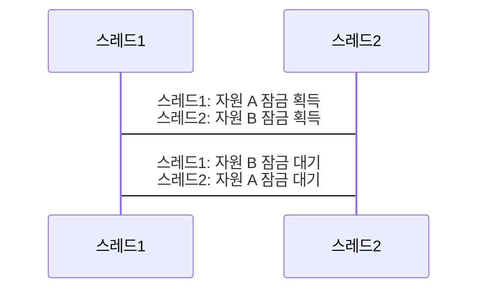
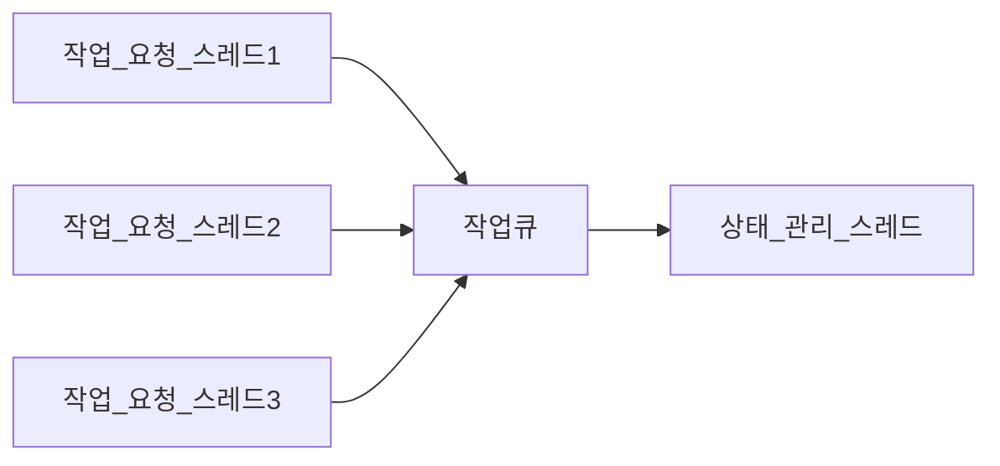

# 🔥 동시성, 데이터가 꼬이기 전에 잡아야 한다.

## 🚀 서버와 동시 실행

서버는 동시에 여러 클라이언트의 요청을 처리하며 DB 도 동시에 여러 쿼리를 실행한다.  
각 요청에 대해 동시에 처리할 수록 처리량은 증가한다.

- 클라이언트 요청마다 스레드를 할당해서 처리

여러 스레드가 동시에 코드를 실행한다. 서버에 따라 요청을 처리할 때 사용할 스레드 개수에 제한을 두지만  
동시 요청 개수만큼 스레드가 동시에 실행한다.

- 비동기 IO (또는 논블로킹 IO) 를 사용해서 처리

단일 스레드만 사용하는 경우는 드물고 IO 요청을 처리하기 위해 여러 스레드를 사용하는 경우가 많다.

어떤 방식을 사용하든 서버는 동시 실행이 기본이다.  
서로 다른 두 스레드가 동시에 같은 데이터를 조회하고 수정하는 일이 발생할 수 있다.  
동시 실행을 고려하지 않고 코드를 만들면 찾기 어려운 버그가 발생할 수 있다.

```java
public class Increaser {
    private int count = 0;

    public void inc() {
        count = count + 1;
    }

    public void getCount() {
        return count;
    }
}
```

여러 스레드가 반복해서 동일한 `Increaser` 객체의 `inc()` 메서드를 실행한 후 `getCount()` 로 값을 출력하면 잘못된 값을 출력하게 된다.



이런식으로 값이 누락되어 동시성 문제가 발생할 수 있다.

### 🎯 경쟁 상태

여러 스레드가 동시에 공유 자원에 접근할 때 접근 순서에 따라 결과가 달라지는 상황을 경쟁 상태<sup>race condition</sup>라고 한다.  
예제처럼 여러 스레드가 count 필드에 접근하는 코드를 어떤 순서로 실행하느냐에 다라 결과가 달라지고 오류가 생긴다.

## 🚀 잘못된 데이터 공유로 인한 문제 예시

```java
public class PayService {
    private Long payId;

    public PayResp Pay(PayRequest req) {
        /*...*/
        this.payId = genPayId(); // 1. `genPayId()` 로 생성한 값을 `payId` 에 할당
        saveTemp(this.payId, req); // 2. `payId` 필드를 이용해서 임시 저장
        PayResp resp = sendPayData(this.payId, _); // 3. `sendPayData()` 호출의 결과를 `resp` 에 저장
        applyResponse(resp); // 4. `applyResponse()` 호출 
        return resp;
    }

    private void applyResponse(PayResp resp) {
        PayData payData = createPayDataFromResp(resp); // 4-1. `resp` 로 `PayData` 생성
        updatePayData(this.payId, payData); // 4-2. `updatePayData()` 메서드에 `payId` 필드로 전달
    }
} 
```

`PayService` 가 싱글톤이라면 다중 스레드 환경에서 payId 값이 서로 다를 수 있다.



`payId = 1` 의 결과는 사라지고 잘못된 값이 반영되는 심각한 문제가 발생한다.

데이터베이스에서도 동시성 문제에 대해 유의해야 한다.



관리자와 고객이 동시에 주문 정보를 변경할 때 주문을 취소했지만 배송이 시작되는 문제가 발생할 수 있다.  
여러 스레드나 프로세스가 동시에 같은 데이터를 수정할 때 발생하는 동시성 문제에 대해 주의해야 한다.

## 🚀 프로세스 수준에서의 동시 접근 제어

동시성 문제는 프로세스 수준과 DB 수준 모두에서 검토해야 한다.

### 🎯 잠금(lock)을 이용한 접근 제어

프로세스 수준에서 데이터를 동시에 수정하는 것을 막기 위한 일반적인 방법은 잠금<sup>lock</sup>을 사용하는 것이다.  
잠금을 사용하면 공유 자원에 접근하는 스레드를 한 번에 하나로 제한할 수 있다.  
잠금을 사용하는 일반적인 흐름은 다음과 같다.

1. 잠금 획득
2. 공유 자원 접근 (임계 영역)
3. 잠금 해제

잠금은 한 번에 한 스레드만 획득할 수 있다. 여러 스레드가 동시에 잠금 획득을 시도하면 그중 하나만 획득하고  
나머지 스레드는 잠금이 해제될 때까지 대기하게 된다. 잠금을 획득한 스레드는 공유 자원에 접근한 뒤 사용을 마치면 잠금을 해제한다.  
잠금이 해제되면 대기 중이던 스레드 중 하나가 잠금을 획득해 자원에 접근한다.

HashMap 은 다중 스레드 환경에서 안전하지 않다.  
동시에 여러 스레드가 HashMap 의 `put()` 메서드를 호출하면 데이터가 유실되거나 값이 잘못 저장되는 문제가 발생할 수 있다.

### 🎯 synchronized 와 ReentrantLock

`synchronized` 키워드를 사용하면 더 간단하게 스레드의 동시 접근을 제어할 수 있다.  
코드 블록이 끝나면 자동으로 잠금을 풀어주기 때문에 `unlock()` 같은 메서드를 호출할 필요도 없다.

반면에 `ReentrantLock` 은 `synchronized` 에 없는 기능들을 제공하는데,  
대표적으로 잠금 획득 대기 시간을 지정하는 기능이다.

### 🎯 뮤텍스 (mutex)

뮤텍스<sup>mutex</sup> 는 mutual exclusion 의 줄임말인데 뮤텍스를 다른 말로 잠금<sup>lock</sup>이라고도 한다.

### 🎯 동시 접근 제어를 위한 구성 요소

자바의 `ReentrantLock`은 한 번에 1개 스레드만 잠금을 구할 수 있다.  
즉, 한 번에 한 스레드만 공유 자원에 접근할 수 있다.

잠금 외에도 동시 접근을 제어하기 위한 구성 요소로 세마포어와 읽기 쓰기 잠금이 있다.

### 🎯 세마포어

세마포어<sup>Semaphore</sup>는 동시에 실행할 수 있는 스레드 수를 제한한다.  
자원에 대한 접근을 일정 수준으로 제한하고 싶을 때 세마포어를 사용할 수 있다.  
ex. 외부 서비스에 대한 동시 요청을 최대 5개로 제한하고 싶을 때

세마포어는 허용 가능한 숫자를 이용해서 생성한다. 이 숫자를 자바 세마포어 구현체는 퍼밋<sup>permit</sup> 이라 한다.  
세마포어를 사용하는 전형적인 순서는 다음과 같다.

1. 세마포어에서 퍼밋 획득 (하용 가능 숫자 1 감소)
2. 코드 실행
3. 세마포어에 퍼밋 반환 (허용 가능 숫자 1 증가)

퍼밋 개수가 0인 상태에서 퍼밋을 획득하려는 스레드는 대기 상태가 된다.

`HashMap`이 바뀌지만 않는다면 `get()` 메서드는 여러 스레드가 동시에 실행해도 문제되지 않는다.  
잠금을 사용하면 데이터를 변경하지 않더라도 동시에 읽기가 안 된다.  
한 번에 한 스레드만 읽기가 가능하므로 쓰기 빈도 대비 읽기 빈도가 높을 때에는 읽기 성능이 떨어지는 문제가 발생할 수 있다.

읽기 쓰기 잠금을 사용하면 이런 성능상 단점을 없애면서 동시성 문제를 해결할 수 있다.

- 쓰기 잠금은 한 번에 한 스레드만 구할 수 있다.
- 읽기 잠금은 한 번에 여러 스레드가 구할 수 있다.
- 한 스레드가 쓰기 잠금을 획득했다면 쓰기 잠금이 해제될 때까지 읽기 잠금을 구할 수 없다.
- 읽기 잠금을 획득한 모든 스레드가 읽기 잠금을 해제할 때까지 쓰기 잠금을 구할 수 없다.

읽기 쓰기 잠금을 사용하면 쓰는 동안 읽기를 할 수 없고 읽는 동안 쓰기를 할 수 없다.  
또한 동시에 여러 스레드가 읽기를 할 수 있으므로 읽기 성능 문제를 완화할 수 있다.

### 🎯 원자적 타입(Atomic Type)

```java
public class Increaser {
    private int count = 0;

    public void inc() {
        count = count + 1;
    }
}
```

동시성 문제를 잠금으로 해결해보자.

```java
import java.util.concurrent.locks.ReentrantLock;

public class Increaser {
    private Lock lock = new ReentrantLock();
    private int count = 0;

    public void inc() {
        lock.lock();
        try {
            count = count + 1;
        } finally {
            lock.unlock();
        }
    }
}
```

잠금을 사용하면 카운터 증가에 대한 동시성 문제를 간단하게 해결할 수 있지만 CPU 효율이 떨어진다.  
여러 스레드가 동시에 실행할 때 잠금을 확보한 스레드를 제외한 나머지 스레드는 대기하기 때문이다.

잠금을 사용하지 않고 동시성 문제없이 카운터를 구현하는 다른 방법은 원자적 타입을 사용하는 것이다.  
자바 언어를 예로 들면 `AtomicInteger`, `AtomicLong`, `AtomicBoolean` 과 같은 타입이 존재한다.

```java
import java.util.concurrent.atomic.AtomicInteger;

public class Increaser {
    private AtomicInteger count = 0;

    public void inc() {
        count.incrementAndGet(); // 다중 스레드 문제없이 값을 1 증가 시킴
    }
}
```

`AtomicInteger` 는 내부적으로 `CAS` 연산을 사용한다.

### 🎯 CAS

Compare And Swap 의 약자로 일므 그대로 비교 후에 교체하는 연산을 말한다.

`AtomicInteger` 클래스의 내부 구현은 잠금을 사용하는 것보다 복잡하지만 사용하는 입장에서는 `Lock` 을 사용하는 것보다  
간단하게 동시성 문제를 해결할 수 있다. 동시에 여러 스레드가 공유 데이터를 변경한다면 잠금 대신 원자적 타입을 사용해서 동시 접근 문제를 해결할 수 있다.

### 🎯 동시성 지원 컬렉션

스레드에 안전하지 않은 컬렉션을 여러 스레드가 공유하면 동시성 문제가 발생할 수 있다.  
동기화된 컬렉션을 사용하면 되는데, 데이터를 변경하는 모든 연산에 잠금을 적용해서 한 번에 한 스레드만 접근할 수 있도록 제한하는 것이다.

자바의 `Collections` 클래스는 동기화된 컬렉션을 생성하는 메서드를 제공한다.

```java
import java.util.Collections;
import java.util.HashMap;

public static void main(String[] args) {
    Map<String, String> map = new HashMap<>();
    Map<String, String> syncMap = Collections.synchronizedMap(map);
    syncMap.put("key1", "value1"); // put 메서드는 내부적으로 synchronized 로 처리 됨
}
```

자바 23 또는 이전 버전 기준으로 가상 스레드를 사용한다면,  
Collections.synchronizedMap() 을 포함한 동기화 컬렉션 객체로 변환해주는 메서드를 사용하면 안 된다.  
내부적으로 synchronized 를 사용해서 동시 접근을 동기화하기 때문인데 해당 버전들에서 가상 스레드는 아직 synchronized 를 지원하지 않기에  
성능 문제가 발생할 수 있다.  

동시성 문제를 해결하는 또 다른 방법은 동시성 자체를 지원하는 컬렉션 타입을 사용하는 것이다.

```java
import java.util.concurrent.ConcurrentMap;

public static void main(String[] args) {
    ConcurrentMap<String, String> map = new ConcurrentMap<>();
    map.put("key1", "value1"); // 동시성 지원 컬렉션은 잠금 범위를 최소화 한다.
}
```

`ConcurrentMap` 타입은 데이터를 변경할 때 잠금 범위를 최소화한다.  
따라서 키의 해시 분포가 고르고 동시 수정이 많으면 동기화된 맵을 사용하는 것보다 더 나은 성능을 제공한다.  

동시성 문제를 피하기 위한 방법 중 하나는 불변<sup>immutable</sup> 값을 사용하는 것이다.  
값이 바뀌지 않기 때문에 동시에 여러 스레드가 접근해도 문제가 발생하지 않는다.  
데이터의 변경이 필요한 경우 기존 값을 수정하는 것이 아닌 새로운 값을 생성해서 사용한다.  

## 🚀 DB 와 동시성

데이터 처리와 관련된 많은 고민을 DB 가 대신 해결해주는데 특히 DB 가 제공하는 트랜잭션은 데이터를 다루는 과정에서 발생할 수 있는 다양한 동시성 문제를 처리해준다.  
DB 트랜잭션은 여러 개의 조회나 쓰기를 논리적으로 하나의 연산으로 묶는다.  
하나의 트랜잭션에 포함된 모든 쓰기는 모두 적용되거나(커밋) 모두 취소된다(롤백).  
트랜잭션 안의 쿼리 중 하나라도 실패하면 전체 트랜잭션을 롤백함으로써 데이터가 깨지는 것을 방지할 수 있다.  
하지만 DB 트랜잭션만으로는 동시성 문제를 해결할 수 없다.  

일부 차이는 있지만 대부분의 데이터베이스는 명시적인 잠금 기법을 제공한다.  
이런 방식은 선점 잠금, 비관적 잠금이라 하며 선점 잠금을 사용하면 동일한 레코드에 대해 한 번에 하나의 트랜잭션만 접근할 수 있도록 허용한다.  
반면 값을 비교해서 수정하는 방식은 비선점 잠금, 낙관적 잠금이라고 한다. 쿼리 실행 자체는 막지 않으면서도 데이터가 잘못 변경되는 것을 막을 수 있다.  

### 🎯 비관적, 낙관적

비관적은 실패할 가능성이 높아서 비관적이다.  
다수가 데이터 변경을 시도하면 데이터를 정상적으로 변경할 가능성이 떨어져 이를 비관적이라고 표현한 것이다.  
낙관적은 성공할 가능성이 높아서 낙관적이다.  

비관적 상황에서는 실패할 확률이 높으므로 접근할 수 있는 클라이언트를 한 번에 1개만 허용하는 배타적 잠금을 사용한다.  
반대로 성공할 확률이 높은 곳에서는 배타적 잠금까지 사용하지 않고 대신 값을 비교하는 방식으로 동시성 문제에 대응한다.  

### 🎯 선점(비관적) 잠금

선점 잠금은 데이터에 먼저 접근한 트랜잭션이 잠금을 획득하는 방식이다.  

```MySQL
# MySQL 예시
SELECT * FROM 테이블 WHERE 조건
FOR UPDATE
```

위의 쿼리는 조건에 해당하는 레코드를 조회하면서 동시에 잠금을 획득한다.  
한 트랜잭션이 특정 레코드에 대한 잠금을 획득한 경우,  
잠금을 해제할 때까지 다른 트랜잭션은 동일 레코드에 대한 잠금을 획득하지 못하고 대기해야 한다.  
레코드에 대한 잠금은 트랜잭션이 종료(커밋 or 롤백)할 때 반납한다.  



트랜잭션2는 트랜잭션1이 변경한 데이터를 조회한다.  



주문이 배송 상태로 바뀌면 취소를 할 수 없다. 반대로 주문 취소가 먼저 된다면 배송 상태로 바꿀 수 없다.  

- 분산 잠금  
분산 잠금<sup>distributed lock</sup>은 여러 프로세스가 동시에 동일한 자원에 접근하지 못하도록 막는 방법이다.  
앞에서 설명한 잠금과 큰 차이는 없지만 분산 잠금은 여러 프로세스 간에 잠금 처리를 한다는 점에서 차이가 있다.  
간단한 분산 잠금은 DB 에서 제공하는 선점 잠금을 이용해 구현하고 트래픽이 많다면 레디스를 이용해 분산 잠금을 구현하는 것을 고려해보자.  

### 🎯 비선점(낙관적) 잠금

명시적으로 잠금을 사용하지 않는 대신, 데이터를 조회한 시점의 값과 수정하려는 시점의 값을 비교하여 동시성 문제를 처리한다.  
 
1. SELECT 쿼리를 실행할 때 version 컬럼을 함께 조회한다.
   1. `SELECT .., version FROM 테이블 WHERE id = 아이디`
2. 로직 수행
3. UPDATE 쿼리를 실행할 때 version 컬럼을 1 증가시킨다. 이때 version 컬럼 값이 1에서 조회한 값과 같은지 비교하는 조건을 WHERE 절에 추가한다.
   1. `UPDATE 테이블 SET .., version = version + 1 WHERE id = 아이디 AND version = [1에서 조회한 version ㄱ밧]` 
4. UPDATE 결과로 변경된 행 개수가 0 이면, 이미 다른 트랜잭션에서 version 값을 증가 시킨 것이다. (롤백)  
5. UPDATE 결과로 변경된 행 개수가 0 보다 크면, 다른 트랜잭션보다 먼저 데이터 변경에 성공한 것이다. (커밋)

비선점 잠금은 낙관적인 방식이기 때문에 일단 데이터 변경을 시도한 후 조회한 버전 값을 함께 비교하여 동시성에 대처한다.  



비선점 잠금 방식을 사용하면 잠금 획득을 위한 대기 시간이 필요 없다.  

### 🎯 외부 연동과 잠금

트랜잭션 범위 내에서 외부 시스템과 연동해야 한다면 비선점 잠금보다는 선점 잠금을 고려하는 것이 좋다.  
배송 시작과 주문 취소가 각각의 트랜잭션에서 시작할 때 주문 취소는 외부 시스템(ex. PG)에 요청을 하게 되는데,  
이때 주문 취소가 성공하였지만 배송 시작의 트랜잭션이 먼저 완료되어 주문 취소 트랜잭션이 실패할 수 있다.  
결제가 취소됐음에도 불구하고 정합성이 안 맞는 문제가 발생하게 되므로 선점 잠금 사용을 고려하는 것이 좋다.  

비선점 잠금을 사용하고 싶다면 트랜잭션 아웃박스 패턴을 도입해 외부 연동을 처리하는 방법도 좋다.  

### 🎯 증분 쿼리

`UPDATE subject SET joinCount = ? WHERE id = ?`  
위의 쿼리는 joinCount 의 값을 1 증가 시키는데 마찬가지로 동시성 문제가 발생한다.  
잠금을 사용하면 대기 시간만큼 처리량이 저하되고 비선점 잠금을 사용하면 대기 시간은 없지만 변경 실패 에러가 자주 발생할 수 있다.  

증분 쿼리를 사용하면 DB 는 원자적 연산으로 처리하게 된다.  
`UPDATE subject SET joinCount = joinCount + 1 WHERE id = ?`  

DB 는 동일한 데이터에 대한 원자적 연산이 동시에 실행될 경우 이를 순차적으로 실행한다.  
증분 쿼리는 DB 에 따라 원자적 연산이 아닐 수도 있으므로 확인해야 한다.  

## 🚀 잠금 사용 시 주의 사항

### 🎯 잠금 해제하기

잠금을 획득한 뒤에는 반드시 잠금을 해제해야 한다. 잠금 획득을 시도하는 스레드가 무한정 대기하기 때문이다.  
세마포어도 마찬가지로 퍼밋을 얻으려는 스레드는 끝없이 대기하게 된다.  

### 🎯 대기 시간 지정하기

잠금 획득을 시도하는 코드는 잠금을 구할 수 있을 때까지 계속 대기하는데 동시 접근이 많아지면 대기 시간이 길어지는 문제가 발생할 수 있다.  
예를 들어 임계 영역의 코드 실행에 0.5초가 걸리고 동시에 1_000개의 스레드가 잠금을 시도하는 상황이 있다고 가정해보자.  
처음으로 잠금을 획득한 스레드는 0.5초 만에 코드를 실행할 수 있지만 마지막 스레드는 499.5초를 기다려야 실행할 수 있다.  

이와 같은 문제에서 대기 시간을 지정해서 해결할 수 있다.  
사용자는 결과를 모른 채 긴 시간 동안 응답을 기다리게 되면 불안감을 느낄 수 있다.  
일정 시간 내에 또는 바로 잠금 획득에 실패하면 사용자에게 빠르게 실패 응답을 주는 것이 더 낫다.  

### 🎯 교착 상태(deadlock) 피하기

한 자원에서 다른 자원으로 용량을 전송하는 기능이 있을 때 두 자원에 대한 잠금이 필요하다.  
- 자원 A 잠금 획득
- 자원 B 잠금 획득
- 자원 A 용량 감소
- 자원 B 용량 감소
- 자원 A 잠금 해제
- 자원 B 잠금 해제

한 작업에서 2개 이상의 자원의 잠금을 획득하는 구조는 교착 상태<sup>deadlock</sup>에 빠지기 쉬운 전형적인 패턴이다.  



스레드1과 스레드2가 서로 상대방이 획득한 잠그을 무한히 대기하는 상황이 발생한다.  
이러한 교착 상태를 해소할 수 있는 여러 방법들

- 잠금 대기 시간 제한
- 지정한 순서대로 잠금 획득

### 🎯 라이브락(livelock)

2명이 지나갈 수 있는 길에서 두 사람이 마주 보며 걸어오다 마주친 상황에서,  
길을 피하려고 둘 다 옆으로 이동했다. 아직 마주보고 있으니 다시 둘 다 옆으로 피했다.  
이런 상황을 계속 반복하다보면 옆으로만 이동하고 앞으로 나아가지 못하는 상황이 발생한다.  

이를 라이브락<sup>livelock</sup> 이라 한다.  
라이브락에 빠진 프로세스나 스레드는 무언가 동작을 한다는 점에서 대기만 하고 있는 교착 상태와는 다르다.  

우선 순위가 낮은 사람이 옆으로 이동하도록 구현하던가,  
중재자를 두어 결정하도록 하던가,  
임의의 시간만큼 기다렸다가 이동하게 구현하는 방법 등으로 라이브락 발생을 방지할 수 있다.  

### 🎯 기아(starvation) 상태

우선 순위가 높은 작업이 많아 우선 순위가 낮은 작업이 실행이 안 될 수 있다.  
또는 특정 자원을 한 프로세스가 긴 시간 동안 독점하고 있어 다른 프로세스가 자원에 접근하지 못해 이후 작업을 실행하지 못할 수도 있다.  

이처럼 프로세스나 스레드가 자원을 할당받지 못해 실행되지 못하는 상태를 기아 상태라고 한다.  
기아 상태에 빠지지 않도록 하려면 실행이 안 되고 있는 작업의 우선 순위를 높이거나,  
여러 프로세스나 스레드가 공유하는 자원을 독점하는 시간에 제한을 두어 가능한 작업을 실행할 수 있도록 해야 한다.  

## 🚀 단일 스레드로 처리하기

동시성 문제가 발생하는 주된 이유는 여러 스레드가 동시에 동일 자원에 접근하기 때문이다.  
한 스레드만 자원에 접근하는 방식을 쓰면 된다.  

- 한 스레드만 상태에 접근하기 위한 구조



상태 관리 스레드만 데이터를 조작할 수 있고  
데이터 변경이나 접근이 필요한 스레드는 작업 큐에 필요한 작업을 추가할 뿐 직접 상태에 접근하지 못한다.  
상태 관리 스레드는 작업 큐에서 작업을 꺼내어 필요한 데이터 처리를 수행한다.  
잠금과 같은 수단이 필요 없어 코드가 간결해진다.  

두 스레드가 데이터 공유가 필요하면 콜백이나 큐와 같은 수단을 사용해서 데이터 복제본을 공유한다.  
복제본 대신 불변<sup>immutable</sup> 값을 공유하기도 한다.  

단일 스레드로 처리하면 동시성 문제에서 자유로울 수 있지만 구조는 복잡해지는 단점이 있다.  
논블로킹이나 비동기 IO 를 사용하는 경우에는 블로킹 연산을 최소화해야 하므로 단일 스레드 처리 방식이 적합하다.  

### 🎯 성능은?

다중 스레드가 처리하던 것을 단일 스레드로 처리하게 되면 성능은 어떻게 될까?  
동시에 실행할 작업 개수와 임계 영역의 실행 시간에 따라 달라진다.  

임계 영역의 실행 시간이 짧고 동시 접근하는 스레드 수가 적을수록 잠금이 좋을 가능성이 높다.  
임계 영역의 실행 시간이 길고 동시 접근하는 스레드 수가 많을수록 큐가 좋을 가능성이 높다.  