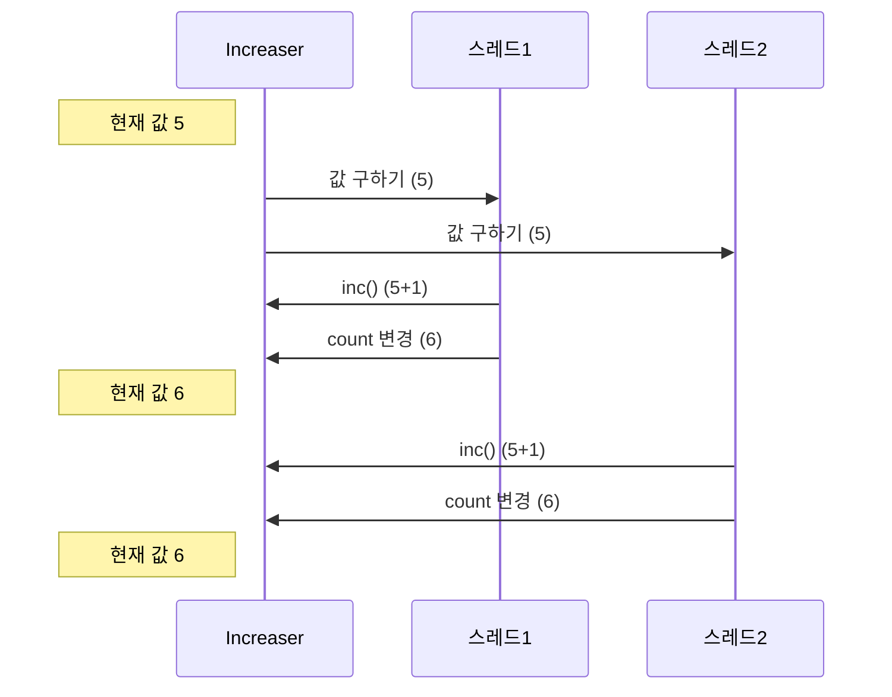
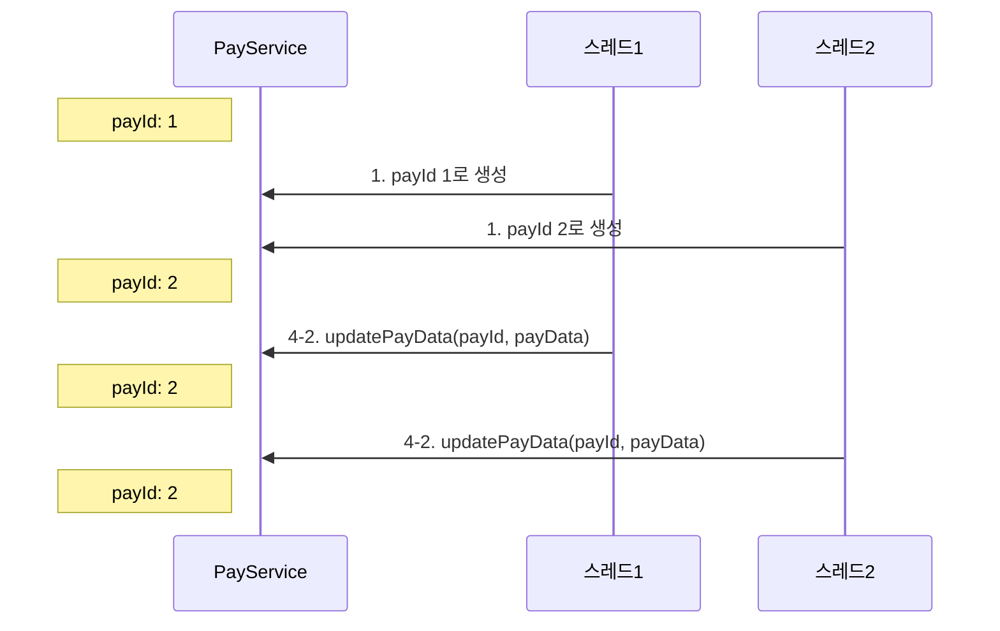
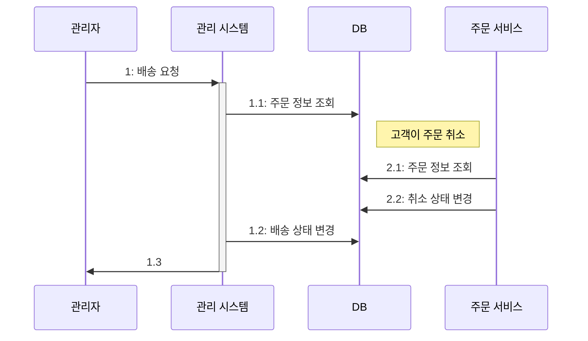

# 🔥 동시성, 데이터가 꼬이기 전에 잡아야 한다.

## 🚀 서버와 동시 실행

서버는 동시에 여러 클라이언트의 요청을 처리하며 DB 도 동시에 여러 쿼리를 실행한다.  
각 요청에 대해 동시에 처리할 수록 처리량은 증가한다.

- 클라이언트 요청마다 스레드를 할당해서 처리

여러 스레드가 동시에 코드를 실행한다. 서버에 따라 요청을 처리할 때 사용할 스레드 개수에 제한을 두지만  
동시 요청 개수만큼 스레드가 동시에 실행한다.

- 비동기 IO (또는 논블로킹 IO) 를 사용해서 처리

단일 스레드만 사용하는 경우는 드물고 IO 요청을 처리하기 위해 여러 스레드를 사용하는 경우가 많다.

어떤 방식을 사용하든 서버는 동시 실행이 기본이다.  
서로 다른 두 스레드가 동시에 같은 데이터를 조회하고 수정하는 일이 발생할 수 있다.  
동시 실행을 고려하지 않고 코드를 만들면 찾기 어려운 버그가 발생할 수 있다.

```java
public class Increaser {
    private int count = 0;

    public void inc() {
        count = count + 1;
    }

    public void getCount() {
        return count;
    }
}
```

여러 스레드가 반복해서 동일한 `Increaser` 객체의 `inc()` 메서드를 실행한 후 `getCount()` 로 값을 출력하면 잘못된 값을 출력하게 된다.



이런식으로 값이 누락되어 동시성 문제가 발생할 수 있다.

### 🎯 경쟁 상태

여러 스레드가 동시에 공유 자원에 접근할 때 접근 순서에 따라 결과가 달라지는 상황을 경쟁 상태<sup>race condition</sup>라고 한다.  
예제처럼 여러 스레드가 count 필드에 접근하는 코드를 어떤 순서로 실행하느냐에 다라 결과가 달라지고 오류가 생긴다.

## 🚀 잘못된 데이터 공유로 인한 문제 예시

```java
public class PayService {
    private Long payId;

    public PayResp Pay(PayRequest req) {
        /*...*/
        this.payId = genPayId(); // 1. `genPayId()` 로 생성한 값을 `payId` 에 할당
        saveTemp(this.payId, req); // 2. `payId` 필드를 이용해서 임시 저장
        PayResp resp = sendPayData(this.payId, _); // 3. `sendPayData()` 호출의 결과를 `resp` 에 저장
        applyResponse(resp); // 4. `applyResponse()` 호출 
        return resp;
    }

    private void applyResponse(PayResp resp) {
        PayData payData = createPayDataFromResp(resp); // 4-1. `resp` 로 `PayData` 생성
        updatePayData(this.payId, payData); // 4-2. `updatePayData()` 메서드에 `payId` 필드로 전달
    }
} 
```

`PayService` 가 싱글톤이라면 다중 스레드 환경에서 payId 값이 서로 다를 수 있다.  


`payId = 1` 의 결과는 사라지고 잘못된 값이 반영되는 심각한 문제가 발생한다.  

데이터베이스에서도 동시성 문제에 대해 유의해야 한다.  



관리자와 고객이 동시에 주문 정보를 변경할 때 주문을 취소했지만 배송이 시작되는 문제가 발생할 수 있다.  
여러 스레드나 프로세스가 동시에 같은 데이터를 수정할 때 발생하는 동시성 문제에 대해 주의해야 한다.    

## 🚀 프로세스 수준에서의 동시 접근 제어

동시성 문제는 프로세스 수준과 DB 수준 모두에서 검토해야 한다.  

### 🎯 잠금(lock)을 이용한 접근 제어

프로세스 수준에서 데이터를 동시에 수정하는 것을 막기 위한 일반적인 방법은 잠금<sup>lock</sup>을 사용하는 것이다.  
잠금을 사용하면 공유 자원에 접근하는 스레드를 한 번에 하나로 제한할 수 있다.  
잠금을 사용하는 일반적인 흐름은 다음과 같다.  

1. 잠금 획득
2. 공유 자원 접근 (임계 영역)
3. 잠금 해제

잠금은 한 번에 한 스레드만 획득할 수 있다. 여러 스레드가 동시에 잠금 획득을 시도하면 그중 하나만 획득하고  
나머지 스레드는 잠금이 해제될 때까지 대기하게 된다. 잠금을 획득한 스레드는 공유 자원에 접근한 뒤 사용을 마치면 잠금을 해제한다.  
잠금이 해제되면 대기 중이던 스레드 중 하나가 잠금을 획득해 자원에 접근한다.  

HashMap 은 다중 스레드 환경에서 안전하지 않다.  
동시에 여러 스레드가 HashMap 의 `put()` 메서드를 호출하면 데이터가 유실되거나 값이 잘못 저장되는 문제가 발생할 수 있다.  

### 🎯 synchronized 와 ReentrantLock

`synchronized` 키워드를 사용하면 더 간단하게 스레드의 동시 접근을 제어할 수 있다.  
코드 블록이 끝나면 자동으로 잠금을 풀어주기 때문에 `unlock()` 같은 메서드를 호출할 필요도 없다.  

반면에 `ReentrantLock` 은 `synchronized` 에 없는 기능들을 제공하는데,  
대표적으로 잠금 획득 대기 시간을 지정하는 기능이다.

### 🎯 뮤텍스 (mutex)

뮤텍스<sup>mutex</sup> 는 mutual exclusion 의 줄임말인데 뮤텍스를 다른 말로 잠금<sup>lock</sup>이라고도 한다.

### 🎯 동시 접근 제어를 위한 구성 요소

자바의 `ReentrantLock`은 한 번에 1개 스레드만 잠금을 구할 수 있다.  
즉, 한 번에 한 스레드만 공유 자원에 접근할 수 있다.  

잠금 외에도 동시 접근을 제어하기 위한 구성 요소로 세마포어와 읽기 쓰기 잠금이 있다.  

### 🎯 세마포어

세마포어<sup>Semaphore</sup>는 동시에 실행할 수 있는 스레드 수를 제한한다.  
자원에 대한 접근을 일정 수준으로 제한하고 싶을 때 세마포어를 사용할 수 있다.  
ex. 외부 서비스에 대한 동시 요청을 최대 5개로 제한하고 싶을 때

세마포어는 허용 가능한 숫자를 이용해서 생성한다. 이 숫자를 자바 세마포어 구현체는 퍼밋<sup>permit</sup> 이라 한다.  
세마포어를 사용하는 전형적인 순서는 다음과 같다.  
1. 세마포어에서 퍼밋 획득 (하용 가능 숫자 1 감소)
2. 코드 실행
3. 세마포어에 퍼밋 반환 (허용 가능 숫자 1 증가)

퍼밋 개수가 0인 상태에서 퍼밋을 획득하려는 스레드는 대기 상태가 된다.  

`HashMap`이 바뀌지만 않는다면 `get()` 메서드는 여러 스레드가 동시에 실행해도 문제되지 않는다.  
잠금을 사용하면 데이터를 변경하지 않더라도 동시에 읽기가 안 된다.  
한 번에 한 스레드만 읽기가 가능하므로 쓰기 빈도 대비 읽기 빈도가 높을 때에는 읽기 성능이 떨어지는 문제가 발생할 수 있다.  

읽기 쓰기 잠금을 사용하면 이런 성능상 단점을 없애면서 동시성 문제를 해결할 수 있다.  
- 쓰기 잠금은 한 번에 한 스레드만 구할 수 있다.
- 읽기 잠금은 한 번에 여러 스레드가 구할 수 있다.
- 한 스레드가 쓰기 잠금을 획득했다면 쓰기 잠금이 해제될 때까지 읽기 잠금을 구할 수 없다.
- 읽기 잠금을 획득한 모든 스레드가 읽기 잠금을 해제할 때까지 쓰기 잠금을 구할 수 없다.

읽기 쓰기 잠금을 사용하면 쓰는 동안 읽기를 할 수 없고 읽는 동안 쓰기를 할 수 없다.  
또한 동시에 여러 스레드가 읽기를 할 수 있으므로 읽기 성능 문제를 완화할 수 있다.  

### 🎯 원자적 타입(Atomic Type)

```java
public class Increaser {
    private int count = 0;
    
    public void inc() {
        count = count + 1;
    }
}
```

동시성 문제를 잠금으로 해결해보자.

```java
import java.util.concurrent.locks.ReentrantLock;

public class Increaser {
    private Lock lock = new ReentrantLock();
    private int count = 0;

    public void inc() {
        lock.lock();
        try {
            count = count + 1;
        } finally {
            lock.unlock();
        }
    }
}
```

잠금을 사용하면 카운터 증가에 대한 동시성 문제를 간단하게 해결할 수 있지만 CPU 효율이 떨어진다.  
여러 스레드가 동시에 실행할 때 잠금을 확보한 스레드를 제외한 나머지 스레드는 대기하기 때문이다.  

잠금을 사용하지 않고 동시성 문제없이 카운터를 구현하는 다른 방법은 원자적 타입을 사용하는 것이다.  
자바 언어를 예로 들면 `AtomicInteger`, `AtomicLong`, `AtomicBoolean` 과 같은 타입이 존재한다.

```java
import java.util.concurrent.atomic.AtomicInteger;

public class Increaser {
    private AtomicInteger count = 0;

    public void inc() {
        count.incrementAndGet(); // 다중 스레드 문제없이 값을 1 증가 시킴
    }
}
```

`AtomicInteger` 는 내부적으로 `CAS` 연산을 사용한다.  

### 🎯 CAS
Compare And Swap 의 약자로 일므 그대로 비교 후에 교체하는 연산을 말한다.  

`AtomicInteger` 클래스의 내부 구현은 잠금을 사용하는 것보다 복잡하지만 사용하는 입장에서는 `Lock` 을 사용하는 것보다  
간단하게 동시성 문제를 해결할 수 있다. 동시에 여러 스레드가 공유 데이터를 변경한다면 잠금 대신 원자적 타입을 사용해서 동시 접근 문제를 해결할 수 있다.

### 🎯 동시성 지원 컬렉션

## 🚀 DB 와 동시성

### 🎯 선점(비관적) 잠금

### 🎯 비선점(낙관적) 잠금

### 🎯 외부 연동과 잠금

### 🎯 증분 쿼리

## 🚀 잠금 사용 시 주의 사항

### 🎯 잠금 해제하기

### 🎯 대기 시간 지정하기

### 🎯 교착 상태(deadlock) 피하기

## 🚀 단일 스레드로 처리하기