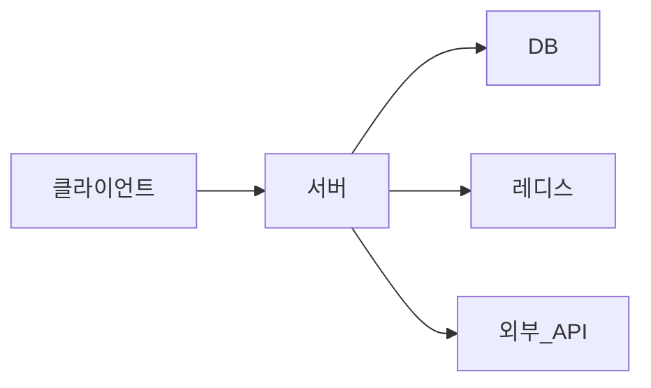
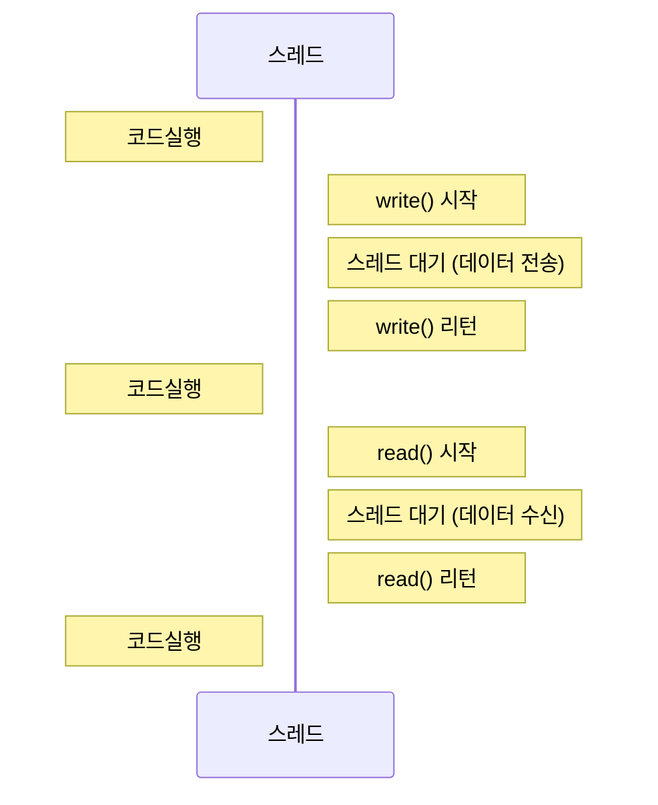
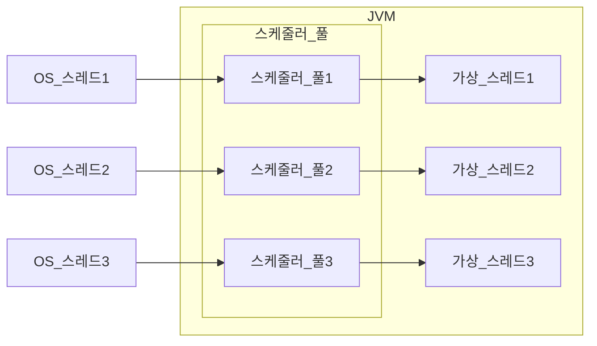
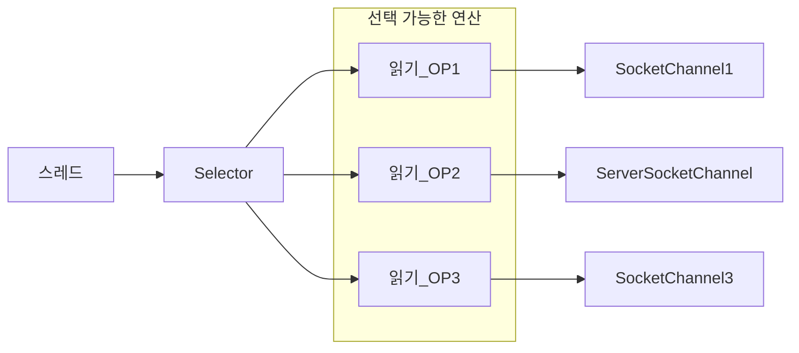
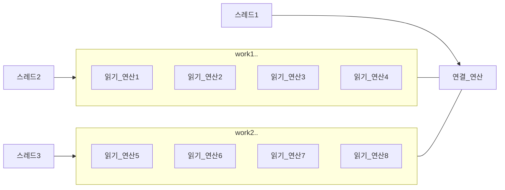

# 🔥 IO 병목, 어떻게 해결하지

## 🚀 네트워크 IO와 자원 효율

서버는 다양한 구성 요소와 네트워크를 통해 데이터를 주고 받는다.



많은 서버는 HTTP 프로토콜을 이용해서 클라이언트와 데이터를 주고 받는다.  
데이터 처리를 위해 DB 를 사용하는데 DB 는 TCP 에 기반한 프로토콜을 사용해서 데이터를 주고 받는다.  
레드를 메모리 캐시로 사용할 때도 네트워크를 통해 데이터를 주고 받는다.  
외부 API 도 마찬가지다.

네트워크를 통해 데이터를 주고 받는 과정은 간단하게 다음 두 줄로 정리할 수 있다.

```java
public static void main(String[] args) {
    outputStream.write(...); // 출력 스트림으로 데이터 보내기
    inputStream.read(...); // 입력 스트림으로 데이터 받기
}
```

예를 들어 SELECT 쿼리를 실행한다면,  
서버는 DB와 연결된 출력 스트림을 이용해서 쿼리를 전송하고  
DB가 보내는 데이터는 입력 스트림을 통해서 받는다.



데이터 입출력이 완료될 때까지 스레드는 아무 작업도 하지 않고 기다리게 되는데 이를 블로킹<sup>blocking</sup>이라 한다.  
입출력 과정에서 블로킹이 발생하기 때문에 이런 방식을 블로킹 IO라고도 한다.  
보통 입출력에 소요되는 시간은 코드를 실행하는 시간보다 훨씬 길다.  
네트워크 연동이 많은 프로그램은 전체 실행 시간의 90% 이상을 입출력 대기에 사용하는 경우도 있다.

스레드가 대기하는데 시간을 소요하는 것은 그 스레드를 실행하는 CPU도 아무것도 하지 않는 시간이 생기는 것을 의미한다.  
CPU 사용률을 높이려면 CPU가 실행할 스레드를 많이 만들면 된다.  
요청당 스레드<sup>thread per request</sup> 방식으로 구현한 서버가 이에 해당한다.  
동시에 실행되는 스레드 개수를 늘려 IO 대기에 따른 CPU 낭비를 줄일 수 있다.

스레드를 생성하는 데는 한계가 있다. 스레드는 수 KB부터 수 MB의 메모리를 사용하는데, 예를 들어 웹소켓 1만 명의 사용자가 동시에 연결되면 메모리는 10G에 육박한다.  
사용자 증가가 곧 병목이며, 메모리를 늘렸다고 하더라도 컨텍스트 스위칭 비용이 영향을 준다.

### 📝 컨텍스트 스위칭

운영 체제는 여러 스레드를 번갈아 가면서 CPU에 할당한다. CPU가 스레드를 전환하려면 현재 실행 중인 스레드의 상태를 기록하고  
다음에 실행할 스레드의 상태 정보를 불러와야 한다. 이러한 과정을 컨텍스트 스위칭<sup>context switching</sup>이라 한다.
컨텍스트 스위칭은 마이크로초 단위로 실행되지만 해당 시간 동안 CPU는 실질적인 작업을 하지 못하므로,  
동시에 실행되는 프로세스와 스레드가 많으면 컨텍스트 스위칭에 소요되는 시간도 무시하기 어렵다.

다시 정리하자면 트래픽이 증가할 때 다음 2가지 이유로 자원 효율이 떨어지게 된다.

- IO 대기와 컨텍스트 스위칭에 따른 CPU 낭비
- 요청마다 스레드를 할당함으로써 메모리 사용량이 높음

톰캣은 요청마다 스레드를 할당하는데, 다수의 서비스는 서버의 자원 낭비를 걱정할 만큼 트래픽이 발생하지 않는다.  
수백만, 수천만 이상의 고객이 사용할 정도로 인기 있는 서비스가 아니라면 CPU와 메모리 자원 부족보다는 다른 이유로 성능 문제가 발생할 때가 많다.

사실 서버를 수평 확장하거나 수직 확장해도 증가하는 트래픽을 쉽게 대처할 수 있다(비용과 직결되는 단점이 있지만).

서버 성능을 높이는 또 다른 방법은 자원의 효율을 높이는 것인데 IO 대기로 인한 CPU 낭비를 줄이고  
요청을 처리하는데 필요한 메모리를 줄이는 것이다.

- 가상 스레드나 고루틴 같은 경량 스레드 사용
- 논블로킹 또는 비동기 IO 사용

위의 두 방식을 적절히 사용하면 CPU와 메모리 자원을 늘리지 않고도 더 많은 트래픽을 처리할 수 있다.

## 🚀 가상 스레드로 자원 효율 높이기

코드를 블로킹 IO 로 작성했는데 입출력 동안 스레드가 대기하지 않고 다른 일을 할 수 있으면 CPU 유휴 시간이 줄어들어  
더 많은 작업을 처리할 수 있다. 자바의 가상 스레드나 Go 언어의 고루틴을 사용하는 것이다.

가상 스레드와 고루틴은 경량<sup>lightweight</sup> 스레드라는 공통점을 갖는다.  
경량 스레드는 OS가 관리하는 스레드가 아니라 JVM 같은 언어의 런타임이 관리하는 스레드다.  
OS가 CPU로 실행할 스레드를 스케줄링하듯, 언어 런타임이 OS 스레드로 실행할 경량 스레드를 스케줄링한다.



JVM은 OS 스레드와 1:1로 대응하는 래퍼<sup>wrapper</sup> 로 구성된 풀을 유지한다.  
CPU가 OS 스케줄러에 의해 여러 스레드를 번갈아 실행하는 것처럼 플랫폼 스레드도 JVM 스케줄러에 의해 여러 가상 스레드를 번갈아 실행한다.
JVM은 기본적으로 풀에 CPU 코어 개수만큼 플랫폼 스레드를 생성하고 필료에 따라 플랫폼 스레드를 증가시킨다.

가상 스레드를 경량 스레드라고 부르는 이유는 플랫폼 스레드보다 더 적은 자원을 사용하기 때문이다.  
플랫폼 스레드를 10_000개 생성해야 한다면 스레드의 기본 스택 크기가 1MB 일 때 약 9.8GB의 메모리를 사용한다.  
반면 가상 스레드는 평균적으로 2KB의 메모리를 사용하므로 힙 메모리는 약 20MB 정도이다.  
(여기에 스케줄링을 위한 플랫폼 스레드가 8개있다면 20MG(힙 메모리) + 8MG(스택 메모리) 정도이다.)

가상 스레드는 수백 바이트에서 수 KB~수십 KB 의 힙 메모리를 사용한다.  
호출 스택의 깊이에 따라 사용하는 메모리를 동적으로 늘렸다가 줄인다.

스레드를 생성하는 시간도 차이가 많이 난다.  
10만 개의 스레드를 생성할 때 플랫폼 스레드는 21,467ms / 가상 스레드는 196ms 가 소요됐다.(약 100배)

톰캣처럼 요청별 스레드<sup>thread per request</sup>를 생성하는 서버에서 가상 스레드를 사용하면 더 적은 자원으로 높은 효율을 낼 수 있다.

가상 스레드를 실행하는 플랫폼 스레드를 캐리어 스레드라고 표현한다. CPU가 여러 스레드를 실행하는 것처럼,  
한 개의 캐리어 스레드도 여러 가상 스레드를 실행하게 된다.  
특정 가상 스레드가 특정 캐리어 스레드에 연결되는 것을 마운트<sup>mount</sup>라고 하며  
언마운트<sup>unmount</sup>되면 가상 스레드는 실행을 멈춘다.

### 🎯 네트워크 IO와 가상 스레드

가상 스레드는 실행하는 과정에서 블로킹되면 플랫폼 스레드와 언마운트<sup>unmount</sup>되고 실행이 멈춘다.  
언마운트된 플랫폼 스레드는 실행 대기 중인 다른 가상 스레드와 연결한 뒤 실행을 재개한다.

블로킹 연산에는 IO 기능, ReentrantLock, Thread.sleep() 등이 포함된다.  
이러한 연산을 사용해서 가상 스레드가 블로킹되면 플랫폼 스레드는 대기 중인 다른 가상 스레드를 실행시킨다.  
자바 23 이하 버전부터는 synchronized 로 인해 블로킹되면 가상 스레드가 언마운트되지 않는다.  
즉 플랫폼 스레드도 함께 블로킹되는데 이를 고정됐다<sup>pinned</sup>고 한다.  
자바 21 기준으로 synchronized 외에도 JNI 호출 등 가상 스레드가 고정되는 경우가 있으니 주의해야 한다.

### 🎯 가상 스레드와 성능

서버는 크게 IO 중심<sup>IO-bound</sup> 작업과 CPU 중심<sup>CPU-bound</sup> 작업으로 나눌 수 있다.  
가상 스레드는 IO 중심 작업일 때 효과적이며 IO 는 가상 스레드가 지원하는 블로킹 연산이므로 CPU 낭비 없이 효율적으로 가상 스레드를 실행할 수 있다.  
CPU 중심 작업은 연산을 하는 동안 플랫폼 스레드는 계속 1개의 가상 스레드만 실행하게 되므로 동시 실행 효과를 얻을 수 없을 것이다.

또한 IO 중심 작업이라고 해서 무조건 가상 스레드의 이점을 얻는 것은 아니다.

- CPU 코어 16개
- TPS 500
- 1개 요청 처리당 20ms 소요
- IO 중심 작업

스레드는 1초 동안 약 50개의 요청을 처리할 수 있으므로 1초에 500개의 요청을 처리하려면 가상 스레드는 10개가 필요하다.  
반면 플랫폼 스레드는 CPU 코어 개수만큼인 16개가 생성된다.

동시에 10개의 가상 스레드가 실행되지만 IO 중심 작업이기 때문에 대부분 대기 상태인데  
플랫폼 스레드가 마운트 시킬 가상 스레드 역시 대부분 대기 상태임을 의미한다.  
가상 스레드는 플랫폼 스레드보다 개수가 많을 때 효과가 있다.

가상 스레드의 이점을 얻으려면 트래픽이 많거나 CPU 코어 수가 적어야 한다.  
클라우드 환경에선 CPU 코어를 줄이고 메모리도 줄여서 더 적은 비용으로 같은 트래픽을 처리할 수 있다.

가상 스레드를 사용해서 높일 수 있는 것은 처리량이다.  
가상 스레드를 사용한다고 해서 실행 속도가 플랫폼 스레드보다 더 빨라지지 않는다. (결국 실행은 CPU가 하기 때문)

요청별 스레드 방식을 사용하는 서버는 스레드 풀을 사용할 때가 많지만 가상 스레드는 플랫폼 스레드보다 생성 비용이 적기 때문에 풀을 미리 구성할 필요가 없다.

### 🎯 가상 스레드의 중요한 장점

가상 스레드의 중요한 장점은 기존 코드를 크게 수정할 필요 없이 별도의 설정을 추가해주기만 하면 된다.  
스프링 프레임워크나 MySQL JDBC 드라이버 같은 많이 상요되는 프레임워크와 라이브러리도 이미 가상 스레드를 지원하고 있다.

## 🚀 논블로킹 IO로 성능 더 높이기

IO 중심 작업의 처리량은 경량 스레드로 높일 수 있지만 경량 스레드 자체도 메모리를 사용하고 스케줄링에 더 많은 시간을 사용하게 된다.  
사용자가 폭발적으로 증가하면 경량 스레드로도 한계가 온다. 이때 서버의 IO 구현 방식을 논블로킹 IO 로 변경하여 해결할 수 있다.

### 🎯 논블로킹 IO 동작 개요

논블로킹 IO 는 입출력이 끝날 때까지 스레드가 대기하지 않는다.

```java
public static void main(String[] args) {
    int byteReads = channel.read(buffer); // 데이터를 읽을 때까지 대기하지 않음
    // 읽은 데이터가 없어도 다음 코드 계속 진행
}
```

데이터 조회 여부와 상관없이 대기하지 않고 바로 다음 코드를 실행하므로 블로킹 IO 처럼 데이터를 조회했다는 가정하에 코드를 작성할 수 없다.  
대신 루프 안에서 조회를 반복해서 호출한 뒤 데이터를 읽었을 때만 처리하는 방식으로 구현할 수 있다.

```java
public static void main(String[] args) {
    // CPU 낭비가 심한 방식
    while (ture) {
        int byteReads = channel.read(buffer);
        if (byteREads > 0) {
            handleData(channel, byteReads);
        }
    }
}
```

논블로킹 IO 를 사용할 때는 데이터 읽기를 바로 시도하기보다는 어떤 연산을 수행할 수 있는지 확인하고 해당 연산을 실행하는 방식으로 구현한다.

1. 실행 가능한 IO 연산 목록을 구한다 (실행 가능한 연산을 구할 때까지 대기)
2. 1에서 구한 IO 연산 목록을 차례대로 순회한다.
    1. 각 IO 연산을 처리한다.
3. 이 과정을 반복한다.



Selector#select() 메서드는 IO 처리가 가능한 연산이 존재할 때까지 대기한다.  
이 메서드가 리턴하면 수행할 수 있는 연산이 존재하는 것이다.

일반적으로 블로킹 IO 로 구현한 서버는 커넥션별로(또는 요청별로) 스레드를 할당한다.  
동시 연결 클라이언트가 1_000개면 스레드를 1_000개 생성한다.  
반면 논블로킹 IO 는 클라이언트 수에 상관없이 소수의 스레드를 사용한다.  
논블로킹 IO 는 동시 접속하는 클라이언트가 증가해도 스레드 개수는 일정하게 유지되므로 같은 메모리로 더 많은 클라이언트 연결을 처리할 수 있다.

### 📝 IO 멀티플렉싱(multiplexing)

단일 이벤트 루프에서 여러 IO 작업을 처리하는 개념을 뜻한다.  
OS 에 따라 epoll(리눅스), IOCP(윈도우) 등을 사용해서 구현한다.  
IO 멀티플렉싱을 사용함으로써 더 적은 자원(메모리와 CPU)으로 더 많은 클라이언트를 처리할 수 있어,  
대규모 트래픽을 처리해야 하는 서버를 구현할 때 IO 멀티플렉싱을 사용한다.

논블로킹 IO 를 1개 스레드로 구현하면 동시성이 떨어진다.  
예제 코드처럼 1개 채널에 대한 읽기 처리가 끝나야 다음 채널에 대한 읽기 처리를 실행하므로  
두 채널에 대한 읽기 연산이 가능해도 한 번에 1개 채널에 대해서만 처리가 가능하다.

논블로킹 IO 에서 동시성을 높이기 위해서 채널들을 N개 그룹으로 나누고 각 그룹마다 스레드를 생성하는 것이다.  
보통 CPU 개수만큼 그룹을 나누고 각 그룹마다 입출력을 처리할 스레드를 할당한다.



논블로킹 IO 에서 동시성을 높이기 위해 N개의 스레드를 사용할 수 있다.

### 🎯 리액터 패턴

리액터<sup>reactor</sup> 패턴은 논블로킹 IO 를 이용해서 구현할 때 사용하는 패턴 중 하나이다.  
동시에 들어오는 여러 이벤트를 처리하기 위한 이벤트 처리 방법으로 크게 '리액터'와 '핸들러' 두 요소로 구성된다.
리액터는 이벤트가 발생할 때까지 대기하다가 발생한 이벤트를 핸들러로 넘기고 핸들러는 필요한 로직을 수행한다.

```java
public static void main(String[] args) {
    /* 리액터 예시 */
    while (isRunning) {
        List<Event> events = getEvents(); // 이벤트가 발생할 때까지 대기
        for (Event event : events) {
            Handler handler = getHandler(event); // 이벤트를 처리할 핸들러를 구함
            handler.handle(event); // 이벤트 처리
        }
    }
}
```

리액터는 이벤트 대기 -> 핸들러 전달 과정을 반복하기에 리액터를 이벤트 루프<sup>event loop</sup>라고도 한다.

실제로 논블로킹 IO에 기반한 Netty, Nginx, Node.js 등의 프레임워크나 서버는 리액터 패턴을 적용하고 있다.  
리액터 패턴에서 이벤트 루프는 단일 스레드로 실행된다. 멀티 코어를 가진 서버에서 단일 스레드만 사용하면 처리량을 최대한 낼 수 없다.  
CPU 연산이나 블로킹을 유발하는 연산을 수행하면 그 시간만큼 전체 이벤트 처리 시간이 지연된다.

이런 한계를 보완하기 위해 핸들러나 블로킹 연산을 별도 스레드 풀에서 실행하기도 한다.  
Netty 는 여러 개의 이벤트 루프를 생성해서 멀티 코어를 활용한다.

### 🎯 프레임워크 사용하기

줄 단위로 데이터를 수신하는 서버를 구현 한다고 생각해보자.  
블로킹 IO 일 경우 BufferedReader 를 사용해서 쉽게 줄 단위로 데이터를 읽을 수 있다.

- 블로킹 IO 예시

```java
import java.io.BufferedReader;
import java.io.InputStreamReader;

public static void main(String[] args) {
    BufferedReader br = new BufferedReader(
        new InputStreamReader(socket.getInputStream(), "UTF-8")
    );

    String line;
    while ((line = br.readLine()) != null) { // 줄 단위로 쉽게 읽을 수 있음
        // line 처리 
    }
}
```

논블로킹 IO 는 블로킹 IO 보다 복잡하다. \n 문자 유무, 여러 개가 존재하는 경우, 채널마다 누적 처리를 위한 버퍼 관리 등 복잡하다.  
그래서 논블로킹 IO API 를 직접 사용하기보다는 논블로킹 IO 를 보다 쉽게 구현할 수 있도록 도와주는 프레임워크를 사용하는 것을 고려해보자.  

리액터 네티가 줄 단위 읽기와 문자열 변환 처리 기능을 제공하므로 저수준의 IO 처리를 직접 구현하지 않아도 된다.  
리액터 네이의 기반인 리액티브 API(스프링 리액터)를 익혀야 하지만, 익숙해지면 논블로킹 IO API 를 직접 사용하는 것보다 생산성이 높다.  

### 🎯 논블로킹/블로킹 IO와 성능

JVM 힙 메모리를 1.5G 를 할당했을 때 블로킹 IO 는 6_000 동접수, 논블로킹 IO 는 120_000 동접수를 기록했다.  
(약 20배 성능 향상)

## 🚀 언제 어떤 방법을 택할까

성능만큼 개발자를 자극하는 단어도 없는 것 같다.  
논블로킹 IO 나 가상 스레드를 무조건 도입하기 보다는 검토가 필요하다.  

- 문제가 있는가?
- 문제가 있다면 네트워크 IO 관련 성능 문제인가?
- 구현 변경이 가능한가?
 
다음은 도입하지 않아도 되는 경우이다.  

- 성능 문제 없음
- CPU 중심 작업
- 잘못된 쿼리로 DB 처리 시간 자체가 느린 경우
- 성능 개선이 후순위인 경우
- 관련 기술을 잘 모를 때

문제가 있고 그 문제가 네트워크 IO 와 관련이 있으며 구현 변경이 가능한 상황이라면 변경을 시도하자.  