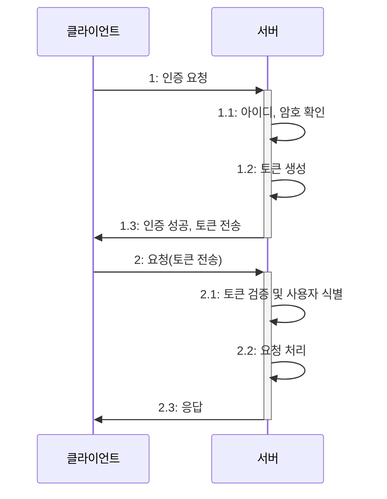
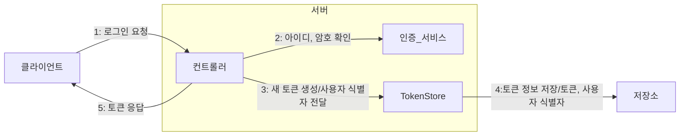
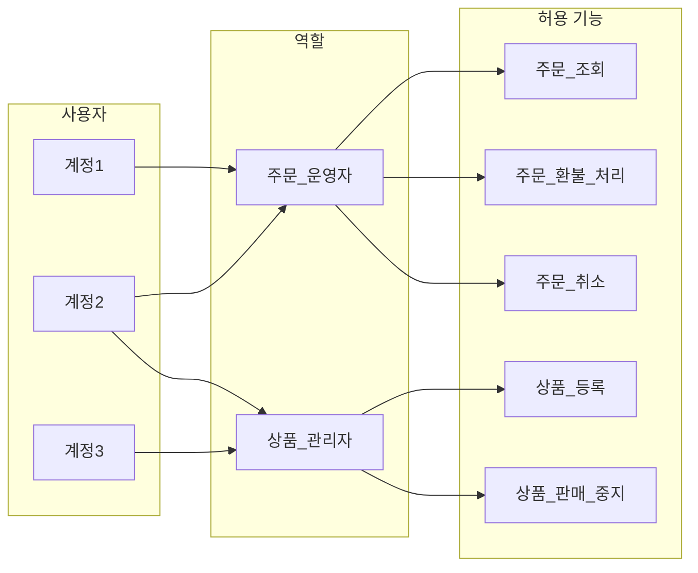
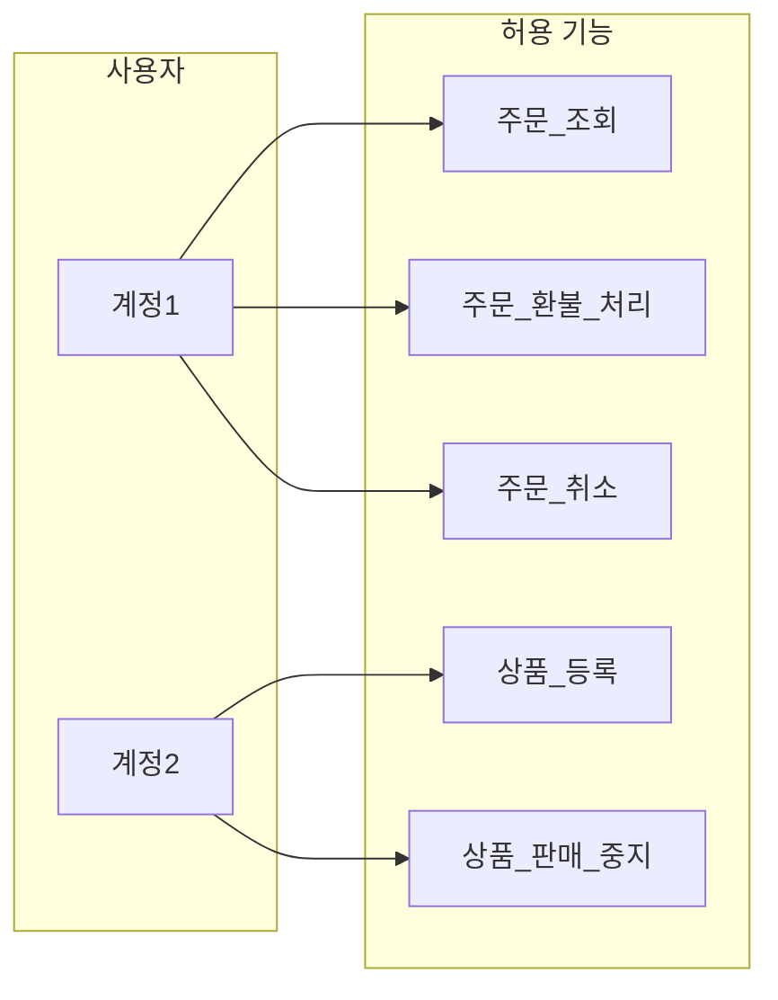
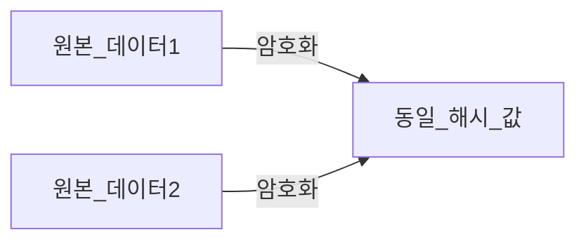
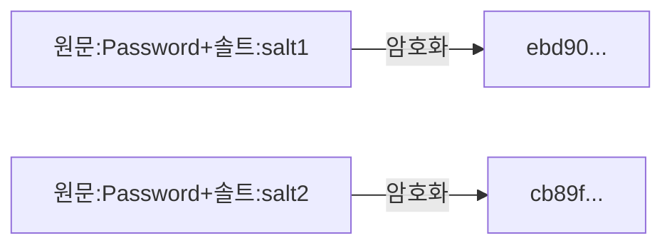

# 🔥 8장 실무에서 꼭 필요한 보안 지식

## 🚀 중요한 보안

`https://주소/...?cd=고객 코드`  
로그인한 유저는 특별한 검증없이 고객 코드를 조회할 수 있어서 고객 정보가 유출되는 보안 사고 사례가 있다.  
무작위로 만든 고객 코드가 실제 고객 코드와 일치하면 해당 고객의 정보를 취득할 수 있었다.  

또 다른 사례로는 API 를 호출할 때 회원 식별자를 전달했는데 이 API 는 암호 변경 API 로 회원 식별자와 변경할 암호의 두 파라미터를 전달받았다.  

- 현재 요청이 로그인한 회원의 요청인지 확인하지 않음
- 회원 식별자가 로그인한 회원의 식별자인지 검증하지 않음
- 변경하지 전 암호를 검증하지 않음

위 문제로 인해 API 의 구조만 알면 누구나 다른 회원의 암호를 변경할 수 있었다.  
보안 사고가 발생할 가능성을 낮추려면 서버 개발자는 기본적인 보안에 신경 써야 한다.  

## 🚀 인증과 인가

- 인증authentication: 사용자가 누구인지 확인
- 인가authorization: 사용자에게 자원에 접근할 수 있는 권한을 확인

### 🎯 인증과 토큰

아이디와 암호를 입력하는 로그인은 인증의 한 형태이다. 보안을 강화하기 위해 2단계 인증Two-Factor-Authentication,2FA을 사용하기도 한다.  

인증이 필요한 기능에 대해 매번 아이디와 암호를 입력받지 않고 토큰을 사용해서 사용자를 식별한다.  
토큰과 사용자 간의 매핑 정보를 저장할 위치로는 크게 다음 2가지를 사용한다.  

- 서버의 별도 저장소: 별도 저장소에 토큰과 사용자 식별 정보를 저장한다.
- 토큰: 토큰 자체에 사용자 식별자 정보를 저장한다.

### ✅ 별도 저장소에 토큰과 사용자 식별자 정보 저장하기

서버는 토큰과 사용자 식별 정보를 DB나 레디스와 같은 별도 저장소에 보관할 수 있다.  

외부 저장소에 보관되는 정보는 토큰, 사용자 식별자, 생성 시간, 최근 사용 시간, 그 외 유효시간, 클라이언트 버전 등의 데이터를 갖는다.  
서버는 클라이언트가 전송한 토큰을 이용해서 저장소에서 사용자 식별자를 구한다.  

토큰 데이터는 크기가 크지 않기 때문에 수백만 개의 토큰을 저장해도 DB 용량에 큰 부담은 없다.  
외부 저장소가 아닌 서버 메모리에 토큰 데이터를 저장할 수도 있다. 서블릿 세션이 이에 해당한다.  
톰캣과 같은 컨테이너는 메모리에 세션 객체를 저장한다. 서블릴 세션은 고유의 세션 ID 를 생성하는데 이 세션 ID 가 토큰에 해당한다.  

메모리에 토큰 데이터를 저장하는 방식을 사용할 때는 고정 세션sticky session이 필요하다.  
분산 환경에서는 로드밸런서를 이용해 고정 세션 방식으로 풀어낸다.
메모리는 서버 재시작과 크기에 대한 제약이 있어 별도 저장소에 보관하기도 한다.  

### ✅ 토큰 자체에 사용자 식별자 정보 저장하기

대표적인 방식이 JWTJSON-Web-Token가 있다.  
사용자가 로그인에 성공하면 사용자 식별자를 값으로 갖는 JWT 를 생성해서 클라이언트에 토큰으로 응답한다.  

장점  
- 토큰만 있으면 사용자가 누구인지 확인할 수 있다.
- 별도의 외부 저장소나 메모리에 토큰 데이터를 저장할 필요가 없다.

단점
- 네트워크 트래픽이 증가한다. (서버와 클라이언트가 주고받는 데이터의 크기가 증가하므로)
- 토큰은 서버에서 제어할 수 없다.

### ✅ 토큰 송수신

클라이언트는 서버에 토큰을 전송할 때 주로 쿠키나 헤더로 전송한다.  

웹 사이트는 주로 쿠키 방식을 사용한다.  
서버 세션도 쿠키를 사용해서 세션 ID를 주고 받는다.
서버는 토큰 문자열을 값으로 갖는 쿠키를 웹 브라우저에 응답한다.  
웹 브라우저는 서버가 전송한 쿠키를 모든 요청에 함께 전송하므로 토큰을 서버에 전송하기 위해 별도 코드를 작성할 필요가 없다.  

헤더를 사용할 수도 있다.  
쿠키도 헤더를 통해 전송되지만 쿠키를 제외한 다른 헤더를 의미하며, 헤더를 통해 토큰을 전송한다.  
클라이언트는 토큰을 로컬에 저장했다가 서버 API 요청을 호출할 때 헤더를 이용해서 토큰을 전송한다.  

### ✅ 토큰 보안

보안을 위해서 토큰을 사용하는 만큼 토큰 자체의 보안에도 신경 써야 한다.  
서버 보안을 철저히 해도 클라이언트가 보안에 취약하면 토큰이 탈취될 수 있기 때문이다.  
토큰을 탈취한 클라이언트는 원래 토큰 소유자처럼 행세할 수 있다.  

- 토큰 유효 시간 제한
  - 토큰 생성 시점을 기준으로 제한 시간 두기
  - 마지막 접근 시간을 기준으로 토큰 유효 시간 설정하기 (서블릿 세션이 이 방식을 사용함)

토큰 유효 시간은 너무 짧으면 불편하고 너무 길면 잠시 자리를 비운 사이 위험할 수 있다.  

유효 시간과 함께 클라이언트 IP 를 비교하면 토큰 보안이 향상된다.  
토큰을 생성할 때 접근한 클라이언트 IP 와 실제 토큰을 전송한 클라이언트 IP 가 같은지 비교한다.  

보안 사교 영향을 줄이고 싶다면 토큰을 무효화해서 강제로 로그아웃시키는 기능도 필요하다.

### ✅ 토큰 재발급

인증과 인가에서 사용하는 토큰으로 액세스 토큰access-token과 리프레시 토큰refresh-token이 있다.  
만료 시간이 짧은 액세스 토큰과 함께 만료 시간이 상대적으로 긴 리프레시 토큰을 함께 발급한 후,  
액세스 토큰이 만료되면 리프레시 토큰을 이용해서 새로운 액세스 토큰을 발급해 준다.  

### 🎯 인가와 접근 제어 모델

인가는 사용자가 요청한 기능을 실행할 권한이 있는지 확인하는 역할을 한다.  
접근 제어의 기본은 접근한 사용자를 토큰이나 세션으로 식별하는 것이다.  
서비스에 따라 사용자마다 실행할 수 있는 기능에 차이를 두기도 한다.  

사용자가 접근할 수 있는 기능(또는 자원)을 관리하기 위한 모델을 접근 제어Access-Control 모델이라고 한다.  
대표적인 접근 제어 모델로는 역할 기반 접근 제어Role-Based-Access-Control,RBAC 모델이 있다.  
RBAC 는 역할별로 실행 가능한 기능 집합을 할당하고, 사용자에게는 역할을 부여한다.  

- 역할은 허용된 기능 집합을 갖는다.
- 사용자에게는 역할을 부여해 역할에 허용된 기능을 실행할 수 있는 권한을 가진다.

- 사용자마다 개별적으로 권한을 부여할 수도 있다.

역할별 권한 부여 방식과 사용자별 권한 부여 방식은 각각 장단점이 있기 때문에 함께 사용하는 경우가 많다.  

RBAC 를 사용할 때는 역할의 설계와 관리에 신경 써야 한다.  
역할을 무분별하게 정의하면 중복된 기능을 가진 유사한 역할이 계속 생기기 쉽다.  

사용자별 권한 부여 방식은 시스템 규모가 작거나 역할을 나누기 애매할 때 적합하다.  
또한 역할별 권한 부여보다 구현이 단순하기 때문에 개발 시간이나 우선 순위 등을 고려해 사용자별 권한 방식을 선택하기도 한다.  

사용자의 속성을 이용해서 접근을 제어하는 속성 기반 접근 제어Attribute-Based-Access-Control,ABAC 모델도 있다.(ex. 사용자별 IP)  
정교한 접근 제어가 가능하지만, 구현이 복잡해지고 사용할 속성과 규칙을 정의하는데도 많은 시간이 소요된다.

## 🚀 데이터 암호화

로그인 아이디와 비밀번호는 유출되면 가장 큰 피해로 이어질 수 있는 데이터 중 하나다.  
비밀번호는 여러 서비스에서 동일하게 사용하는 경향이 있어 다른 서비스마저 위험해지고  
외부 유출뿐 아니라 내부에서도 문제가 될 수 있다.  

데이터베이스에 접근할 수 있는 엔지니어가 평문으로된 데이터를 확인한다면 그 자체로 보안에 위협이 될 수 있다.  
엔지니어가 악용하지 않더라도 PC 가 해킹을 당해 유출될 가능성이 있다.

### 🎯 단방향 암호화

암호화한 데이터를 다시 복호화할 수 없는 암호화 방식이다.  
단방향 암호화는 해시 함수를 사용해서 데이터를 해시 값으로 변환한다.  
해시 알고리즘에는 SHA-256, MD5, BCrypt 등이 있다.  

로그인 비밀번호 같은 문자열을 암호화하는 데 주로 사용되지만, 실제 암호화는 바이트 데이터를 기준으로 동작한다.  
입력 파라미터와 리턴 값은 바이트 배열이므로 문자열에 알맞는 캐릭터셋을 이용한다.  

암호환 결과를 영속화하려면 바이트 배열을 문자열로 표현해야 한다.  16진수 표기법이나 Base64 표기법을 사용해서 문자열로 표현한다.  

### 📝 충돌 저항성(collision resistance)

해시 함수는 원본 데이터에 상관없이 일정한 길이의 해시 값을 생성한다.  
길이가 제한되기 때문에 서로 다른 데이터가 동일한 해시 값을 가질 수 있다.  
서로 다른 데이터에 대해 최대한 다른 해시 값을 생성하는 해시 알고리즘이 좋다고 할 수 있다.  
동일한 해시 값을 갖는 서로 다른 데이터를 찾기 어려울 때 해시 함수는 충돌 저항성을 갖는다.  

### ✅ 값의 비교

단방향 암호화는 해시 함수로 생성한 해시 값이 같다면 두 데이터가 같다고 간주한다.  

로그인할 때 비밀번호가 일치하는지 여부도 해시 값을 이용해서 비교한다.  
단방향 암호화는 원본 데이터로 복호화할 수 없기 때문에, 사용자가 비밀번호를 잊었을 때 기존 비밀번호를 알려주는 기능은 구현할 수 없다.

### ✅ Salt 로 보안 강화하기

같은 해시 알고리즘을 사용하면 동일한 원본 데이터에 대해 항상 동일한 해시 값이 생성된다.  
같은 원본 데이터에 대해 항상 동일한 해시 값을 생성하는 것은 보안에 취약하다.  

해시 알고리즘은 이 취약점을 보완하기 위해 솔트Salt를 사용한다.  
솔트는 임의의 값이며, 암호활 때 솔트를 함께 사용하면 솔트 값에 따라 결과 해시 값이 달라진다.  

솔트를 사용해서 암호화한 해시 값은 유출되더라도 미리 계산해둔 해시 표에서 일치하는 값을 찾기 어렵다.  
사용자마다 서로 다른 솔트를 사용하면 보안 강도를 더욱 높일 수 있다.  

### 🎯 양방향 암호화

## 🚀 HMAC을 이용한 데이터 검증

### 🎯 HMAC 예제 코드

## 🚀 방화벽으로 필요한 트래픽만 허용하기

## 🚀 감사 로그(audit log) 남기기

## 🚀 데이터 노출 줄이기

## 🚀 비정상 접근 처리

## 🚀 시큐어 코딩

## 🚀 개인 보안

