# 🔥 8장 실무에서 꼭 필요한 보안 지식

## 🚀 중요한 보안

`https://주소/...?cd=고객 코드`  
로그인한 유저는 특별한 검증없이 고객 코드를 조회할 수 있어서 고객 정보가 유출되는 보안 사고 사례가 있다.  
무작위로 만든 고객 코드가 실제 고객 코드와 일치하면 해당 고객의 정보를 취득할 수 있었다.  

또 다른 사례로는 API 를 호출할 때 회원 식별자를 전달했는데 이 API 는 암호 변경 API 로 회원 식별자와 변경할 암호의 두 파라미터를 전달받았다.  

- 현재 요청이 로그인한 회원의 요청인지 확인하지 않음
- 회원 식별자가 로그인한 회원의 식별자인지 검증하지 않음
- 변경하지 전 암호를 검증하지 않음

위 문제로 인해 API 의 구조만 알면 누구나 다른 회원의 암호를 변경할 수 있었다.  
보안 사고가 발생할 가능성을 낮추려면 서버 개발자는 기본적인 보안에 신경 써야 한다.  

## 🚀 인증과 인가

- 인증<sup>authentication</sup>: 사용자가 누구인지 확인
- 인가<sup>authorization</sup>: 사용자에게 자원에 접근할 수 있는 권한을 확인

### 🎯 인증과 토큰

```mermaid
sequenceDiagram
    클라이언트 ->>+ 서버: 1: 인증 요청
    서버 ->> 서버: 1.1: 아이디, 암호 확인
    서버 ->> 서버: 1.2: 토큰 생성
    서버 ->>- 클라이언트: 1.3: 인증 성공, 토큰 전송
    클라이언트 ->>+ 서버: 2: 요청(토큰 전송)
    서버 ->> 서버: 2.1: 토큰 검증 및 사용자 식별
    서버 ->> 서버: 2.2: 요청 처리
    서버 ->>- 클라이언트: 2.3: 응답
```

아이디와 암호를 입력하는 로그인은 인증의 한 형태이다. 보안을 강화하기 위해 2단계 인증<sup>Two-Factor-Authentication,2FA</sup>을 사용하기도 한다.  



인증이 필요한 기능에 대해 매번 아이디와 암호를 입력받지 않고 토큰을 사용해서 사용자를 식별한다.  
토큰과 사용자 간의 매핑 정보를 저장할 위치로는 크게 다음 2가지를 사용한다.  

- 서버의 별도 저장소: 별도 저장소에 토큰과 사용자 식별 정보를 저장한다.
- 토큰: 토큰 자체에 사용자 식별자 정보를 저장한다.

### ✅ 별도 저장소에 토큰과 사용자 식별자 정보 저장하기

서버는 토큰과 사용자 식별 정보를 DB나 레디스와 같은 별도 저장소에 보관할 수 있다.  

```mermaid
flowchart LR
    클라이언트 -- 1: 로그인 요청 --> 컨트롤러
    컨트롤러 -- 5: 토큰 응답 --> 클라이언트
    subgraph 서버
        컨트롤러
        인증_서비스
        TokenStore
    end

    컨트롤러 -- 2: 아이디, 암호 확인 --> 인증_서비스
    컨트롤러 -- 3: 새 토큰 생성/사용자 식별자 전달 --> TokenStore
    TokenStore -- 4:토큰 정보 저장/토큰, 사용자 식별자 --> 저장소
```

외부 저장소에 보관되는 정보는 토큰, 사용자 식별자, 생성 시간, 최근 사용 시간, 그 외 유효시간, 클라이언트 버전 등의 데이터를 갖는다.  
서버는 클라이언트가 전송한 토큰을 이용해서 저장소에서 사용자 식별자를 구한다.  

토큰 데이터는 크기가 크지 않기 때문에 수백만 개의 토큰을 저장해도 DB 용량에 큰 부담은 없다.  
외부 저장소가 아닌 서버 메모리에 토큰 데이터를 저장할 수도 있다. 서블릿 세션이 이에 해당한다.  
톰캣과 같은 컨테이너는 메모리에 세션 객체를 저장한다. 서블릴 세션은 고유의 세션 ID 를 생성하는데 이 세션 ID 가 토큰에 해당한다.  

메모리에 토큰 데이터를 저장하는 방식을 사용할 때는 고정 세션<sup>sticky session</sup>이 필요하다.  
분산 환경에서는 로드밸런서를 이용해 고정 세션 방식으로 풀어낸다.
메모리는 서버 재시작과 크기에 대한 제약이 있어 별도 저장소에 보관하기도 한다.  

### ✅ 토큰 자체에 사용자 식별자 정보 저장하기

대표적인 방식이 JWT<sup>JSON-Web-Token</sup>가 있다.  
사용자가 로그인에 성공하면 사용자 식별자를 값으로 갖는 JWT 를 생성해서 클라이언트에 토큰으로 응답한다.  

장점  
- 토큰만 있으면 사용자가 누구인지 확인할 수 있다.
- 별도의 외부 저장소나 메모리에 토큰 데이터를 저장할 필요가 없다.

단점
- 네트워크 트래픽이 증가한다. (서버와 클라이언트가 주고받는 데이터의 크기가 증가하므로)
- 토큰은 서버에서 제어할 수 없다.

### ✅ 토큰 송수신

클라이언트는 서버에 토큰을 전송할 때 주로 쿠키나 헤더로 전송한다.  

웹 사이트는 주로 쿠키 방식을 사용한다.  
서버 세션도 쿠키를 사용해서 세션 ID를 주고 받는다.
서버는 토큰 문자열을 값으로 갖는 쿠키를 웹 브라우저에 응답한다.  
웹 브라우저는 서버가 전송한 쿠키를 모든 요청에 함께 전송하므로 토큰을 서버에 전송하기 위해 별도 코드를 작성할 필요가 없다.  

헤더를 사용할 수도 있다.  
쿠키도 헤더를 통해 전송되지만 쿠키를 제외한 다른 헤더를 의미하며, 헤더를 통해 토큰을 전송한다.  
클라이언트는 토큰을 로컬에 저장했다가 서버 API 요청을 호출할 때 헤더를 이용해서 토큰을 전송한다.  

### ✅ 토큰 보안

보안을 위해서 토큰을 사용하는 만큼 토큰 자체의 보안에도 신경 써야 한다.  
서버 보안을 철저히 해도 클라이언트가 보안에 취약하면 토큰이 탈취될 수 있기 때문이다.  
토큰을 탈취한 클라이언트는 원래 토큰 소유자처럼 행세할 수 있다.  

- 토큰 유효 시간 제한
  - 토큰 생성 시점을 기준으로 제한 시간 두기
  - 마지막 접근 시간을 기준으로 토큰 유효 시간 설정하기 (서블릿 세션이 이 방식을 사용함)

토큰 유효 시간은 너무 짧으면 불편하고 너무 길면 잠시 자리를 비운 사이 위험할 수 있다.  

유효 시간과 함께 클라이언트 IP 를 비교하면 토큰 보안이 향상된다.  
토큰을 생성할 때 접근한 클라이언트 IP 와 실제 토큰을 전송한 클라이언트 IP 가 같은지 비교한다.  

보안 사교 영향을 줄이고 싶다면 토큰을 무효화해서 강제로 로그아웃시키는 기능도 필요하다.

### ✅ 토큰 재발급

인증과 인가에서 사용하는 토큰으로 액세스 토큰<sup>access-token</sup>과 리프레시 토큰<sup>refresh-token</sup>이 있다.  
만료 시간이 짧은 액세스 토큰과 함께 만료 시간이 상대적으로 긴 리프레시 토큰을 함께 발급한 후,  
액세스 토큰이 만료되면 리프레시 토큰을 이용해서 새로운 액세스 토큰을 발급해 준다.  

### 🎯 인가와 접근 제어 모델


## 🚀 데이터 암호화


### 🎯 단방향 암호화


### 🎯 양방향 암호화


## 🚀 HMAC을 이용한 데이터 검증


### 🎯 HMAC 예제 코드


## 🚀 방화벽으로 필요한 트래픽만 허용하기


## 🚀 감사 로그(audit log) 남기기


## 🚀 데이터 노출 줄이기


## 🚀 비정상 접근 처리


## 🚀 시큐어 코딩


## 🚀 개인 보안

