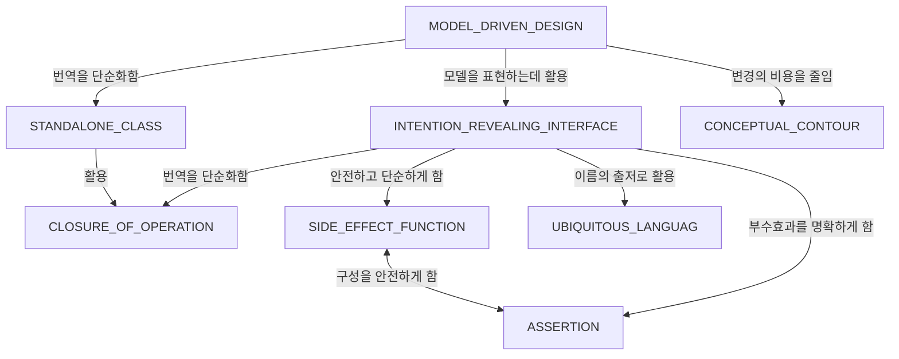
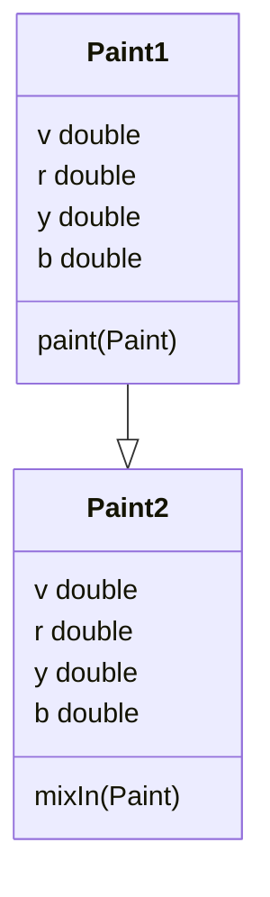

# 🎯 DDD

- (160p)개발자는 캡슐화된 행위를 활용하는 것에 내포된 의미를 알아야 한다.
 
#### SPECIFICATION

기존의 객체를 선별하는 것이 아닌, 완전히 새로운 객체를 새로 만들어내거나 재구성하는 것.  

- 검증(Validation)
- 선택(Selection)
- 요청 구축(Building to Order)

`SPECIFICATION`을 사용하면 `GENERATOR`의 구현을 인터페이스로부터 분리(decouple)할 수 있다. 생성 요구사항은 선언하지만 방법(어떻게)은 선언하지 않는다.  

#### 모델과 심층 모델

#### 유연한 설계

#### INTENTION_REVEALING_INTERFACE (의도를 드러내는 인터페이스)

개발자가 컴포넌트를 사용하기 위해 컴포넌트의 구현 세부사항을 고려해야 한다면(혹은 짐작하거나) 캡슐화의 가치는 사라진다.  
추측한 바가 원래의 취지에 어긋난다면 정상적으로 동작했다고 하더라도 설계의 개념적 기반은 무너진 것이다.

#### SIDE_EFFECT_FREE FUNCTION (부수효과가 없는 함수)

- 연산은 크게 `command(modifier)`와 `query`로 나눌 수 있다.
- `command(modifier)`와 `query`의 연산을 엄격하게 구분하라.
- 안전하게 예측할 수 있는 추상화를 마련해라.  
- `Entity`로부터 `VALUE OBJECT`를 추출해냈다면 복잡한 로직의 위치도 재구성하라.
- 도메인 지식 탐구에서 얻은 통찰력을 바탕으로 객체 및 함수등에 이름을 반영하라(UBIQUITOUS LANGUAGE).
- 캡슐화. 클라이언트에 대한 배려.

#### ASSERTION (단언)