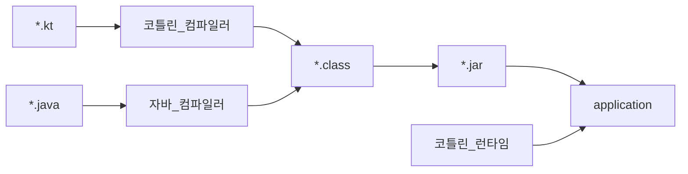

# 1장 코틀린이란 무엇이며, 왜 필요한가?

- 코틀린은 타입 추론을 지원하는 정적 타입 지정 언어다. 따라서 소스코드의 정확성과 성능을 보장하면서도 소스코드를 간결하게 유지할 수 있다.
- 코틀린은 객체지향과 함수형 프로그래밍 스타일을 모두 지원한다. 코틀린에서는 일급 시민 함수를 사용해 수준 높은 추상화가 가능하고 불변 값 지원을 통해 다중 스레드 어플리케이션에 개발과 테스트를 더 쉽게 할 수 있다.
- 코루틴은 스레드에 대한 대안으로 경량이다. 코루틴을 사용하면 비동기 코드를 자연스럽게 느낄 수 있는 순차적 코드와 비슷한 로직을 작성할 수 있으며, 자식-부모 관계로 동시성 코드를 구조화할 때 도움이 된다.
- 코틀린을 서버 애플리케이션 개발에 잘 활용할 수 있다. 코틀린은 코틀린으로 작성된 케이토나 http4k와 같은 프레임워크는 물론이고 스프링 부트와 같은 기존 자바 프레임워크도 완전히 지원한다.
- 안드로이드도 코틀린 우선으로 개발이 이뤄진다. 안드로이드 개발 도구, 라이브러리, 예제, 문서는 모두 주로 코틀린에 초점이 맞춰져 있다.
- 코틀린은 무료이며 오픈소스다. 또한 주요 IDE와 여러 빌드 시스템을 지원한다.
- 인텔리제이 IDEA와 안드로이드 스튜디오를 사용하면 코틀린과 자바 모두가 포함된 코드를 매끄럽게 내비게이션할 수 있다.
- 코틀린 놑이터(https://play.kotlinlang.org/)는 아무 설정 없이 코틀린 코드를 시도해볼 수 있는 빠른 방법이다.
- 자바를 코틀린으로 변환하는 자동화된 자바-코틀린 변환기를 사용하면 기존 코드와 자바 언어에 대한 지식을 코틀린으로 가져올 수 있다.
- 코틀린은 실용적이며 안전하고 간결하며 상호운용성이 좋다. 이는 우리가 코틀린을 설계하면서 일반적인 작업에 대해 이미 잘 알려진 해법을 채택하고, NPE 와 같이 흔히 발생하는 오류를 방지하며, 읽기 쉽고 간결한 코드를 지원하면서 자바와 아무런 제약 없이 통합될 수 있는 언어를 만드는 데 초점을 맞췄다는 뜻이다.

