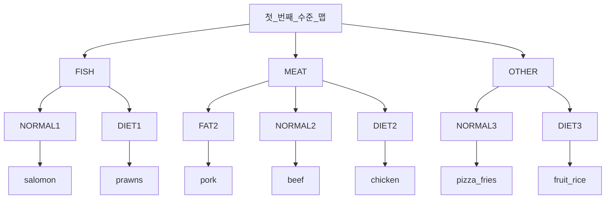

# CHAPTER 6 스트림으로 데이터 수집

## 그룹화

### 요리의 타입을 기준으로 일정 칼로리 이상을 수집

```java
Map<Dish.Type, List<Dish>> caloricDishedByType =
        menu.stream().filter(dish -> dish.getCalories() > 500)
                .collect(groupingBy(Dish::getType));    
// result
{OTHER=[french fries, pizza], MEAT[port, beef]}
```

- filter predicate 를 만족하지 못하는 FISH 종류 요리는 없으므로 결과 맵에서 해당 키 자체가 사라진다.<br/>

<br/>

```java
Map<Dish.Type, List<Dish>> caloricDishesByType =
    menu.stream()
        .collect(groupingBy(Dish::getType,
                filtering(dish -> dish.getCalories() > 500), toList()));
```

- Collectors 클래스의 또 다른 정적 팩터리 메소드인 filtering 을 통해 해결한다.<br/>

<br/>

### 그룹의 각 요리 관련 이름 목록 수집

```java
Map<Dish.Type, List<String>> dishNamesByType =
    menu.stream()
        .collect(groupingBy(Dish::getType,
            mapping(Dish::getName, toList())));
```

```java
Map<Dish.Type, Set<String>> dishNamesByType =
    menu.stream()
        .collect(groupingBy(Dish::getType,
            flatMapping(dish -> dishTags.get(dish.getName()).stream(), toSet()));
```

## 다수준 그룹화

- `Collectors.groupingBy`

```java
Map<Dish.Type, Map<CaloricLevel, List<Dish>>> dishesByTypeCaloricLevel =
    menu.stream().collect(
            groupingBy(Dish::getType, // 첫 번째 수준의 분류 함수
                groupingBy(dish -> { // 두 번째 수준의 분류 함수
                    if (dish.getCalories() <= 400) return CaloricLevel.DIET;    
                    if (dish.getCalories() <= 700) return CaloricLevel.NORMAL
                    return CaloricLevel.FAT;
                }))
        );
// result
{
    MEAT={DIET=[chicken], NORMAL=[beef], FAT=[pork]},
    FISH={DIET=[prawns], NORMAL=[salomon]},
    OTHER={DIET=[rice, seasonal fruit], NORMAL=[french fries, pizza]}    
}
```

- 다수준 그룹화 연산은 다양한 수준으로 확장할 수 있다.



## 서브그룹으로 데이터 수집

```java
Map<Dish.Type, Long> typesCount = menu.stream().collect(
        groupingBy(Dish::getType, counting())
        );
// result
{MEAT=3, FISH=2, OTHER=4}
```