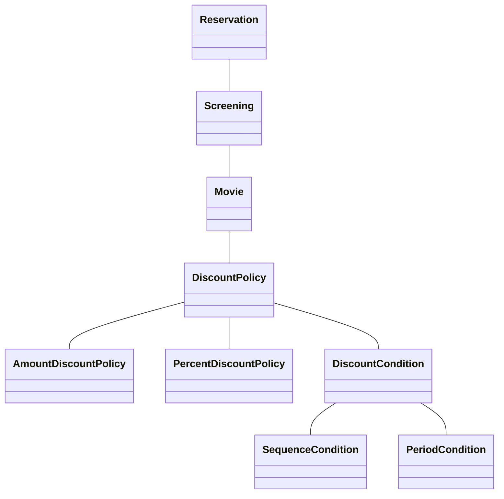

# 도메인의 구조를 따르는 프로그램 구조

## 자율적인 객체

1. 각체는 상태와 행동을 함께가지는 복합적인 존재이다. 
2. 객체는 스스로 판단하고 행동하는 자율적인 존재이다. 

데이터와 기능을 객체 내부로 함게 묶는 것을 캡슐화라고 한다. 

객체지향의 장점은 도메인의 의미를 풍부하게 표현할 수 있다는 것. 
객체와 객체간의 상호작용은 오직 메시지를 전송하는 것뿐이다. 

협력은 다형적이다. 
유연성이 필요한 곳에 추상화를 사용하라. 

상속의 가장 큰 문제는 캡슐화를 위반하는 것이다. 
(부모 클래스의 내부 구조를 잘 알아야하기 때문) 