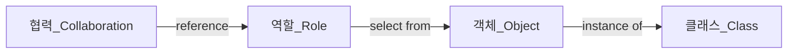

# 역할, 책임, 협력

객체지향 패러다임의 관점에서 핵심은 역할(role), 책임(responsibility), 협력(collaboration)이다. 
객체의 자율성을 보장하기 위해서는 필요한 정보와 정보에 기반한 행동을 같은 객체 안에 모아놓아야 한다. 
`Movie` 는 영화 예매라는 협력에 참여하고 있고 그 안에서 요금을 계산하는 책임을 지고 있기 때문이다. 

## 책임

`하는 것` 과 `아는 것` 의 두 가지 범주로 나누어 세분화 한다. 

#### 하는 것
- 객체를 생성하거나 계산을 수행하는 등의 스스로 하는 것
- 다른 객체의 행동을 시작시키는 것
- 다른 객체의 활동을 제어하고 조절하는 것

#### 아는 것
- 사적인 정보에 관해 아는 것
- 관련된 객체에 관해 아는 것
- 자신이 유도하거나 계산할 수 있는 것에 관해 아는 것

### 메시지가 객체를 결정한다.

- 최소한의 인터페이스
- 추상적인 인터페이스

### 행동이 상태를 결정한다.

상태를 먼저 결정하면 캡슐화를 저해하고 내부 구현이 퍼블릭 인터페이스에 노출된다. 
객체의 내부 구현에 초점을 맞춘 설계 방법을 `데이터-주도-설계`라고 부른다. 

### 역할과 협력

특정한 협력 안에서 수행하는 책임의 집합을 역할이라 한다. 
역할은 대체가 가능하다, 유연하고 재사용 가능한 협력을 얻을 수 있다. 

`AmountDiscountPolicy`, `PercentDiscountPolicy` 모두 할인 요금 계산이라는 _동일한 책임_을 수행한다. 
공통 책임을 역할로 추상화할 수 있다. `역할은 다른 것으로 교체할 수 있는 책임의 집합이다.` 

중요한 것은 책임이다. 
다양한 객체들이 협력에 참여한다는 것이 확실하다면 역할로 시작하라, 아니라면 객체로 시작하라. 
상황을 추상화할 수 있다. (책임의 집합을 추상화=역할) 

협력은 연극과 동일하고 코드는 극본과 동일하다. 
협력이라는 문맥 안에서 역할은 특정한 협력에 참여해서 책임을 수행하는 객체의 일부다. 