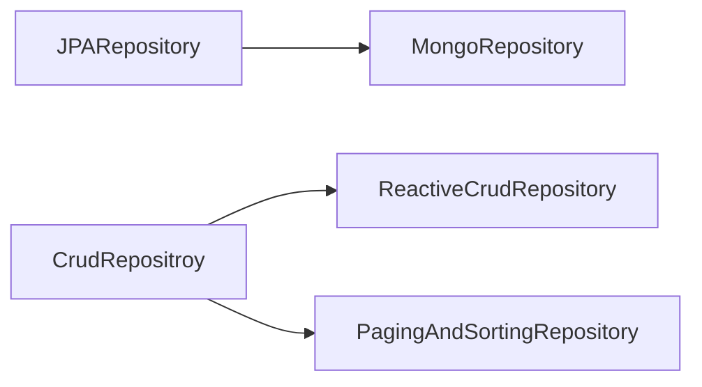

# chap06 - 데이터 파고들기

스프링 데이터의 미션은 '기본적인 데이터 저장의 특수한 속성을 유지하면서 데이터에 액세스하는 친숙하고 일관된 스프링 기반 프로그래밍 모델을 제공하는 것.'<br/>

## 엔티티 정의

'도메인 클래스' 는 그 연관성과 중요성이 다른 데이터와 독립적인 기본 도메인 엔티티다.<br/>
도메인 클래스를 하나 정의한 후에 데이터 사용 범위, 클라이언트가 사용하는 외부 API, DB 종류를 고려해 데이터베이스와 추상화 수준을 정한다.<br/>

## 템플릿 지원

템플릿은 일종의 SPI<sup>Service Provider Interface</sup><br/>
바로 사용할 수 있고 유용하지만, 일반적으로는 매번 반복되는 단계를 거쳐야 한다.<br/>
일반적인 패턴의 데이텅 액세스에서는 repository가 더 좋은 옵션이 된다.<br/>
무엇보다 repository가 템플릿을 기반으로 하기 때문에 추상화를 더 높이더라도 잃을게 없다.<br/>

## 저장소 지원

다양한 파생 가능 <br/>



## 레디스로 템플릿 기반 서비스 생성하기

레디스<sup>Redis</sup> 일반적으로 서비스 내 인스턴스 간에 상태를 공유하고,<br/>
캐싱과 서비스 간 메시지를 중개<sup>brokering</sup> 하기 위해 인메모리 repository로 사용하는 DB.<br/>

## 어노테이션

- @Data : getter(),setter(),equals(),hashCode(),toString()
- @NoArgsConstructor : 매개변수가 없는 생성자
- @AllArgsConstructor : 매개변수가 있는 생성자
- @JsonIgnoreProperties(ignoreUnknown = true) : 필드와 매핑이 안 되면 역직렬화 무시
- @Id : 고유 식별자
- @JsonProperty("vert_rate") : 한 멤버 변수를 다른 이름이 붙은 JSON 필드와 연결
- @RedisHash : 레디스 해시에 저장될 애그리거트 루트<sup>Aggregate Root</sup>
- @PostConstruct : 빈이 생선된 후 초기화 메서드로 실행되어야 하는 메서드 지정

## 템플릿 지원 추가하기

```java
    @Bean
public RedisOperations<String, String> redisOperations(RedisConnectionFactory factory){
        Jackson2JsonRedisSerializer<String> serializer=new Jackson2JsonRedisSerializer<>(String.class);

        RedisTemplate<String, String> template=new RedisTemplate<>();
        template.setConnectionFactory(factory);
        template.setDefaultSerializer(serializer);
        template.setKeySerializer(new StringRedisSerializer());

        return template;
        }
```

- 객체와 JSON 레코드 간 변환 시 사용할 `Serializer` 생성.
- Jackson은 JSON 값의 `마샬링/언마샬링`에 사용.
- 스프링 부트 웹 애플리케이션에 이미 Jackson이 있으므로 `Jackson2JsonRedisSerializer` 생성
- String ID가 있는 객체를 수용하기 위해,
- `String 타입 키`와 `Integer 타입의 값`을 허용 하는 `RedisTemplate` 생성
- `RedisConnectionFactory` 객체에 자동 주입된
- `RedisConnectionFactory` 빈을 `template` 객체에 담아서 레디스 데이터 베이스에 커넥션을 생성하고 조회가 가능하도록 설정
- 기본 serializer로 사용하기 위해 template 객체에 `Jackson2JsonRedisSerializer&lt;Integer&gt;` 제공
- `RedisTemplate` 에는 특별히 `serializer` 를 지정하지 않는 경우, 기본 serializer로 지정되는 여러 serializer가 있다.
- 기본 serializer는 Integer 타입의 객체를 기대한다.
- 그렇기 때문에 String 타입의 키를 변환하기 위해 다른 serializer를 지정한다.
- Serializer에 StringRedisSerializer 를 담아준다.
- 마지막으로 RedisOperations 빈의 구현체가 요구될 때 사용할 `return template`

## 데이터 로드하기

영속<sup>persist</sup>해야 하는 데이터(샘플,테스트,실제 시드 데이터)가 존재한다.<br/>

- DDL(데이터 정의 언어), DML(데이터 조작 언어) 스크립트를 사용해 초기화하고 채위
- 하이버네이트를 통해 @Entity 클래스에서 테이블 구조를 자동으로 생성하고 repository 빈을 통해 채우기

API 또는 데이터베이스별 스크립트

- schema.sql
- data.sql
- schema-${platform}.sql
- data-${platform}.sql

## 스크립트 생성하고 채우기

DDL - schema-mysql.sql<br/>
DML - data-mysql.sql<br/>

resources 하위에 schema.mysql.sql, data-mysql.sql 이 있으며,<br/>
yaml에서 자동 설정.

```yaml
# 외부(내장되지 않은) 데이터베이스를 사용하리라 예상하고 실행할 때마다 DB 초기화.
spring:
  datasource:
    initialization-mode: always
```

```yaml
# @Entity 클래스에서 스프링 부트가 테이블을 자동으로 생성하는 기능 비활성화
spring:
  jpa:
    hibernate:
      ddl-auto: none
```

장점

- SQL 스크립트 직접 사용
- 선택한 DB의 특정 SQL 구문에 액세스

단점

- SQL 파일의 사용은 분명히 SQL 지원 관계형 데이터베이스에만 해당됨.
- 스크립트가 특정 데이터베이스 구문에 의존할 수 있다.
- 기본 데이터베이스 선택이 변경될 경우 편집이 필요.
- 기본 부팅 동작을 재정의하려면 애플리케이션 속성 설정

## 데이터를 불러오는 클래스로 분리

@PostConstruct 으로 데이터를 채우는 메서드를 실행하여<br/>
데이터베이스에 완전히 독립적으로 만들 수 있다.<br/>

## NoSQL 도큐먼트 데이터베이스를 사용해 repository 기반 서비스 만들기

```groovy
implementation 'org.springframework.boot:spring-boot-starter-data-mongodb'
```

## NoSQL 그래프 데이터베이스를 사용해 repository 기반 서비스 만들기

```groovy
implementation 'org.springframework.boot:spring-boot-starter-data-neo4j'
```