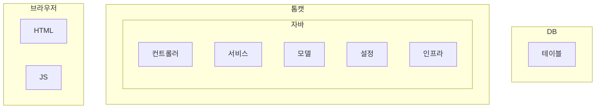

# 9. 테스트 범위와 종류

- 기능 테스트 : 브라우저 - 톰캣 - DB
- 통합 테스트 : 톰캣 - DB
- 단위 테스트 : 서비스, 모델 등

## 대역

| 대역 종류    | 설명                                                                           |
|----------|------------------------------------------------------------------------------|
| 스텁(Stub) | 구현을 단순한 것으로 대체한다. 테스트에 맞게 단순히 원하는 동작을 수행한다.                                  |
| 가짜(Fake) | 제품에는 적합하지 않지만, 실제 동작하는 구현을 제공한다.                                             |
| 스파이(Spy) | 호출된 내역을 기록한다. 기록한 내용은 테스트 결과를 검증할 때 사용한다. 스텁이기도 하다.                          |
| 모의(Mock) | 기대한 대로 상호작용하는지 행위를 검증한다. 기대한 대로 동작하지 않으면 익셉션을 발생할 수 있다. 모의 객체는 스텁이자 스파이도 된다. |

## WireMock

JSON/XML 응답, HTTPS 지원, 단독 실행 등 다양한 기능을 제공한다. 
외부 연동 코드를 테스트할 때 유용하게 사용할 수 있다. 
ref. wiremock.org 

