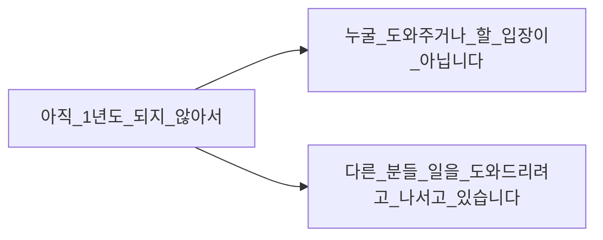

# 학습 프레임과 실행 프레임

실행 프레임은 '잘하기'에 초점이 맞추는 것, 학습 프레임은 '자라기'에 초점을 맞추는 것이다. 
실행 프레임은 성장이 목표라면 불리한 선택이다. 

## '그렇기 때문에'
이라는 단어는 핑계로 변할 수도, 원동력으로 바뀔 수도 있다. 
어떤 마인드셋이냐에 따라 궁극적으로 '자라기'에 영향을 미친다. 
성장을 도모한다면 적극적으로 참여하는 마인드셋이 도움이 될 것 같다. 

# 가장 학습하기 힘든 직업이 살아남는다

타인과의 경쟁뿐만 아니라 기계와의 경쟁까지 고려해야 할 걱정이 늘었다.

## 학습에 유리한 조건, 불리한 조건

1. 목표가 모호하고 주관적일 수 있으며 동적이다.
2. 매 순간 선택할 수 있는 행동/선택의 종류(Move)가 불확실하다.
3. 매 순간 내가 목표에 얼마나 근접했는지를 알기 어렵다(내가 한 선택의 피드백을 빨리 얻기 어렵다)
4. 주로 열린 시스템(즉, 예상 못 한 외부 요소가 갑자기 들어오는 경우가 흔한) 속에서 일한다.
5. 과거의 선택과 결과에 대한 구조화된 기록이 별로 없다.

위는 학습에 불리한 조건이고 반대로 뒤집으면 유리한 조건이 된다. 
학습에 불리할 수록 인공지능이 학습하기 어렵다. 

## 컴퓨터로 대체되기 힘든 일

지각과 조작, 창의적 지능, 사회적 지능

1. 독창성
2. 사회적 민감성
3. 협상
4. 설듯
5. 타인을 돕고 돌보기

개발자는 더 높은 수준의 협상 능력이 필요하다. 

## 무엇에 집중할 것인가

암묵지와 직관을 배우고 수련하는 방법을 배우면 된다. 

AI를 더 잘 활용하고 AI를 감독하는 일의 비율이 높아질 것이며, 
비즈니스 모델을 바라보고 그 가치에 대해 집중할 것이다. 
인공지능이 모든 것을 해결해준다는 생각이 때로는 회의감을 들게 하지만, 
인공지능을 강력한 무기로 적극 활용해야 한다. 